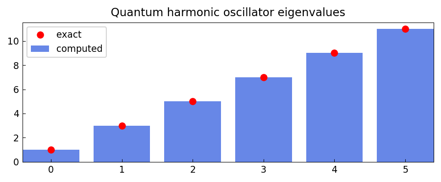

# Harmonic oscillator eigenstates

*chebfunjax team*

## Overview

Computes eigenstates of the quantum harmonic oscillator:

$$-u'' + x^2 u = E u, \quad u(\pm L) = 0$$

The exact eigenvalues are $E_n = 2n + 1$ for $n = 0, 1, 2, \ldots$
with eigenfunctions given by the Hermite functions.

```python
from chebfunjax.operators.chebop import Chebop

dom = (-6.0, 6.0)
L = Chebop(lambda x, u: -u.diff(2) + x**2 * u, domain=dom)
L.lbc = 0.0; L.rbc = 0.0
lams = L.eigs(k=6)
# Exact: 1, 3, 5, 7, 9, 11
```

## Results

The computed eigenvalues match the exact values to near machine precision,
verifying the spectral accuracy of the Chebyshev collocation method.


