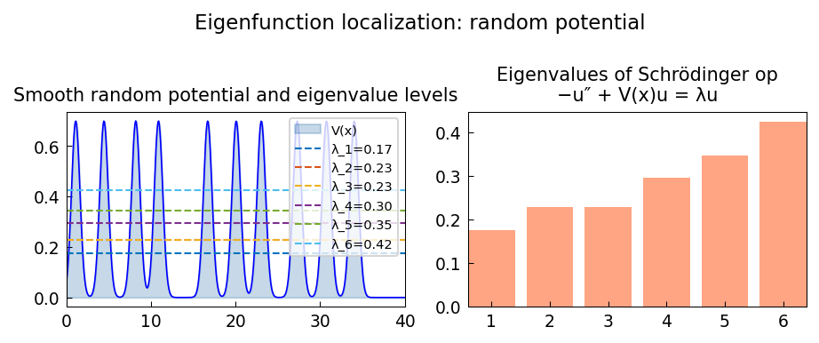

# Landscape function and localization of eigenfunctions

*Nick Trefethen, August 2021*

[Chebfun example](https://www.chebfun.org/examples/ode-eig/landscape.html)

## Overview

Demonstrates eigenfunction localization for the Schrodinger operator with
a random piecewise-constant potential on $[0, 40]$.

The landscape function $u$ solves $Hu = 1$ (with Dirichlet BCs) and
serves as an envelope for the eigenfunctions, explaining their localization.

```python
from chebfunjax.operators.chebop import Chebop

dom = (0.0, 40.0)
# Random potential V(x) via piecewise constants
L = Chebop(lambda x, u: -u.diff(2) + V_func(x)*u, domain=dom)
L.lbc = 0.0; L.rbc = 0.0
lams = L.eigs(k=6)
# Landscape function: solve Hu = 1
u_landscape = L.solve(1.0)
```



