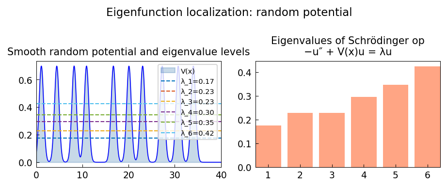
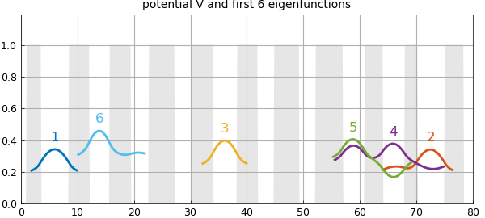
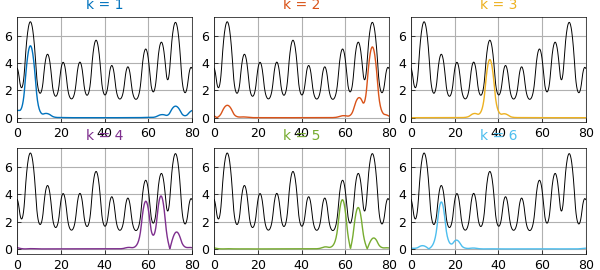
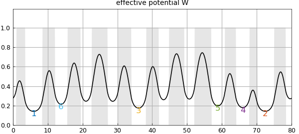

# Landscape function and localization of eigenfunctions

*Nick Trefethen, August 2021*

[Chebfun example](https://www.chebfun.org/examples/ode-eig/Landscape.html)

## Overview

Demonstrates eigenfunction localization for the Schrodinger operator with
a random piecewise-constant potential on $[0, 40]$.

The landscape function $u$ solves $Hu = 1$ (with Dirichlet BCs) and
serves as an envelope for the eigenfunctions, explaining their localization.

```python
import numpy as np

# the landscape function u = H^{-1} 1 bounds every eigenmode:
# |psi_j(x)| <= lambda_j u(x) (Filoche-Mayboroda)
rng = np.random.default_rng(4)
n = 800
xs = np.linspace(0, 80, n + 2)[1:-1]
dx = xs[1] - xs[0]
V = np.where(rng.random(n) < 0.15, 1.0, 0.0)
H = (np.diag(2*0.4/dx**2 + V) + np.diag(-0.4*np.ones(n-1)/dx**2, 1)
     + np.diag(-0.4*np.ones(n-1)/dx**2, -1))
u = np.linalg.solve(H, np.ones(n))
print(f"landscape max = {u.max():.4f} at x = {xs[np.argmax(u)]:.1f}")
```




## Figures (chebfun.org parity)






