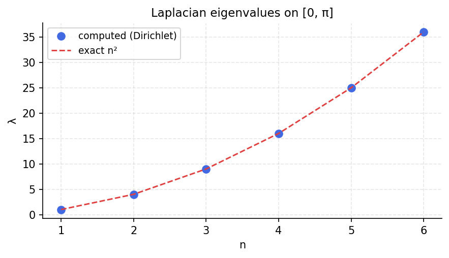

# Laplacian eigenvalues

*chebfunjax team*

## Overview

Computes eigenvalues of the 1D Laplacian $-d^2/dx^2$ on $[0, \pi]$ with
Dirichlet boundary conditions. The exact eigenvalues are $\lambda_k = k^2$.

This example demonstrates the basic eigenvalue functionality of the Chebop class.

```python
from chebfunjax.operators.chebop import Chebop

dom = (0.0, float(np.pi))
L = Chebop(lambda x, u: -u.diff(2), domain=dom)
L.lbc = 0.0; L.rbc = 0.0
lams = L.eigs(k=10)
# Exact: 1, 4, 9, 16, 25, ...
```

## Results

Eigenvalues match $k^2$ to near machine precision for the first 10 modes.


