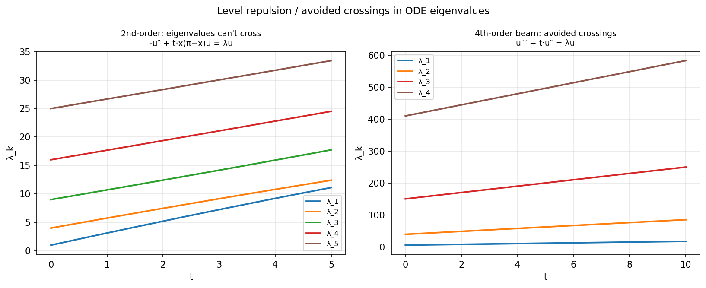

# Avoided crossings for ODE eigenvalues

*Abi Gopal and Nick Trefethen, March 2017*

[Chebfun example](https://github.com/chebfun/examples/blob/master/linalg/LevelRepulsion.m)

## Overview

Demonstrates level repulsion (avoided crossings) for eigenvalues of
parameter-dependent differential operators.

For second-order self-adjoint operators, Sturm-Liouville theory forbids
eigenvalue crossings. Fourth-order operators can have near-crossings,
analogous to pentadiagonal matrices.

```python
from chebfunjax.operators.chebop import Chebop

dom = (0.0, float(np.pi))
for t in np.linspace(0, 5, 30):
    L_t = Chebop(
        lambda x, u: -u.diff(2) + t*x*(np.pi-x)*u,
        domain=dom)
    L_t.lbc = 0.0; L_t.rbc = 0.0
    lams_t = L_t.eigs(k=5)
```



