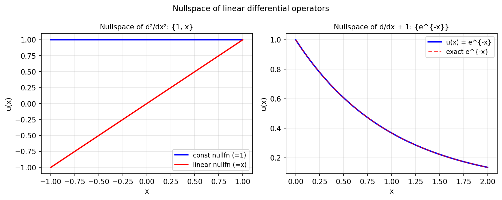

# The nullspace of a linear differential operator

*Nick Hale and Stefan Guettel, December 2011*

[Chebfun example](https://www.chebfun.org/examples/ode-eig/NullSpace.html)

## Overview

Computes the nullspace of differential operators by solving $Lu = 0$
with minimal boundary conditions. Examples include:

- $Lu = u''$: nullspace $= \text{span}\{1, x\}$
- $Lu = u'' + k^2 u$: nullspace $= \text{span}\{\sin(kx), \cos(kx)\}$

```python
from chebfunjax.operators.chebop import Chebop

dom = (-1.0, 1.0)
L1 = Chebop(lambda x, u: u.diff(2), domain=dom)
L1.lbc = 1.0; L1.rbc = 1.0  # picks out constant function
sol_const = L1.solve(0.0)  # should be u = 1

L2 = Chebop(lambda x, u: u.diff(2), domain=dom)
L2.lbc = -1.0; L2.rbc = 1.0  # picks out x
sol_linear = L2.solve(0.0)  # should be u = x
```



