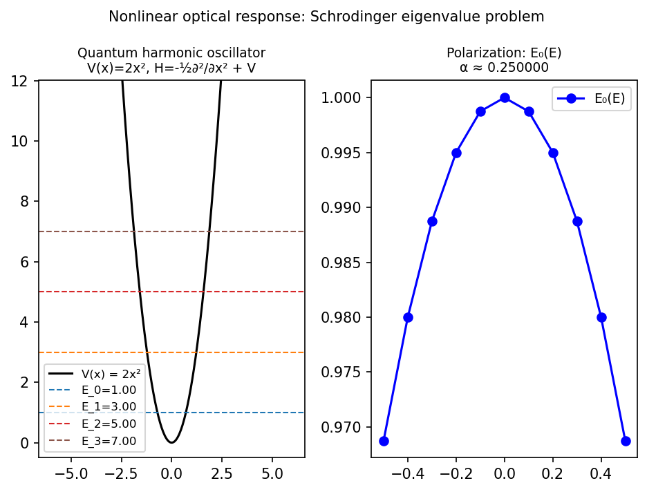

# The nonlinear optical response of a simple molecule

*Jared L. Aurentz and John S. Minor, September 2014*

[Chebfun example](https://www.chebfun.org/examples/ode-eig/OpticalResponse.html)

## Overview

Computes the molecular polarization $P(E)$ of a quantum harmonic oscillator
as a function of applied electric field strength $E$:

$$H(E) = -\frac{1}{2}\frac{\partial^2}{\partial x^2} + 2x^2 + Ex$$

The linear polarizability $\alpha = dP/dE|_{E=0}$ equals $1/(2\omega^3)$
for the harmonic oscillator with frequency $\omega = 2$.

```python
from chebfunjax.operators.chebop import Chebop

dom = (-6.0, 6.0)
for E in np.linspace(-0.5, 0.5, 11):
    HE = Chebop(
        lambda x, u: -0.5*u.diff(2) + 2.0*x**2*u + E*x*u,
        domain=dom)
    HE.lbc = 0.0; HE.rbc = 0.0
    E0 = HE.eigs(k=1)
```



