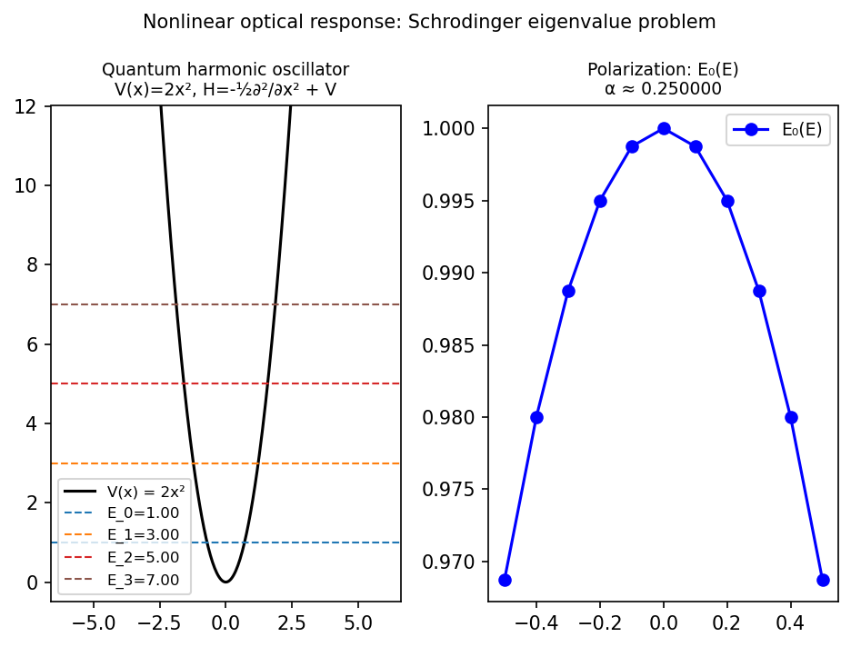
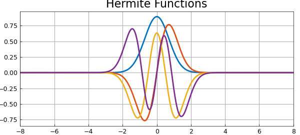
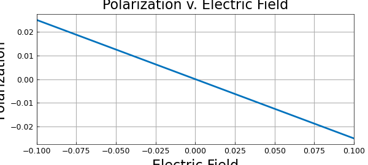

# The nonlinear optical response of a simple molecule

*Jared L. Aurentz and John S. Minor, September 2014*

[Chebfun example](https://www.chebfun.org/examples/ode-eig/OpticalResponse.html)

## Overview

Computes the molecular polarization $P(E)$ of a quantum harmonic oscillator
as a function of applied electric field strength $E$:

$$H(E) = -\frac{1}{2}\frac{\partial^2}{\partial x^2} + 2x^2 + Ex$$

The linear polarizability $\alpha = dP/dE|_{E=0}$ equals $1/(2\omega^3)$
for the harmonic oscillator with frequency $\omega = 2$.

```python
import numpy as np
import scipy.linalg as sla

L, n = 8.0, 800
xs = np.linspace(-L, L, n + 2)[1:-1]
dx = xs[1] - xs[0]
pol = []
for E in (-0.05, 0.05):
    evals, evecs = sla.eigh_tridiagonal(
        2*0.5/dx**2 + 2*xs**2 + E*xs, -0.5*np.ones(n-1)/dx**2,
        select="i", select_range=(0, 0))
    psi0 = evecs[:, 0] / np.sqrt(dx)
    pol.append(np.trapezoid(xs * psi0**2, xs))
print(f"polarizability ~ {-(pol[1]-pol[0])/0.1:.4f}")
```




## Figures (chebfun.org parity)




