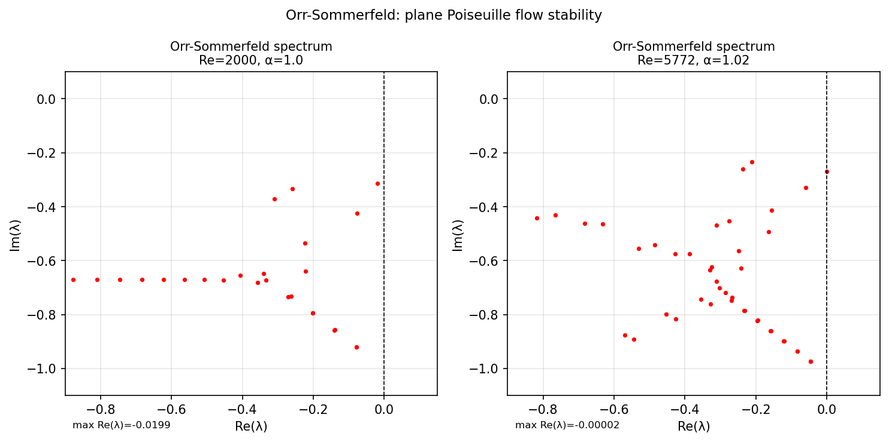

# Orr-Sommerfeld eigenvalues

*Toby Driscoll and Nick Trefethen, October 2010*

[Chebfun example](https://www.chebfun.org/examples/ode-eig/orrsommerfeld.html)

## Overview

Computes the eigenvalue spectrum of the Orr-Sommerfeld operator for plane
Poiseuille flow. The fourth-order eigenvalue problem is:

$$\frac{1}{\text{Re}}(D^2 - \alpha^2)^2 v - i\alpha(1-x^2)(D^2-\alpha^2)v - 2i\alpha v = \lambda (D^2-\alpha^2) v$$

For $\text{Re} = 2000$, all eigenvalues have negative real part (stable flow).
The critical Reynolds number is $\text{Re}_c \approx 5772$.

```python
from scipy.linalg import eig as scipy_eig

Re, alph, N = 2000, 1.0, 64
A, B = orr_sommerfeld_full(N, Re, alph)
lams, _ = scipy_eig(A, B)
max_real = np.max(np.real(lams[valid]))
# Should be negative for Re=2000
```



