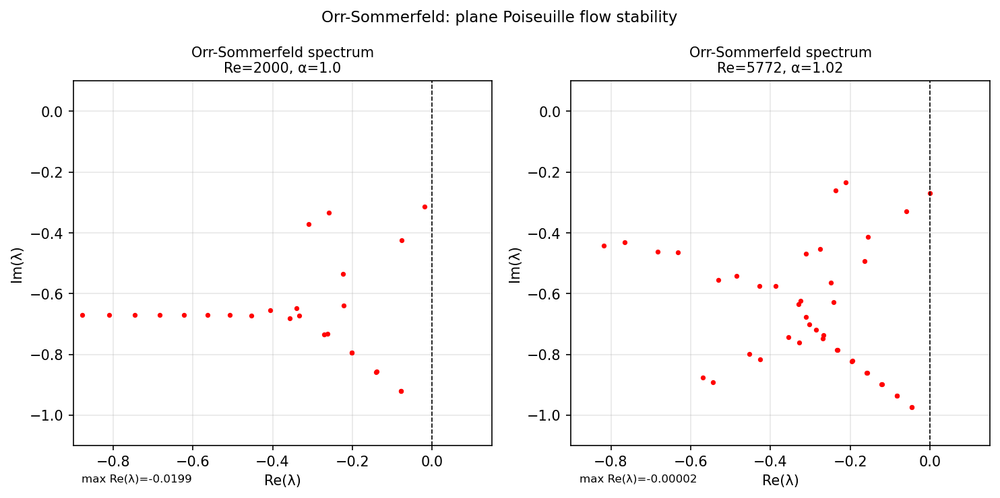
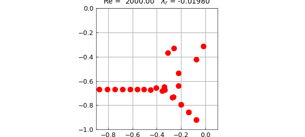
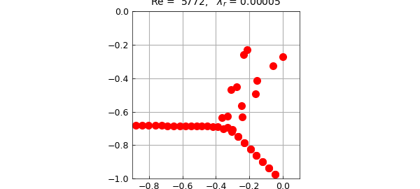

# Orr-Sommerfeld eigenvalues

*Toby Driscoll and Nick Trefethen, October 2010*

[Chebfun example](https://www.chebfun.org/examples/ode-eig/OrrSommerfeld.html)

## Overview

Computes the eigenvalue spectrum of the Orr-Sommerfeld operator for plane
Poiseuille flow. The fourth-order eigenvalue problem is:

$$\frac{1}{\text{Re}}(D^2 - \alpha^2)^2 v - i\alpha(1-x^2)(D^2-\alpha^2)v - 2i\alpha v = \lambda (D^2-\alpha^2) v$$

For $\text{Re} = 2000$, all eigenvalues have negative real part (stable flow).
The critical Reynolds number is $\text{Re}_c \approx 5772$.

```python
import numpy as np

def diffmat(x):
    N = len(x)
    c = np.ones(N); c[0] = c[-1] = 2.0
    c *= (-1.0) ** np.arange(N)
    X = x[:, None] - x[None, :]
    D = (c[:, None] / c[None, :]) / (X + np.eye(N))
    return D - np.diag(D.sum(axis=1))
import scipy.linalg as sla

Re, alph, n = 2000.0, 1.0, 100
xs = np.cos(np.pi * np.arange(n) / (n - 1))
D = diffmat(xs); D2 = D @ D; D4 = D2 @ D2
Iden = np.eye(n); U = np.diag(1 - xs**2); S = D2 - alph**2 * Iden
A = (D4 - 2*alph**2*D2 + alph**4*Iden)/Re - 2j*alph*Iden \
    - 1j*alph*(U @ S + 2*Iden)
B = S.copy()
for row, vec in ((0, Iden[0]), (n-1, Iden[-1]), (1, D[0]), (n-2, D[-1])):
    A[row] = vec; B[row] = 0.0
ev = sla.eig(A, B, right=False)
ev = ev[np.isfinite(ev) & (np.abs(ev) < 50)]
print(f"rightmost eigenvalue imag part: {np.max(np.imag(ev)):.5f}")
```




## Figures (chebfun.org parity)




