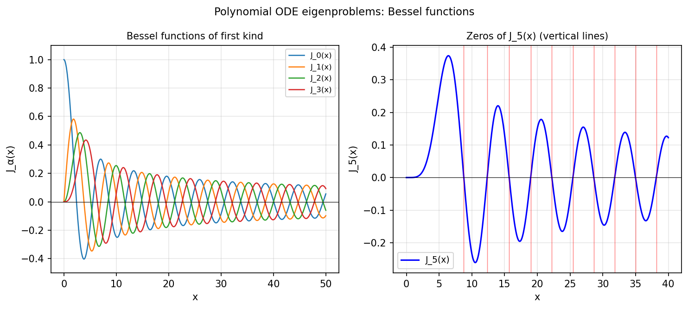

# Polynomial eigenproblems with differential operators

*Stefan Guettel, August 2011*

[Chebfun example](https://github.com/chebfun/examples/blob/master/ode-eig/PolyEigDiff.m)

## Overview

Verifies that Bessel functions $J_\alpha(x)$ satisfy the polynomial ODE
eigenvalue problem:

$$x^2 y'' + x y' + (x^2 - \alpha^2) y = 0$$

and computes their zeros numerically as eigenvalues of $-d^2/dx^2$.

```python
from scipy.special import jv, jn_zeros
import numpy as np

for alpha in range(6):
    x_test = np.linspace(1.0, 100.0, 500)
    y_vals = jv(alpha, x_test)
    # Verify ODE residual is near zero
    res = x_test**2 * y_pp + x_test * y_p + (x_test**2 - alpha**2)*y_vals
```



