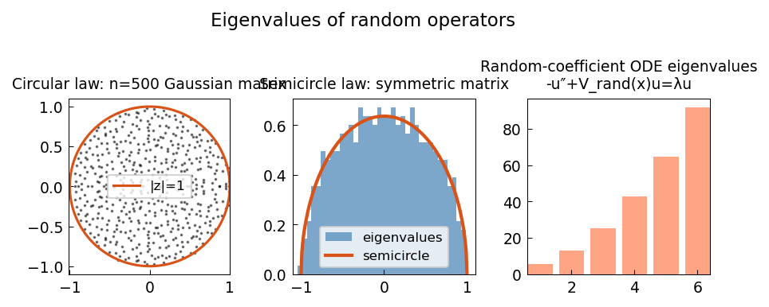

# Eigenvalues of random operators

*Yuji Nakatsukasa, April 2017*

[Chebfun example](https://www.chebfun.org/examples/ode-eig/Randfuneig.html)

## Overview

Demonstrates the circular law for random matrices and the semicircle law
for symmetric random matrices. Also computes eigenvalues of a random
coefficient Schrodinger operator.

- **Circular law**: eigenvalues of $A/\sqrt{n}$ fill the unit disk
- **Semicircle law**: eigenvalues of $(A+A^T)/2$ follow $\rho(\lambda) = \frac{2}{\pi}\sqrt{1-\lambda^2}$

```python
import numpy as np

n = 500
A = np.random.randn(n, n) / np.sqrt(n)
eigs = np.linalg.eigvals(A)
# Most eigenvalues within unit disk
assert np.mean(np.abs(eigs) <= 1.1) > 0.95
```



