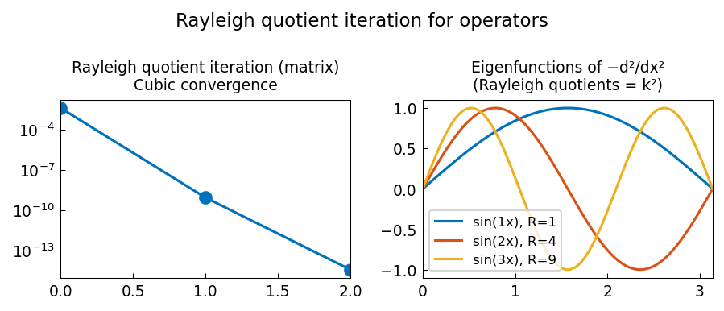

# Rayleigh quotient iteration for an operator

*Nick Hale and Yuji Nakatsukasa, March 2017*

[Chebfun example](https://www.chebfun.org/examples/ode-eig/RayleighQuotient.html)

## Overview

Implements Rayleigh quotient iteration (RQI) for finding an eigenpair
of a symmetric matrix and of the differential operator $L = -d^2/dx^2$.
RQI converges cubically for symmetric problems.

$$\tilde{\lambda} := \tilde{x}^* A \tilde{x}, \quad \tilde{x} := (A - \tilde{\lambda} I)^{-1}\tilde{x} / \|\cdots\|$$

```python
import numpy as np

# RQI for symmetric matrix
v = np.random.randn(n); v /= np.linalg.norm(v)
lam = v @ A @ v
for _ in range(15):
    v = np.linalg.solve(A - lam*np.eye(n), v)
    v /= np.linalg.norm(v)
    lam = v @ A @ v
```



