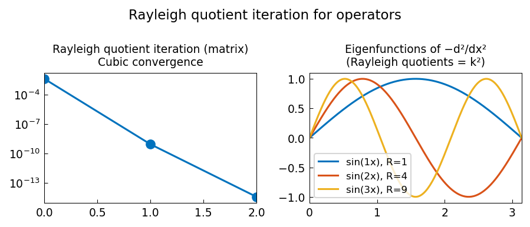
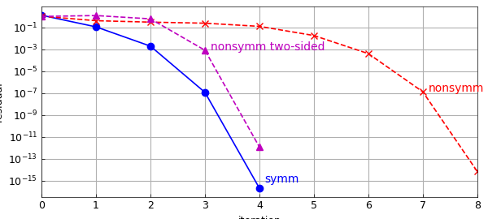
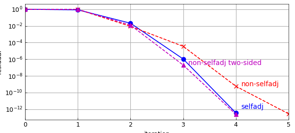

# Rayleigh quotient iteration for an operator

*Nick Hale and Yuji Nakatsukasa, March 2017*

[Chebfun example](https://www.chebfun.org/examples/ode-eig/RayleighQuotient.html)

## Overview

Implements Rayleigh quotient iteration (RQI) for finding an eigenpair
of a symmetric matrix and of the differential operator $L = -d^2/dx^2$.
RQI converges cubically for symmetric problems.

$$\tilde{\lambda} := \tilde{x}^* A \tilde{x}, \quad \tilde{x} := (A - \tilde{\lambda} I)^{-1}\tilde{x} / \|\cdots\|$$

```python
import numpy as np

def diffmat(x):
    N = len(x)
    c = np.ones(N); c[0] = c[-1] = 2.0
    c *= (-1.0) ** np.arange(N)
    X = x[:, None] - x[None, :]
    D = (c[:, None] / c[None, :]) / (X + np.eye(N))
    return D - np.diag(D.sum(axis=1))

n = 200
xs = np.cos(np.pi * np.arange(n) / (n - 1))[::-1] * np.pi / 2 + np.pi / 2
H = -(diffmat(xs) @ diffmat(xs))[1:-1, 1:-1] * (2 / np.pi) ** 0 \
    + np.diag(2 * np.sin(xs[1:-1]) ** 2)
u = np.sin(xs[1:-1]); u /= np.linalg.norm(u)
for it in range(5):
    lam = u @ H @ u
    u = np.linalg.solve(H - lam * np.eye(len(u)), u)
    u /= np.linalg.norm(u)
print(f"Rayleigh quotient after 5 iterations: {u @ H @ u:.10f}")
```




## Figures (chebfun.org parity)




