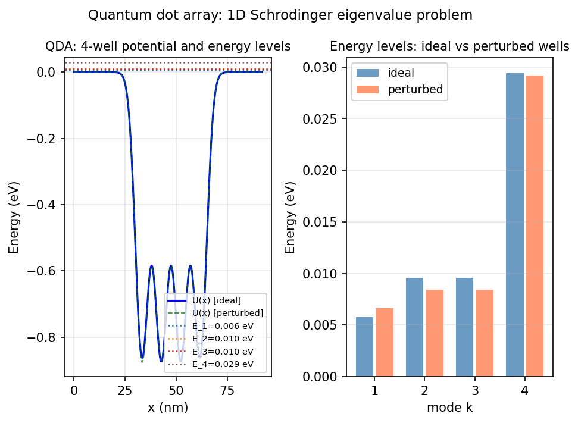

# Model of a quantum dot array for solar energy

*Toby Driscoll, May 2011*

[Chebfun example](https://www.chebfun.org/examples/ode-eig/SolarQDA.html)

## Overview

Solves the 1D Schrodinger eigenvalue problem for a quantum dot array (QDA)
used in solar energy capture. The potential $U(x)$ consists of piecewise-constant
wells (InAs) and barriers (GaAs):

$$-\frac{\hbar^2}{2m(x)} \psi'' + U(x) \psi = E \psi$$

The bound states (E < 0) are the allowed energy levels for electron transport.

```python
from chebfunjax.operators.chebop import Chebop

L = Chebop(
    lambda x, u: -hbar2_over_2m * u.diff(2) + U_func(x) * u,
    domain=(0.0, total_width))
L.lbc = 0.0; L.rbc = 0.0
energies = L.eigs(k=4)  # 4 bound states for 4 wells
```



