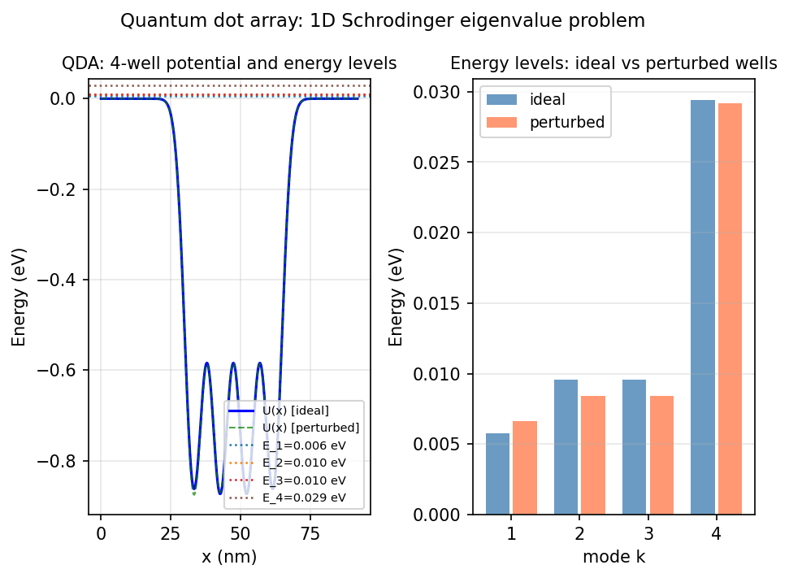
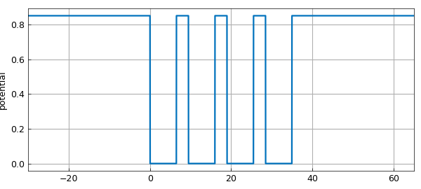
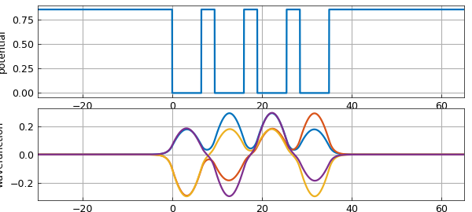
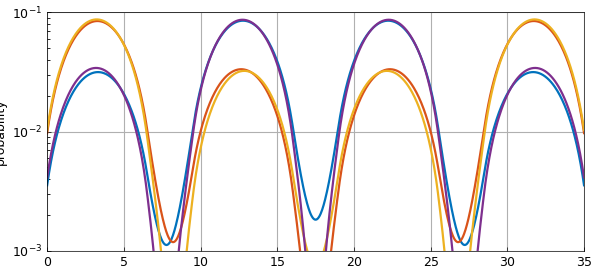
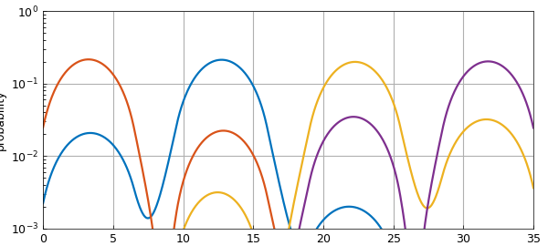

# Model of a quantum dot array for solar energy

*Toby Driscoll, May 2011*

[Chebfun example](https://www.chebfun.org/examples/ode-eig/SolarQDA.html)

## Overview

Solves the 1D Schrodinger eigenvalue problem for a quantum dot array (QDA)
used in solar energy capture. The potential $U(x)$ consists of piecewise-constant
wells (InAs) and barriers (GaAs):

$$-\frac{\hbar^2}{2m(x)} \psi'' + U(x) \psi = E \psi$$

The bound states (E < 0) are the allowed energy levels for electron transport.

```python
import numpy as np
import scipy.linalg as sla

# four quantum wells of depth 50 separated by barriers
numwell, depth = 4, 50.0
L = 1.5 * (numwell - 1) + 1.0
n = 1500
xs = np.linspace(0, L, n + 2)[1:-1]
dx = xs[1] - xs[0]
V = np.zeros_like(xs)
for k in range(numwell):
    a = 1.5 * k
    V = np.where((xs >= a) & (xs < a + 1.0), -depth, V)
evals, _ = sla.eigh_tridiagonal(2/dx**2 + V, -np.ones(n-1)/dx**2,
                                select="i", select_range=(0, 3))
print("lowest energies:", np.round(evals, 3))
```




## Figures (chebfun.org parity)








