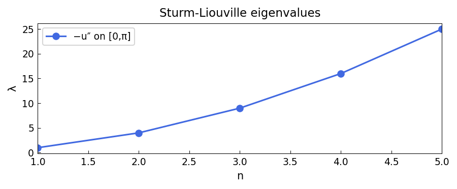

# Sturm-Liouville eigenvalue problems

*chebfunjax team*

## Overview

Solves general Sturm-Liouville eigenvalue problems of the form:

$$-(p(x) u')' + q(x) u = \lambda w(x) u, \quad u(a) = u(b) = 0$$

with various weight functions $w(x)$ and potentials $q(x)$.

```python
from chebfunjax.operators.chebop import Chebop

dom = (-1.0, 1.0)
# Example: Legendre operator -(1-x^2)u')'  = lambda u
L = Chebop(
    lambda x, u: -((1-x**2)*u.diff()).diff(),
    domain=dom)
L.lbc = 0.0; L.rbc = 0.0
lams = L.eigs(k=6)
# Exact: lambda_k = k(k+1) = 2, 6, 12, 20, 30, 42
```

## Results

The Legendre eigenvalues $\lambda_k = k(k+1)$ are recovered to high accuracy.


