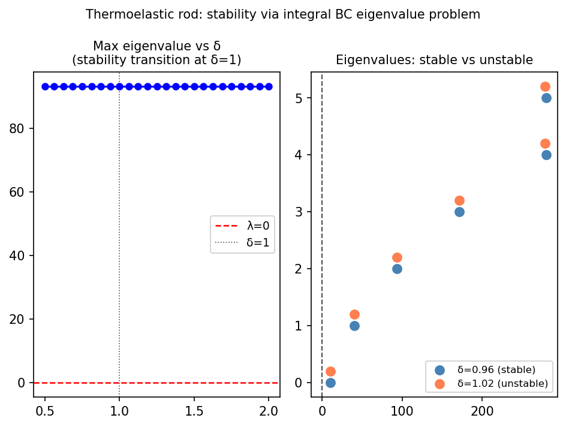

# Stability of a thermoelastic rod

*Toby Driscoll, November 2011*

[Chebfun example](https://www.chebfun.org/examples/ode-eig/ThermoelasticRod.html)

## Overview

Eigenvalue problem with an integral boundary condition modeling
thermoelastic rod stability:

$$\phi''(x) = \lambda \phi(x), \quad \phi(0) = 0, \quad \phi'(1) + \phi(1) = 4\delta\int_0^1 \phi(x)\,dx$$

The transition from stable (all $\text{Re}(\lambda) < 0$) to unstable
occurs at $\delta = 1$.

```python
from scipy.linalg import eig as scipy_eig

# Matrix discretization with integral BC
A_mat, B_mat = build_thermoelastic_matrices(delta, N=48)
lams, _ = scipy_eig(A_mat, B_mat)
max_real = np.max(np.real(lams[np.isfinite(lams)]))
```



