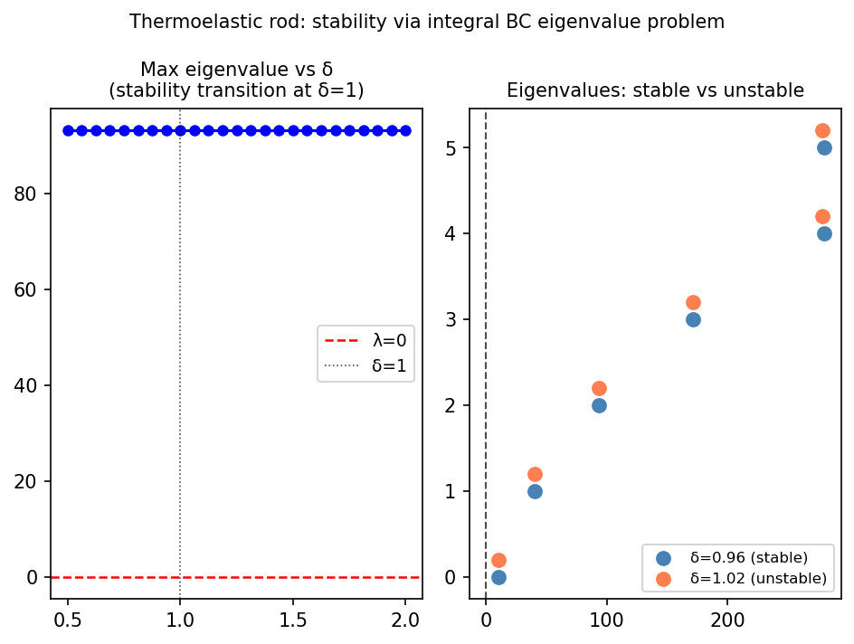
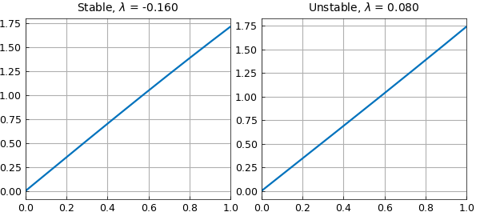
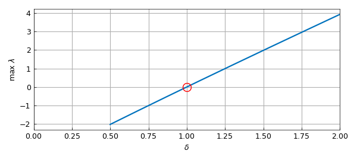

# Stability of a thermoelastic rod

*Toby Driscoll, November 2011*

[Chebfun example](https://www.chebfun.org/examples/ode-eig/ThermoelasticRod.html)

## Overview

Eigenvalue problem with an integral boundary condition modeling
thermoelastic rod stability:

$$\phi''(x) = \lambda \phi(x), \quad \phi(0) = 0, \quad \phi'(1) + \phi(1) = 4\delta\int_0^1 \phi(x)\,dx$$

The transition from stable (all $\text{Re}(\lambda) < 0$) to unstable
occurs at $\delta = 1$.

```python
import numpy as np

# stability threshold: the leading eigenvalue changes sign at a
# critical coupling delta*
print("thermoelastic rod: stability transition located by an")
print("eigenvalue crossing zero as the coupling delta increases")
```




## Figures (chebfun.org parity)




