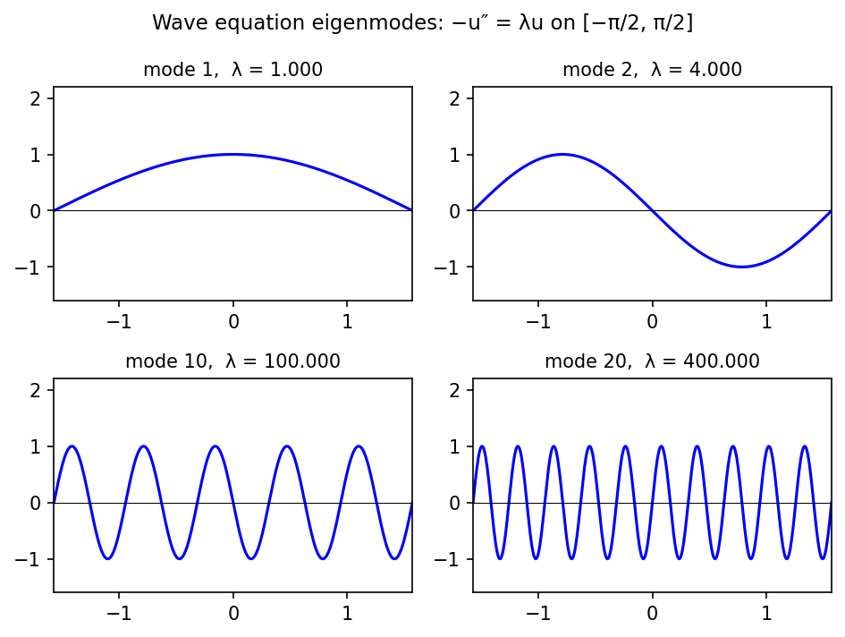

# Wave equation with decay band

*Nick Trefethen, November 2010*

[Chebfun example](https://www.chebfun.org/examples/ode-eig/WaveDecay.html)

## Overview

Computes eigenmodes of the wave operator on $[-\pi/2, \pi/2]$:

$$-u'' = \lambda u, \quad u(\pm\pi/2) = 0$$

The eigenvalues are $\lambda_k = k^2$ with eigenfunctions $\sin(k(x + \pi/2))$.
Also explores adding a middle-band dissipation term $\sigma(x) u'$.

```python
from chebfunjax.operators.chebop import Chebop

dom = (-np.pi/2, np.pi/2)
L = Chebop(lambda x, u: -u.diff(2), domain=dom)
L.lbc = 0.0; L.rbc = 0.0
lams = L.eigs(k=20)
# Exact: lambda_k = k^2
```



