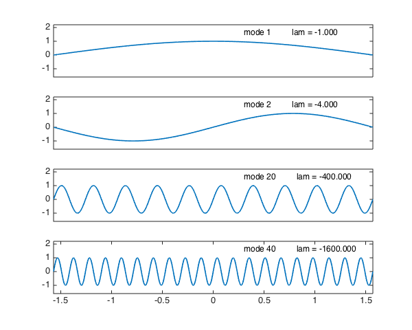
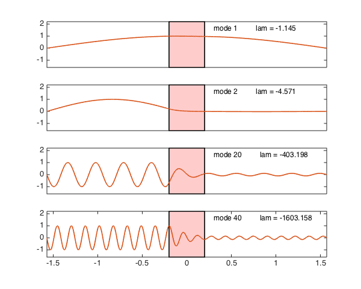

<!-- Generated by scripts/sync_chebfun_examples.py. -->
<!-- Source: https://www.chebfun.org/examples/ode-eig/WaveDecay.html -->

<h1>Wave equation with decay band</h1>
<h2>Nick Trefethen, November 2010 in <a href='../'>ode-eig</a><a href='/examples/ode-eig/WaveDecay.m'>download</a>&middot;<a href='//github.com/chebfun/examples/blob/master/ode-eig/WaveDecay.m'>view on GitHub</a></h2>

Here are eigenmodes $1$, $2$, $10$, $20$ of the wave equation on $[-\pi/2,\pi/2]$:

<pre class="mcode-input">FS = 'fontsize'; fs = 12;
figure('position', [0 0 600 480])
L = chebop(-pi/2,pi/2);
L.op = @(u) diff(u,2);
L.bc = 'dirichlet';
nn = [1 2 20 40]; nmax = max(nn);
[V,D] = eigs(L,nmax);
d = diag(D); [d,ii] = sort(d,'descend'); V = V(:,ii');
for j = 1:4
  n = nn(j);
  v = V(:,n);                 % pick out nth eigenvector
  v = v/norm(v,inf);          % normalize to have amplitude 1
  lam = d(n);                 % nth eigenvalue
  subplot(4,1,j)
  plot(v)
  axis([-pi/2 pi/2 -1.6 2.2])
  if j &lt; 4, set(gca,'xtick',[]), end
  text(.3,1.6,sprintf('mode %d         lam = %6.3f',n,lam),FS,fs)
end</pre>

Here are the same, but for the wave equation with a decay band:

<pre class="mcode-input">clf
a = 0.2;
x = chebfun('x',[-pi/2 pi/2]);
middle = (abs(x)&lt;=a);
L.op = @(x,u) diff(u,2) + (2/a)*middle.*diff(u);   % decay band
nn = [1 2 20 40]; nmax = max(nn);
[V,D] = eigs(L,nmax);
d = diag(D); [d,ii] = sort(d,'descend'); V = V(:,ii');
for j = 1:4
  n = nn(j);
  v = V(:,n);                 % pick out nth eigenvector
  v = v/norm(v,inf);          % normalize to have amplitude 1
  lam = d(n);                 % nth eigenvalue
  subplot(4,1,j)
  hold off, fill(a*[-1 1 1 -1],[-1.6 -1.6 2.2 2.2],[1 .8 .8])
  hold on, plot(v)
  axis([-pi/2 pi/2 -1.6 2.2])
  if j &lt; 4, set(gca,'xtick',[]), end
  text(.3,1.6,sprintf('mode %d         lam = %6.3f',n,lam),FS,fs)
end</pre>

        

    

