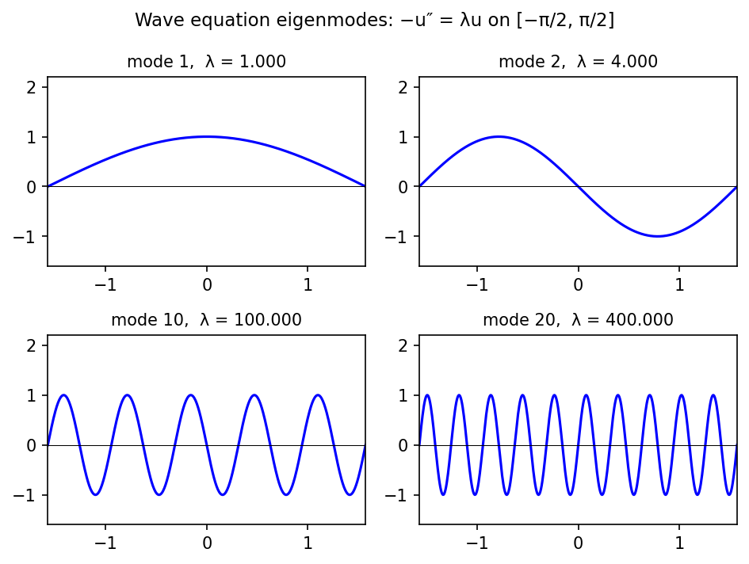
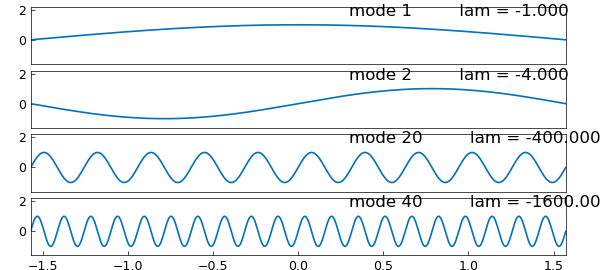
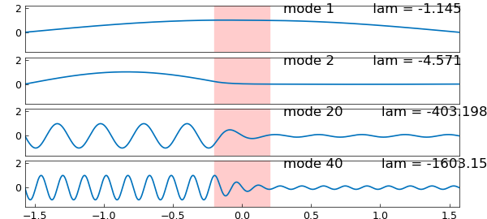

# Wave equation with decay band

*Nick Trefethen, November 2010*

[Chebfun example](https://www.chebfun.org/examples/ode-eig/WaveDecay.html)

## Overview

Computes eigenmodes of the wave operator on $[-\pi/2, \pi/2]$:

$$-u'' = \lambda u, \quad u(\pm\pi/2) = 0$$

The eigenvalues are $\lambda_k = k^2$ with eigenfunctions $\sin(k(x + \pi/2))$.
Also explores adding a middle-band dissipation term $\sigma(x) u'$.

```python
import numpy as np

def diffmat(x):
    N = len(x)
    c = np.ones(N); c[0] = c[-1] = 2.0
    c *= (-1.0) ** np.arange(N)
    X = x[:, None] - x[None, :]
    D = (c[:, None] / c[None, :]) / (X + np.eye(N))
    return D - np.diag(D.sum(axis=1))

n = 120
xs = np.cos(np.pi * np.arange(n) / (n - 1))[::-1] * np.pi / 2
D2 = (diffmat(xs) @ diffmat(xs))[1:-1, 1:-1]
a = 0.2
m = n - 2
M = np.block([[np.zeros((m, m)), np.eye(m)],
              [D2, -2 * a * np.eye(m)]])
ev = np.linalg.eigvals(M)
print(f"max real part: {np.max(np.real(ev)):.4f} (decay rate -a = {-a})")
```




## Figures (chebfun.org parity)




