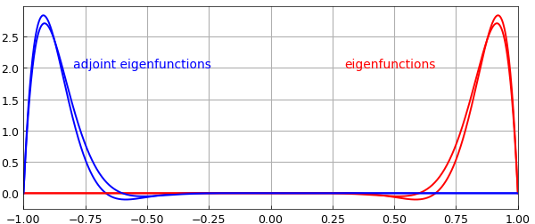

# Adjoint of a linear operator

*Yuji Nakatsukasa, February 2017*

[Original MATLAB Chebfun example](https://www.chebfun.org/examples/ode-linear/Adjoints.html)

Python translation: [`examples/ode-linear/adjoints.py`](https://github.com/ma-gilles/chebfunjax/blob/main/examples/ode-linear/adjoints.py)

[revised June 2019]

## 1. Adjoint of a chebop

Let $L$ be a linear operator on the Hilbert space $H=L_2[-1,1]$ together with homogeneous boundary conditions. The adjoint of $L^\ast$ is defined as another operator, together with another set of homogeneous boundary conditions, such that $$(v,Lu)= (L^\ast v,u) $$ for all $u,v\in H$ such that $u$ satisfies the boundary condition of $L$ and $v$ satisfies the boundary condition of $L^\ast$. Since version 5.6, Chebfun has been able to compute the adjoint of a linear operator represented as a chebop by the command `adjoint`. The operator adjoint is a classical subject [3], and the mathematical background for Chebfun's `adjoint` is summarized in [2]. The programming was done by Jared Aurentz, and much of this example is taken from a talk by him at a seminar in 2016 at Oxford.

For example, here is the adjoint of the first derivative operator with a Dirichlet boundary condition at the left boundary.

```matlab
L = chebop([-1 1]);
L.op = @(u) diff(u);         % u'
L.lbc = 0
Ls = adjoint(L)
```

```text
L =
   Linear operator:
      u |--> diff(u)
   operating on chebfun objects defined on:
      [-1,1]
   with
    left boundary condition(s):
      u = 0
Ls =
   Linear operator:
      v |--> -diff(v)
   operating on chebfun objects defined on:
      [-1,1]
   with
    right boundary condition(s):
      v = 0
```

Note the sign change in the operator, which comes from integration by parts. Note also the change in the boundary condition, which has switched from an initial condition $u(-1)=0$ to a final condition $v(1)=0$. Let's check that the adjoint condition is satisfied:

```matlab
x = chebfun('x');
u = (x+1)*sin(x);            % function with u(-1) = 0
v = (x-1)*exp(x);            % function with v(1) = 0
format short
abs(v'*(L*u) - (Ls*v)'*u)
```

```text
ans =
   6.661e-16
```

For self-adjoint operators with self-adjoint boundary conditions, the adjoint is itself:

```matlab
L = chebop([-1 1]);
L.op = @(u) diff(u,2)+u;     % u"+u
L.lbc = 0; L.rbc = 0;
Ls = adjoint(L)
```

```text
Ls =
   Linear operator:
      v |--> diff(v,2)+v
   operating on chebfun objects defined on:
      [-1,1]
   with
    left boundary condition(s):
      v = 0
    right boundary condition(s):
      v = 0
```

## 2. Adjoint boundary conditions

With the same operator, if we change the boundary conditions so that we have an initial value problem, the problem is no longer self-adjoint and the adjoint becomes a final value problem (as we saw above). The adjoint operator is still the formal adjoint $L^\ast v=v''+v$.

```matlab
L = chebop([-1 1]);
L.op = @(u) diff(u,2)+u;
L.lbc = [1;0]               % IVP with both BCs at left end
Ls = adjoint(L)
```

```text
L =
   Linear operator:
      u |--> diff(u,2)+u
   operating on chebfun objects defined on:
      [-1,1]
   with
    left boundary condition(s):
      u  = 1
      u' = 0
```

If there's only one (more generally $k$) boundary condition in $L$, then the adjoint will have $2d-1=3$ (or $2d-k$) boundary conditions, where $d$ is the order of the differential operator (here 2).

```matlab
L.lbc = 1;                  % just one BC
Ls = adjoint(L)
```

```text
Ls =
   Linear operator:
      v |--> diff(v,2)+v
   operating on chebfun objects defined on:
      [-1,1]
   with
    right boundary condition(s):
      [v;diff(v)] = 0
Ls =
   Linear operator:
      v |--> diff(v,2)+v
   operating on chebfun objects defined on:
      [-1,1]
   with
    left boundary condition(s):
      v = 0
    right boundary condition(s):
      [v;diff(v)] = 0
```

The boundary conditions of the original and adjoint operators are related in an intricate manner, with those of the adjoint satisfying a null vector condition involving a so-called complementarity matrix. For details, see [2,3].

Let's try an operator with variable coefficients.

```matlab
L = chebop([-1 1]);
L.op = @(x,u) x*diff(u,2);  % xu"
L.lbc = 0; L.rbc = 0
Ls = adjoint(L)
```

```text
L =
   Linear operator:
      u |--> x.*diff(u,2)
   operating on chebfun objects defined on:
      [-1,1]
   with
    left boundary condition(s):
      u = 0
    right boundary condition(s):
      u = 0
Ls =
   Linear operator:
      v |--> a11_2.*diff(v,2)+a11_1.*diff(v)
   operating on chebfun objects defined on:
      [-1,1]
   with
    left boundary condition(s):
      v = 0
    right boundary condition(s):
      v = 0
```

The formal adjoint here is $L^\ast v = (xv)''$. Note that the Chebfun display of $L^\ast$ is not very informative, as one can't see what the variable coefficients are. This happens because Chebfun is a numerical system, not symbolic: its representation of each coefficient function is not an algebraic expression but a Chebyshev series that aims for the usual 16-digit accuracy.

Let's check that the adjoint equation is satisfied.

```matlab
x = chebfun('x');
u = (x^2-1)*sin(x);
v = (x^2-1)*exp(x);
abs(v'*(L*u) - (Ls*v)'*u)
```

```text
ans =
   6.6613e-16
```

## 3. Eigenvalues and eigenfunctions of the adjoint

The eigenvalues of an operator and its adjoint are complex conjugates of each other, so if the eigenvalues are real, then they are the same for $L$ and $L^\ast$. Let's verify this a with non-self-adjoint example, an advection-diffusion operator.

```matlab
L = chebop([-1 1]);
L.op = @(x,u) diff(u,2) - 20*diff(u) + u;
L.lbc = 0; L.rbc = 0;
Ls = adjoint(L);

[V,D] = eigs(L,'sm');
[Vs,Ds] = eigs(Ls,'sm');

[diag(D) diag(Ds)]
```

```text
ans =
 -187.8264 -187.8264
 -160.6850 -160.6850
 -138.4784 -138.4784
 -121.2066 -121.2066
 -108.8696 -108.8696
 -101.4674 -101.4674
```

Since if $Lx=\lambda x$ and $L^\ast y=\bar{\mu} y$ then $(y,Lx) = \bar{\lambda}(y,x)$ and $(L^\ast y,x) =\mu(y,x)$, it follows that if $\lambda\neq \mu$, then $(y,x)=0$, i.e., left and right eigenfunctions corresponding to different eigenvalues are orthogonal. We can confirm this as follows:

```matlab
Vs'*V
```

```text
ans =
[[ 1.7526e-07  1.5394e-14 -8.5792e-15 -6.5765e-15  5.8636e-15  5.6383e-15]
 [ 3.9863e-14  2.1610e-07  4.5076e-14  2.4732e-14 -1.8744e-14 -1.6473e-14]
 [ 3.7356e-14  7.9168e-14  2.9128e-07  9.2455e-14 -5.2589e-14 -4.1616e-14]
 [-3.8442e-14 -6.2062e-14  1.3416e-13  4.5371e-07  1.7272e-13  1.0613e-13]
 [-3.9869e-14 -5.8361e-14  9.6427e-14  2.1895e-13  9.1780e-07  3.4361e-13]
 [ 4.0864e-14  5.7432e-14 -8.6684e-14 -1.5330e-13  3.9169e-13  3.4239e-06]]
```

Let's plot the first two eigenfunctions of $L$ and of $L^\ast$. Note that the curves are symmetric about the origin.

```matlab
for ii = 1:2
    v = V{ii}; if v(.9) < 0, v = -v; end
    plot(v,'r'), hold on
    vs = Vs{ii}; if vs(-.9) < 0, vs = -vs; end
    plot(vs,'b')
end
text(-.8,2,'adjoint eigenfunctions','color','b')
text(.3,2,'eigenfunctions','color','r')
shg
```



The first eigenfunction is very far from orthogonal to the second --- in fact, they are nearly the same:

```matlab
V(:,2)'*V(:,1)
```

```text
ans =
    0.9944
```

There is a lot of physics in a figure like this; see chapter 12 of [1]. The concentration of the eigenfunctions at the right boundary reflects the fact that this operator governs rightward propagation, and solutions tend to "pile up" at the right boundary before eventually being absorbed by the diffusion. The concentration of the adjoint eigenfunctions at the left boundary reflects that fact that if you want to control a solution, the most effective place to insert a signal is at the left.

## References

1. M. Embree and L. N. Trefethen, *Spectra and Pseudospectra: The Behavior of Nonnormal Matrices and Operators*, Princeton U. Press, 2005.
2. Hrothgar, *Block Operators and Continuous Adjoint Methods*, transfer thesis, Dept. of Mathematics, U. of Oxford, 2015.
3. I. Stakgold and M. J. Holst. *Green's Functions and Boundary Value Problems*, John Wiley & Sons, 2011.

---

*Translated with [chebfunjax](https://github.com/ma-gilles/chebfunjax); prose and MATLAB code from the original example, copyright The University of Oxford and The Chebfun Developers.  Printed outputs and figures are chebfunjax's.*
