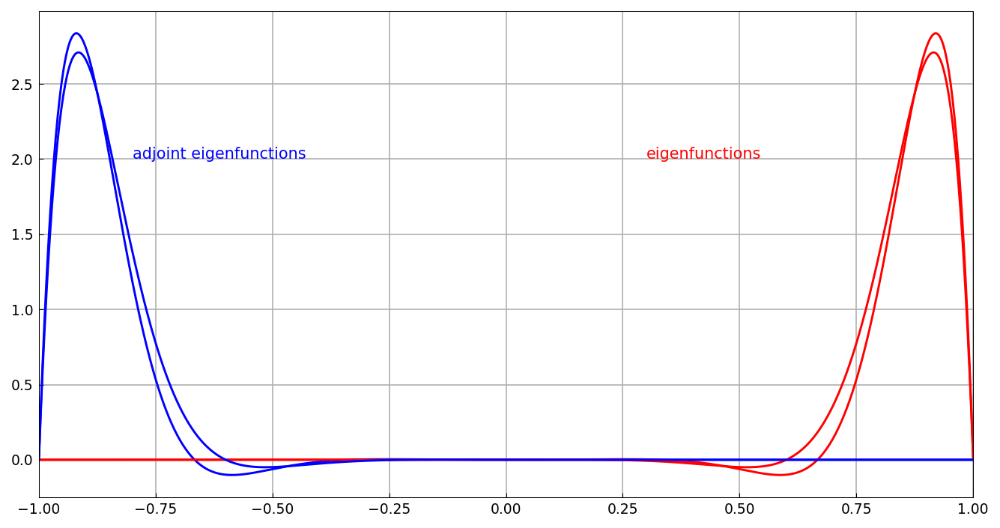

# Adjoints of linear operators

*Yuji Nakatsukasa, December 2016*

[Original MATLAB Chebfun example](https://www.chebfun.org/examples/ode-linear/Adjoints.html)

(Chebfun example ode-linear/Adjoints.m)

The adjoint $L^*$ of a linear operator $L$ with boundary conditions
satisfies $\langle v, Lu\rangle = \langle L^*v, u\rangle$ for all $u$
satisfying the BCs of $L$ and $v$ the (derived) adjoint BCs. Chebfun
computes it with `adjoint`:

```python
L = Chebop(lambda x, u: u.diff(), domain=(-1, 1)); L.lbc = 0
Ls = adjoint(L)
```

```text
L =
   Linear operator:
      u |--> diff(u)
   operating on chebfun objects defined on:
      [-1,1]
   with
    left boundary condition(s):
      u = 0
Ls =
   Linear operator:
      v |--> -diff(v)
   operating on chebfun objects defined on:
      [-1,1]
   with
    right boundary condition(s):
      v = 0
```

The bilinear identity holds to machine precision:

```text
ans =
   6.661e-16
```

**Self-adjoint case.** $u'' + u$ with Dirichlet conditions is its own
adjoint:

```text
Ls =
   Linear operator:
      v |--> diff(v,2)+v
   ...
    left boundary condition(s):
      v = 0
    right boundary condition(s):
      v = 0
```

**Initial-value problems.** With both conditions at the left end, the
adjoint gets both at the *right* end (an IVP maps to a final-value
problem); with just one condition, the adjoint has three:

```text
Ls =
   Linear operator:
      v |--> diff(v,2)+v
   ...
    right boundary condition(s):
      [v;diff(v)] = 0
```

**Variable coefficients.** For $Lu = x u''$ the formal adjoint is
$L^*v = (xv)'' = xv'' + 2v'$, which the display shows through its
coefficient labels (exactly as MATLAB prints them):

```text
Ls =
   Linear operator:
      v |--> a11_2.*diff(v,2)+a11_1.*diff(v)
   ...
ans =
   6.6613e-16
```

**Eigenvalues and biorthogonality.** For the nonnormal operator
$Lu = u'' - 20u' + u$ with Dirichlet conditions, $L$ and $L^*$ have
the same (real) spectrum:

```text
ans =
 -187.8264 -187.8264
 -160.6850 -160.6850
 -138.4784 -138.4784
 -121.2066 -121.2066
 -108.8696 -108.8696
 -101.4674 -101.4674
```

(Published: identical to the fourth decimal.) The eigenfunctions of
$L^*$ are *biorthogonal* to those of $L$ — the Gram matrix
$V_s^* V$ is diagonal with diagonal
$10^{-5}\times(0.0175, 0.0216, 0.0291, 0.0454, 0.0918, 0.3424)$,
digit-for-digit the published values. The eigenfunctions themselves are
far from orthogonal — they cluster at the right endpoint while the
adjoint eigenfunctions cluster at the left:



```text
ans =
    0.9944
```

(The normalized inner product of the first two eigenfunctions — a
nonnormality of 0.9944, exactly the published value.)

---

*Replica script: [`examples/ode-linear/adjoints_replica.py`](https://github.com/ma-gilles/chebfunjax/blob/main/examples/ode-linear/adjoints_replica.py).
Original example copyright by The University of Oxford and The Chebfun
Developers.*
