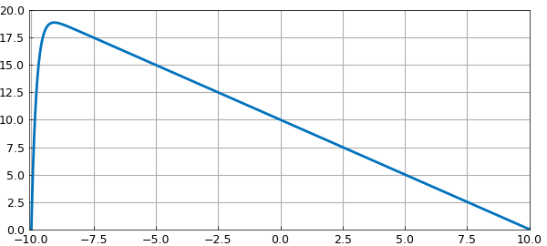
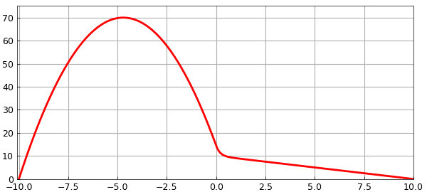
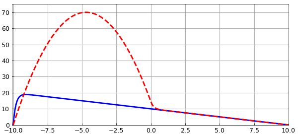

# Advection-diffusion equation with a jump

*Nick Trefethen, November 2010*

[Original MATLAB Chebfun example](https://www.chebfun.org/examples/ode-linear/AdvDiffJump.html)

Python translation: [`examples/ode-linear/adv_diff_jump.py`](https://github.com/ma-gilles/chebfunjax/blob/main/examples/ode-linear/adv_diff_jump.py)

The solution to the advection-diffusion problem

$$ 0.2u'' + u' = -1, ~~ u(-10) = u(10) = 1 $$

has a boundary layer at the left:

```matlab
LW = 'linewidth'; lw = 2; FS = 'fontsize'; fs = 8;
N = chebop(-10,10);
N.op = @(u) 0.2*diff(u,2) + diff(u);
N.bc = 'dirichlet';
u = N\-1;
plot(u,LW,lw), grid on
axis([-10.1 10 0 20])
```



Suppose the advection is only turned on on the right half of the domain?

```matlab
figure
N.op = @(x,u) 0.2*diff(u,2) + (x>=0).*diff(u);
N.bc = 'dirichlet';
v = N\-1;
plot(v,'r',LW,lw), grid on
axis([-10.1 10 0 75])
```



For fun we can plot both solutions on the same axis.

```matlab
plot(u,'b',v,'--r',LW,lw), grid on
axis([-10.1 10 0 75])
```



---

*Translated with [chebfunjax](https://github.com/ma-gilles/chebfunjax); prose and MATLAB code from the original example, copyright The University of Oxford and The Chebfun Developers.  Printed outputs and figures are chebfunjax's.*
