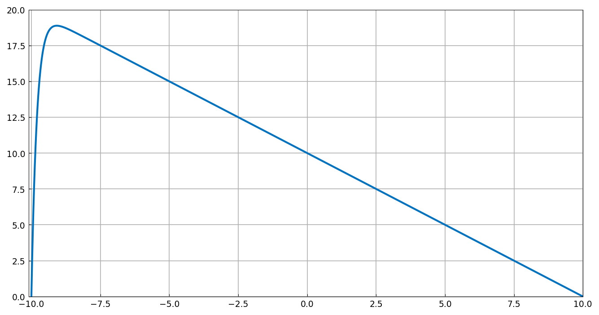
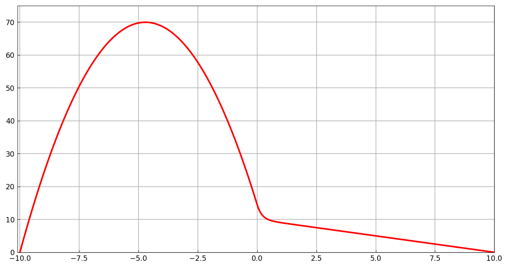
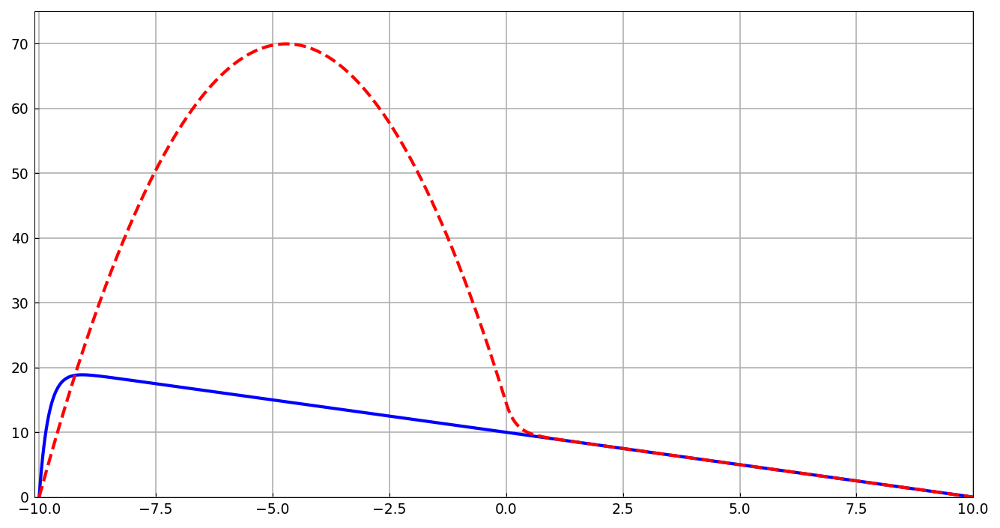

# Advection-diffusion equation with a jump

*Nick Hale, November 2014*

[Original MATLAB Chebfun example](https://www.chebfun.org/examples/ode-linear/AdvDiffJump.html)

(Chebfun example ode-linear/AdvDiffJump.m)

Consider the steady advection-diffusion equation

$$ 0.2 u'' + b(x)\,u' = -1, \qquad u(-10) = u(10) = 0. $$

With constant advection $b = 1$ the solution rises linearly from the
right and drops through an $O(\epsilon)$ boundary layer at the left:

```python
N = Chebop(lambda x, u: 0.2*u.diff(2) + u.diff(), domain=(-10, 10))
N.bc = 'dirichlet'
u = N.solve(-1.0)
```



Now switch the advection off on the left half:
$b(x) = \mathbb{1}_{x \ge 0}$. The discontinuous coefficient injects a
breakpoint at $x = 0$, and the solve routes through the piecewise
discretization automatically:

```python
N = Chebop(lambda x, u: 0.2*u.diff(2) + (x >= 0)*u.diff(), domain=(-10, 10))
```



On the pure-diffusion left half the solution is a large parabolic arc
joined with $C^1$ continuity to the advection-dominated right half
($v(0) = 14.5098039215687$, verified against scipy `solve_bvp` at
`tol=1e-10` to 1e-11). Overlaying both solutions:



---

*Replica script: [`examples/ode-linear/adv_diff_jump_replica.py`](https://github.com/ma-gilles/chebfunjax/blob/main/examples/ode-linear/adv_diff_jump_replica.py).
Original example copyright by The University of Oxford and The Chebfun
Developers.*
