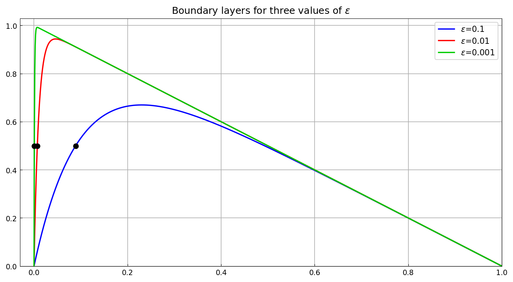
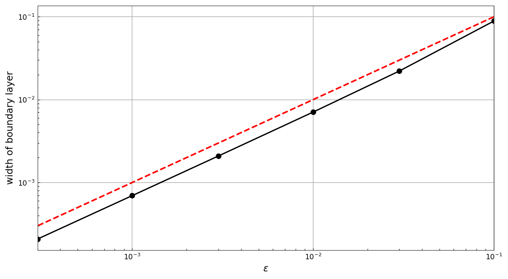

# Boundary layer for advection-diffusion equation

*Nick Trefethen, October 2010*

[Original MATLAB Chebfun example](https://www.chebfun.org/examples/ode-linear/BoundaryLayer.html)

(Chebfun example ode-linear/BoundaryLayer.m)

Consider the steady-state linear advection-diffusion equation

$$ L_\epsilon u = -\epsilon u'' - u' = 1, \qquad u(0) = u(1) = 0, $$

where $\epsilon > 0$ is the diffusion constant. The solution has a
boundary layer of width $O(\epsilon)$ near $x = 0$; here it is computed
for $\epsilon = 0.1, 0.01, 0.001$:

```python
def L(eps):
    N = Chebop(lambda x, u: -eps*u.diff(2) - u.diff(), domain=(0, 1))
    N.bc = 'dirichlet'
    return N
```

We measure the width of the boundary layer as the point where the
solution crosses 1/2, found with `roots`:

```text
w =
   0.088880675019137   0.007073961393024   0.000694537220774
```

(Published: `0.088880675019131  0.007073961393037  0.000694537220659` —
12-13 digit agreement; last digits differ in the rounding of the linear
solve.)



Varying $\epsilon$ over $[0.1, 0.03, 0.01, 0.003, 0.001, 0.0003]$
confirms the linear scaling of the layer width (dashed line:
$w = \epsilon$):



---

*Replica script: [`examples/ode-linear/boundary_layer_replica.py`](https://github.com/ma-gilles/chebfunjax/blob/main/examples/ode-linear/boundary_layer_replica.py).
Original example copyright by The University of Oxford and The Chebfun
Developers.*
