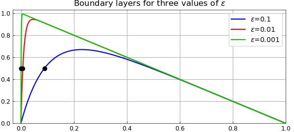
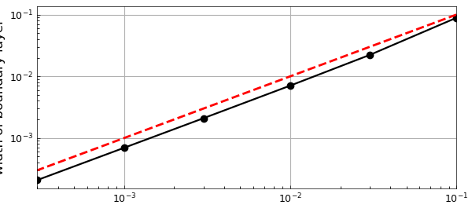
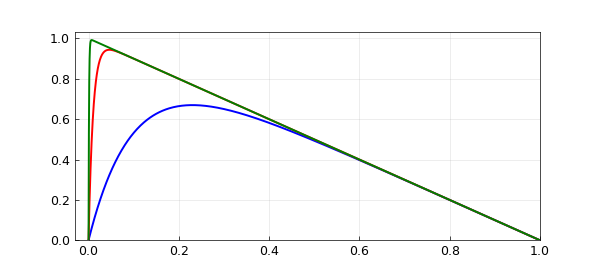
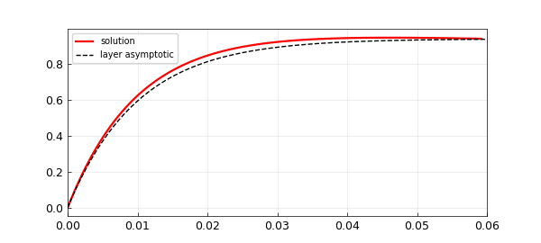
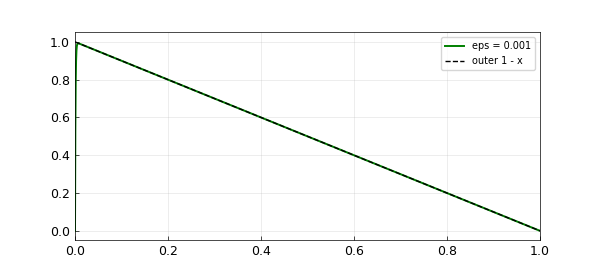

# Boundary layer for advection-diffusion equation

*Nick Trefethen, October 2010*

[Original MATLAB Chebfun example](https://www.chebfun.org/examples/ode-linear/BoundaryLayer.html)

Python translation: [`examples/ode-linear/boundary_layer.py`](https://github.com/ma-gilles/chebfunjax/blob/main/examples/ode-linear/boundary_layer.py)

Consider the steady-state linear advection-diffusion equation

$$ L_\varepsilon u = -\varepsilon u'' - u' = 1,\qquad u(0) = u(1) = 0 , $$

where $\varepsilon>0$ is a small parameter. The solution to this equation has a boundary layer near $x=0$.

In Chebfun, we can define the $\varepsilon$-dependent operator like this:

```matlab
dom = [0,1];
L = @(eps) chebop(@(u) -eps*diff(u,2) - diff(u),dom,'dirichlet');
```

Another supported and perhaps more memorable syntax for specifying boundary conditions is with the `&amp;` operator:

```matlab
L = @(eps) chebop(@(u) -eps*diff(u,2) - diff(u),dom) & 'dirichlet';
```

For $\varepsilon=0.1$ we get this picture:

```matlab
u = L(0.1)\1;
LW = 'linewidth'; lw = 1.6;
clf, plot(u,'b',LW,lw)
grid on, axis([-0.03 1 0 1.03])
```



Let's add a curve for $\varepsilon = 0.01$:

```matlab
u = L(0.01)\1;
hold on, plot(u,'r',LW,lw)
```



Here's $\varepsilon = 0.001$:

```matlab
u = L(0.001)\1;
hold on, plot(u,LW,lw,'color',[0 .8 0])
legend('\epsilon=0.1','\epsilon=0.01','\epsilon=0.001')
FS = 'fontsize';
title('Boundary layers for three values of \epsilon',FS,12)
```



It can be shown that the width of the boundary layer for this equation is $O(\varepsilon)$. Suppose we want to measure this in Chebfun. One method would be to find the point where the solution goes through $0.5$. (This definition wouldn't work for larger $\varepsilon$.)

```matlab
width = @(eps) min(roots(L(eps)\1-.5));
```

For example, here are the widths for the three curves just plotted:

```matlab
format long
w = [width(.1) width(.01) width(.001)]
```

```text
w =
   0.088880675019136   0.007073961393040   0.000694537220774
```

Let's add these points to the plot:

```matlab
MS = 'markersize';
plot(w,[.5 .5 .5],'.k',MS,18)
```



We can also plot boundary layer width against $\varepsilon$. The dashed red line confirms the linear behavior.

```matlab
epsvec = [.1 .03 .01 .003 .001 .0003];
for j = 1:length(epsvec)
    w(j) = width(epsvec(j));
end
clf
loglog(epsvec,w,'.-k',LW,1.6,MS,16), grid on
xlabel('\epsilon',FS,12)
ylabel('width of boundary layer',FS,12)
hold on, plot(epsvec,epsvec,'--r',LW,2)
```



---

*Translated with [chebfunjax](https://github.com/ma-gilles/chebfunjax); prose and MATLAB code from the original example, copyright The University of Oxford and The Chebfun Developers.  Printed outputs and figures are chebfunjax's.*
