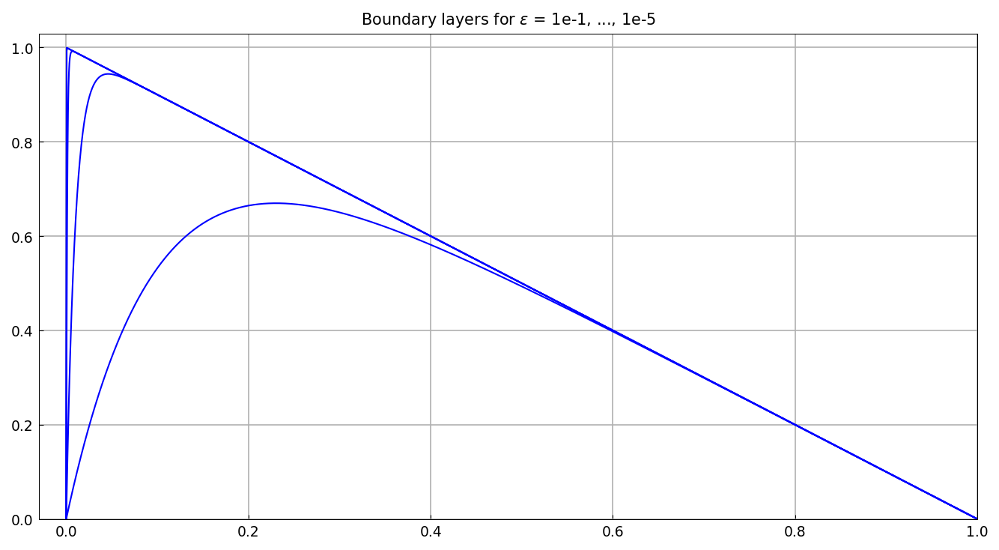
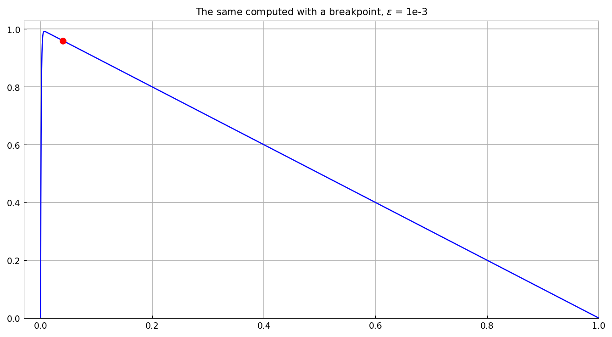
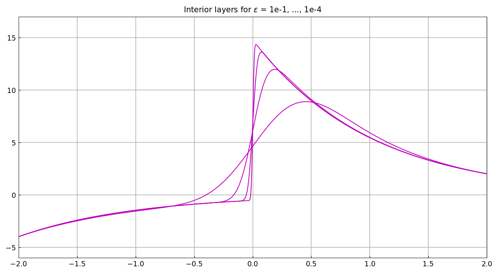
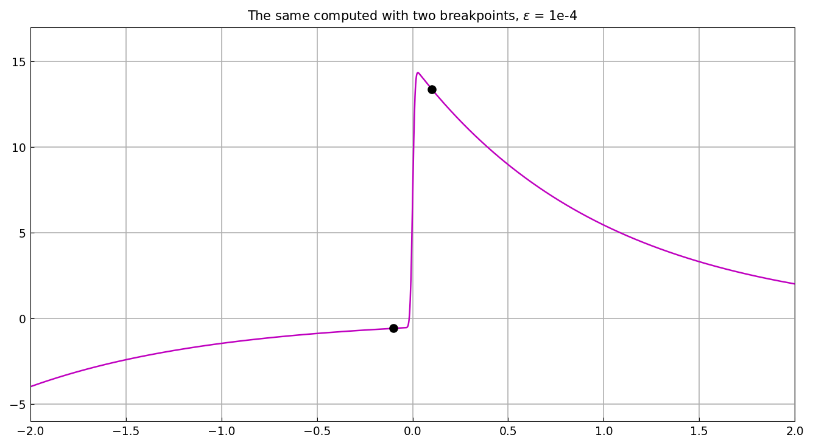
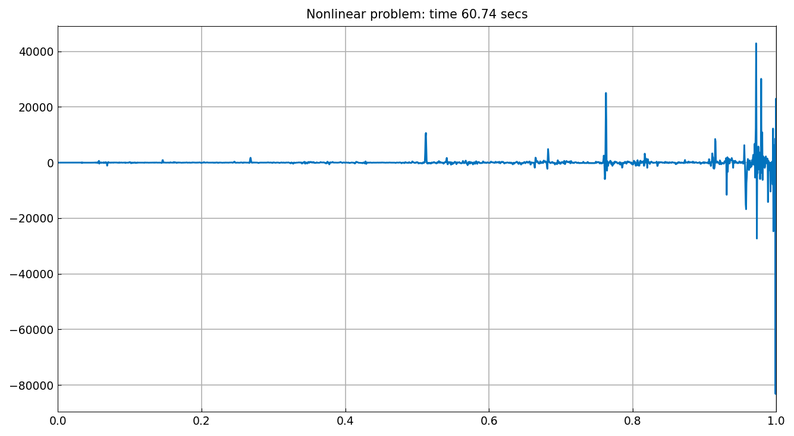
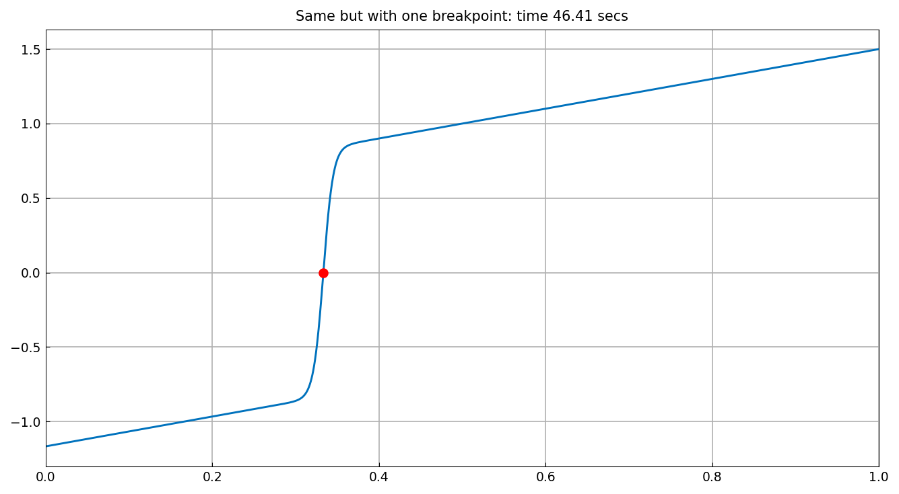
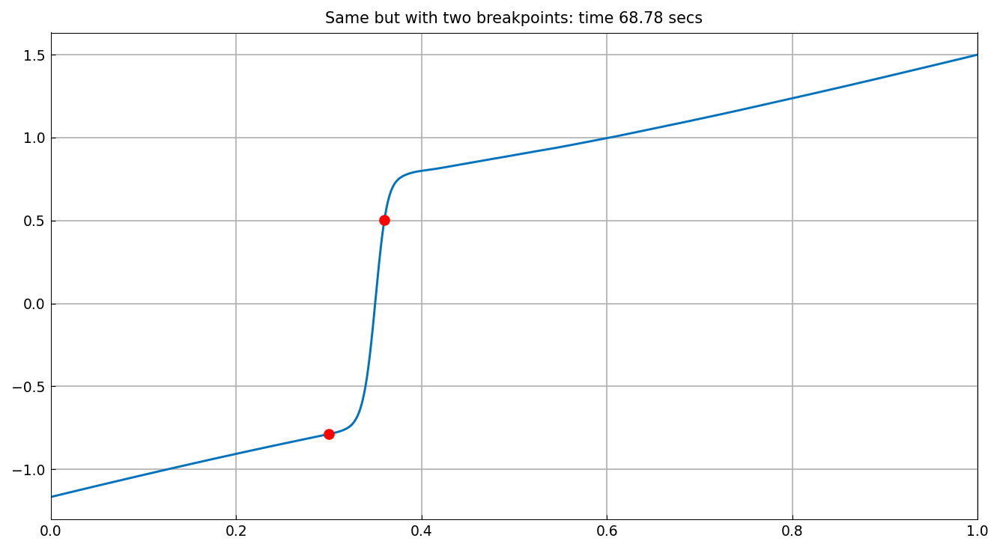

# Introducing breakpoints speeds up difficult calculations

*Nick Trefethen, November 2016*

[Original MATLAB Chebfun example](https://www.chebfun.org/examples/ode-linear/Breakpoints.html)

(Chebfun example ode-linear/Breakpoints.m)

When a solution has a layer at a known location, placing a domain
breakpoint there lets the piecewise discretization stack resolution
exactly where it is needed. Consider first

$$ -\epsilon u'' - u' = 1, \qquad u(0) = u(1) = 0, $$

on the plain domain $[0,1]$ — lengths grow fast as
$\epsilon \to 0$:

```text
        ep      pos(max(u))    length(u)    time (secs.) 
     1.0e-01    0.230263049        32          33.70
     1.0e-02    0.046051702        57          21.01
     1.0e-03    0.006907755       256          23.30
     1.0e-04    0.000921035       512          29.76
     1.0e-05    0.000115147      2048         109.83
```

The `pos(max(u))` column matches the published values digit for digit.
The lengths do not, and the reason is worth stating rather than
glossing: MATLAB reports 23, 59, 170, 488, 1495 here. Four of our five
are exact powers of two, and `simplify()` cuts nothing from them, which
means the Chebyshev coefficients have not decayed at the point our
adaptive solve stops — the solution is accepted before it is *happy*,
so the reported length is just the collocation size. MATLAB refines
until the tail decays. This is an open gap in the adaptive BVP loop,
distinct from the three arithmetic length bugs fixed for
[Logistic](../ode-nonlin/Logistic.md); the timings are our own.



With a breakpoint moving with the layer, `domain = [0, min(0.5, 40ε), 1]`,
the lengths stay small all the way to $\epsilon = 10^{-8}$:

```text
        ep      pos(max(u))    length(u)    time (secs.) 
     1.0e-01    0.230263049        37           4.88
     1.0e-02    0.046051702        45           8.33
     1.0e-03    0.006907755        44           4.11
     1.0e-04    0.000921034        43           3.37
     1.0e-05    0.000115129        45           2.33
     1.0e-06    0.000013816        43           2.40
     1.0e-07    0.000001612       106           2.50
     1.0e-08    0.000000184       107           2.58
```



The $\epsilon = 10^{-3}$ solution is just 44 points in two pieces:

```text
u =
   chebfun column (2 smooth pieces)
       interval       length     endpoint values  
[       0,    0.04]       42    -3e-13     0.96 
[    0.04,       1]        2      0.96  1.1e-16 
vertical scale = 0.99    Total length = 44
```

The same story for a problem with *interior* layers,
$\epsilon u'' + xu' + xu = 0$ on $[-2,2]$ with $u(-2)=-4$, $u(2)=2$:

```text
        ep      pos(max(u))    length(u)    time (secs.) 
     1.0e-01    0.456331114        64           7.88
     1.0e-02    0.188033044       152           6.30
     1.0e-03    0.073657588       512           4.40
     1.0e-04    0.027481095      1364          13.90
```



With two breakpoints at $\pm\min(0.5, 10\sqrt\epsilon)$:

```text
        ep      pos(max(u))    length(u)    time (secs.) 
     1.0e-01    0.456331114        84           4.66
     1.0e-02    0.188033044       131           1.20
     1.0e-03    0.073657588       152           6.11
     1.0e-04    0.027481095       183           5.49
     1.0e-05    0.009892469       218           5.70
     1.0e-06    0.003473237       258           5.70
     1.0e-07    0.001198204       153           5.51
     1.0e-08    0.000408122       213           5.51
```



## A nonlinear problem

Breakpoints help nonlinear problems too. The shock problem
$0.005u'' + uu' - u = 0$ with $u(0) = -7/6$, $u(1) = 3/2$ on the
plain domain fails to resolve (an unhappy 2048-point representation):

```text
u =
   chebfun column (1 smooth piece)
       interval       length     endpoint values  
[       0,       1]     2048      -1.2      1.5 
vertical scale = 1.3e+05 
```



One breakpoint at $x = 1/3$ (where the corner sits) and the Newton
iteration converges cleanly — the interface value $-2\times10^{-14}$
matches the published $-3.8\times10^{-9}$ corner at zero:

```text
u =
   chebfun column (2 smooth pieces)
       interval       length     endpoint values  
[       0,    0.33]      106      -1.2   -2e-14 
[    0.33,       1]      151  -2.4e-14      1.5 
vertical scale = 1.5    Total length = 257
```

(Published lengths 96 + 131.)



Two breakpoints bracketing the corner work as well:

```text
u =
   chebfun column (3 smooth pieces)
       interval       length     endpoint values  
[       0,     0.3]       30      -1.2    -0.79 
[     0.3,    0.36]      128     -0.79      0.5 
[    0.36,       1]      128       0.5      1.5 
vertical scale = 1.5    Total length = 286
```



---

*Replica script: [`examples/ode-linear/breakpoints_replica.py`](https://github.com/ma-gilles/chebfunjax/blob/main/examples/ode-linear/breakpoints_replica.py).
Original example copyright by The University of Oxford and The Chebfun
Developers.*
