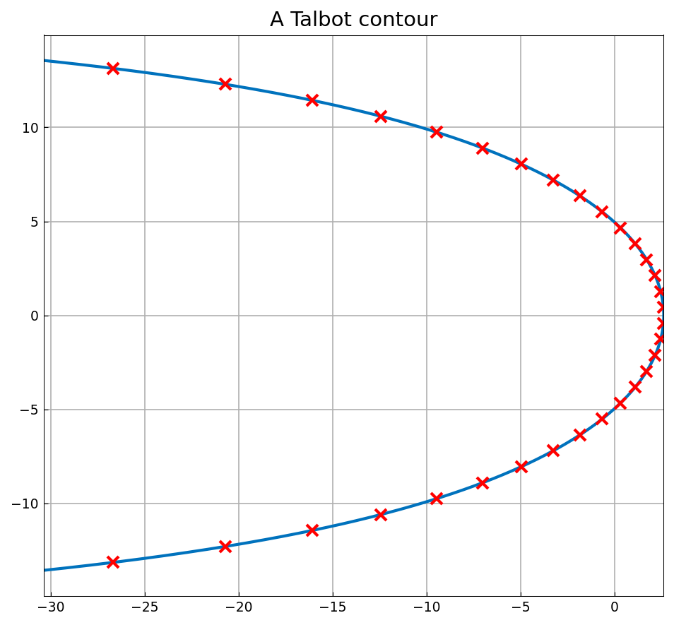
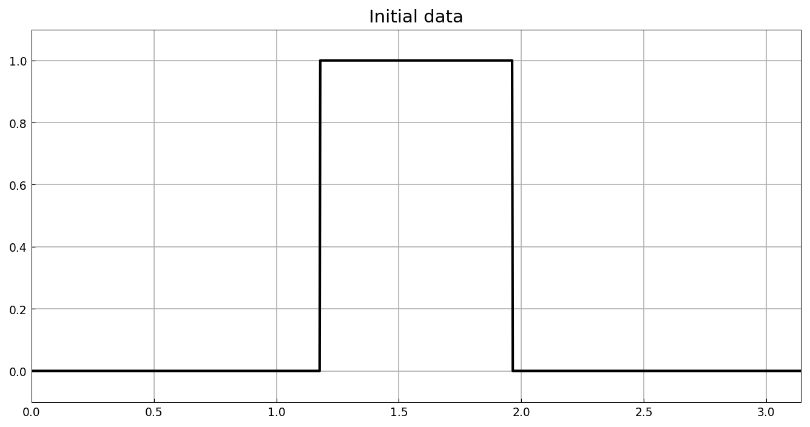
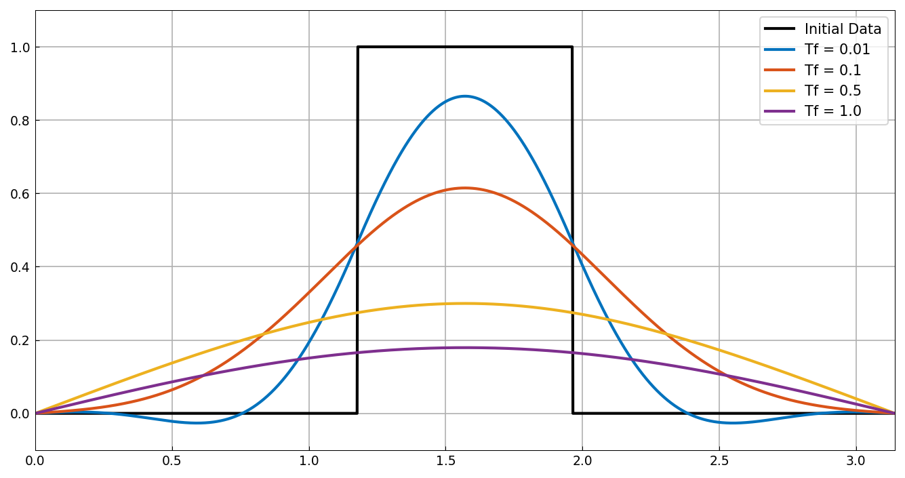

# Exponentials of linear operators via contour integrals

*Anthony Austin, May 2013*

[Original MATLAB Chebfun example](https://www.chebfun.org/examples/ode-linear/ContourExpm.html)

(Chebfun example ode-linear/ContourExpm.m)

The solution to the heat equation $u_t = u_{xx}$ with Dirichlet
conditions can be written $u(t) = e^{tL}u_0$, and the operator
exponential can be computed by numerical quadrature of the inverse
Laplace transform

$$ e^{tL}u_0 = \frac{1}{2\pi i}\int_\Gamma e^{zt}(z - L)^{-1}u_0\,dz $$

along a *Talbot contour* $\Gamma$ winding around the negative real
axis, here with Weideman's optimized parameters and $N = 32$ trapezoid
nodes:



The initial data is a discontinuous square pulse (a piecewise chebfun
built with splitting):



Each quadrature node contributes one *complex-shifted* Helmholtz solve
$(z_k - L)^{-1}u_0$ — a chebop backslash with complex $z_k$ — and by
conjugate symmetry only the 16 upper-half-plane nodes are needed:

```python
Ls = Chebop(lambda x, u: zk*u - u.diff(2), domain=(0, pi))
Ls.lbc = 0; Ls.rbc = 0
uf += exp(zk*Tf) * Ls.solve(u0) * dzk
```

The resulting diffusion profiles at $T_f = 0.01, 0.1, 0.5, 1$ (note the
small quadrature-induced undershoot at $T_f = 0.01$, also visible on
the published page):



## References

1. J. A. C. Weideman, "Optimizing Talbot's contours for the inversion
   of the Laplace transform", SIAM J. Numer. Anal. 44 (2006),
   2342-2362.

---

*Replica script: [`examples/ode-linear/contour_expm_replica.py`](https://github.com/ma-gilles/chebfunjax/blob/main/examples/ode-linear/contour_expm_replica.py).
Original example copyright by The University of Oxford and The Chebfun
Developers.*
