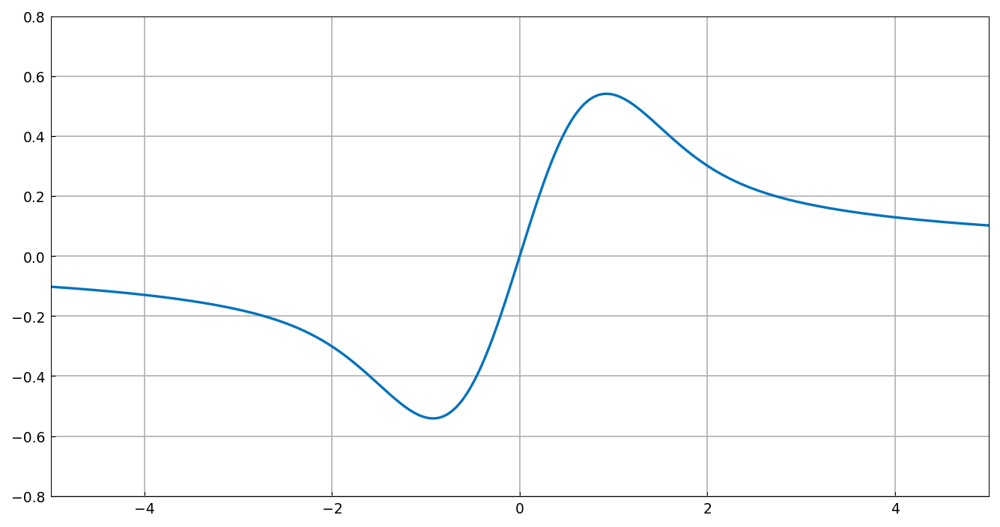

# Dawson's integral

*Kuan Xu, October 2012*

[Original MATLAB Chebfun example](https://www.chebfun.org/examples/ode-linear/DawsonIntegral.html)

(Chebfun example ode-linear/DawsonIntegral.m)

Here is a simple linear ODE boundary value problem:

$$ \frac{dF}{dx} + 2xF = 1, \qquad F(0) = 0. $$

Chebfun can crack this problem in a few lines. Instead of a boundary
condition, we specify an interior point condition:

```python
L = Chebop(lambda x, f: f.diff(1) + 2*x*f, domain=(-5, 5))
L.bc = lambda x, f: f(0.0)
f = L.solve(1.0)
```

```text
Elapsed time is 15.546456 seconds.
```

(Published: 1.07 s — the general interior-point condition takes the
column-probe path in chebfunjax; timing is machine- and path-dependent.)


The problem can be solved analytically:
$F(x) = e^{-x^2}\int_0^x e^{t^2}\,dt$ — Dawson's integral, with its
dipole structure about the origin. It can be assembled directly with
`cumsum`, extended to $[-5,0]$ by odd symmetry with
`flipud`/`new_domain`, and glued with `join`/`merge`:

```python
fr = (-x**2).exp() * ((x**2).exp()).cumsum()      # right of x=0
fl = (-fr.flipud()).new_domain((-5.0, 0.0))       # left of x=0
f = fl.join(fr).merge()
```

```text
f =
   chebfun column (2 smooth pieces)
       interval       length     endpoint values  
[      -5,       0]       87      -0.1 -6.6e-07 
[       0,       5]       87   6.6e-07      0.1 
vertical scale = 0.54    Total length = 174
```

(Published: identical structure and lengths — 87 + 87 = 174, vertical
scale 0.54; the interior endpoint values `±6.2e-07` are eps-scale
`cumsum` artifacts and differ only in that noise.)


Finally, the fastest method: Weideman's 1994 rational approximation of
the complex error function $w(z)$, with $N = 36$ terms:

```text
Elapsed time is 0.295044 seconds.
```



## References

1. J. A. C. Weideman, "Computation of the complex error function",
   SIAM Journal on Numerical Analysis, 31 (1994), 1497-1518.

---

*Replica script: [`examples/ode-linear/dawson_integral_replica.py`](https://github.com/ma-gilles/chebfunjax/blob/main/examples/ode-linear/dawson_integral_replica.py).
Original example copyright by The University of Oxford and The Chebfun
Developers.*
