# Phase portraits of linear dynamical systems

*Grady Wright, October 2014*

[Original MATLAB Chebfun example](https://www.chebfun.org/examples/ode-linear/DynamicalSystems.html)

(Chebfun example ode-linear/DynamicalSystems.m)

The behavior of the linear dynamical system $u' = Au$ near the origin
is classified by the eigenvalues of $A$. Each portrait below shows the
vector field (`quiver`) with `ode45` trajectories from several initial
conditions; the printed eigenvalues/eigenvectors match the published
page (complex conjugate pairs listed in MATLAB's order).

## The origin is an unstable fixed point

$A = \begin{pmatrix}2 & -2\\ 0 & 1\end{pmatrix}$ — both eigenvalues positive: trajectories leave the origin.

```text
eigenvalues of A:
   2   1
eigenvectors of A:
   1.000000000000000   0.894427190999916
   0.000000000000000   0.447213595499958
```

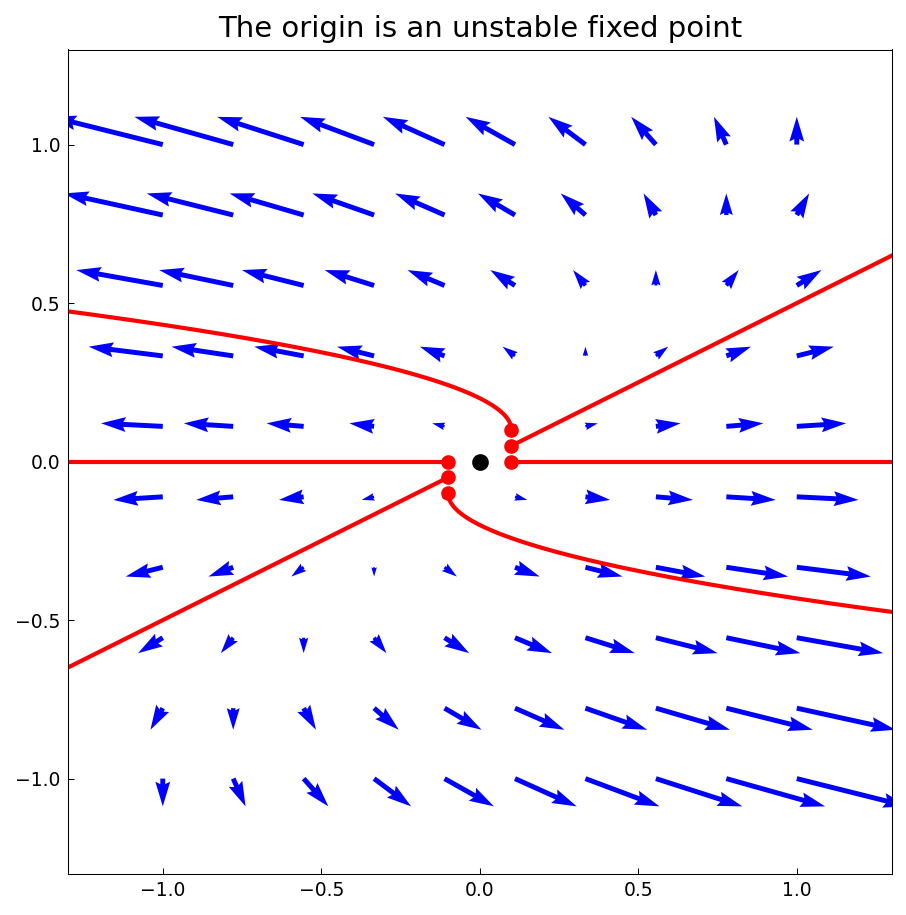

## The origin is a stable fixed point

$A = \begin{pmatrix}-1 & 3\\ 0 & -3\end{pmatrix}$ — both eigenvalues negative: all trajectories decay.

```text
eigenvalues of A:
   -1   -3
eigenvectors of A:
   1.000000000000000  -0.832050294337844
   0.000000000000000   0.554700196225229
```

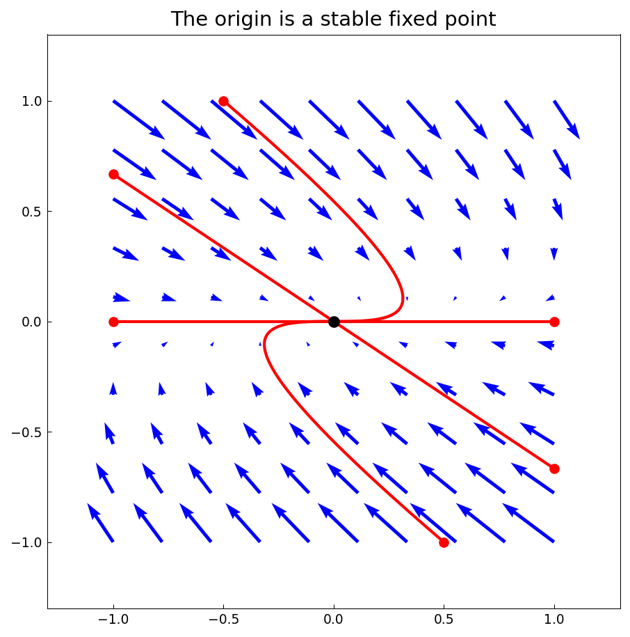

## The origin is a center

$A = \begin{pmatrix}2 & -2\\ 3 & -2\end{pmatrix}$ — purely imaginary eigenvalues $\pm i\sqrt 2$: closed orbits.

```text
eigenvalues of A:
  Column 1
  0.000000000000000 - 1.414213562373095i
  Column 2
  0.000000000000000 + 1.414213562373095i
eigenvectors of A:
  Column 1
  0.516397779494322 - 0.365148371670111i
  0.774596669241483 + 0.000000000000000i
  Column 2
  0.516397779494322 + 0.365148371670111i
  0.774596669241483 + 0.000000000000000i
```

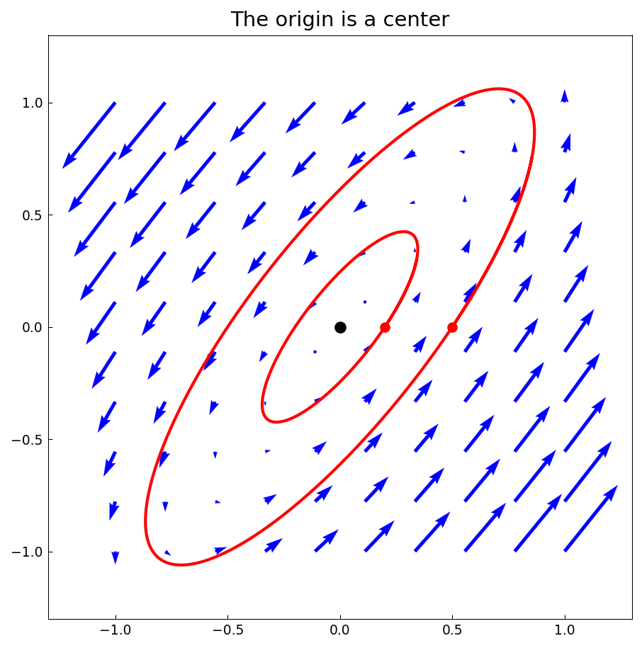

## The trace-determinant diagram

The stability classification in the det(A)-tr(A) plane, lettered with `scribble` and the parabola $\mathrm{tr}^2 = 4\det$:

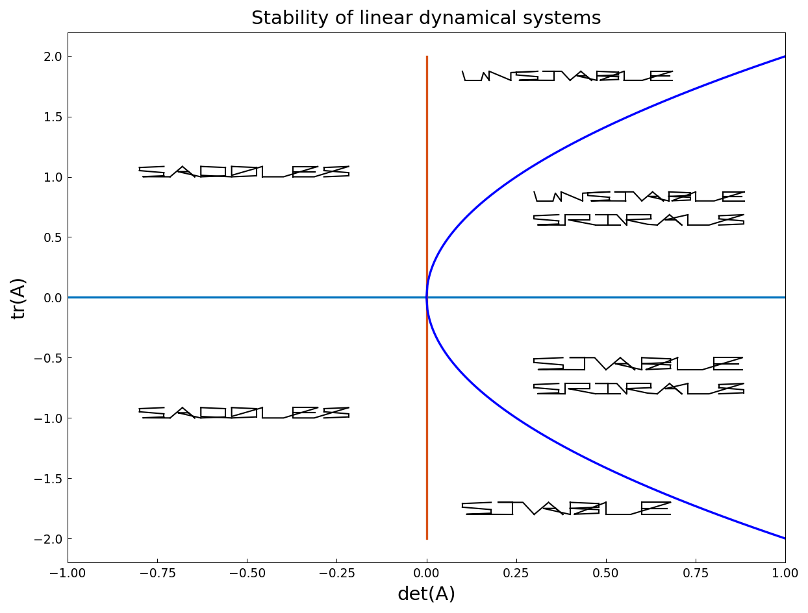

## The origin is an unstable spiral

$A = \begin{pmatrix}2 & -2\\ 8 & 1\end{pmatrix}$ — complex eigenvalues with positive real part.

```text
eigenvalues of A:
  Column 1
  1.500000000000000 - 3.968626966596886i
  Column 2
  1.500000000000000 + 3.968626966596886i
eigenvectors of A:
  Column 1
  0.055901699437495 - 0.443705983732471i
  0.894427190999916 + 0.000000000000000i
  Column 2
  0.055901699437495 + 0.443705983732471i
  0.894427190999916 + 0.000000000000000i
```

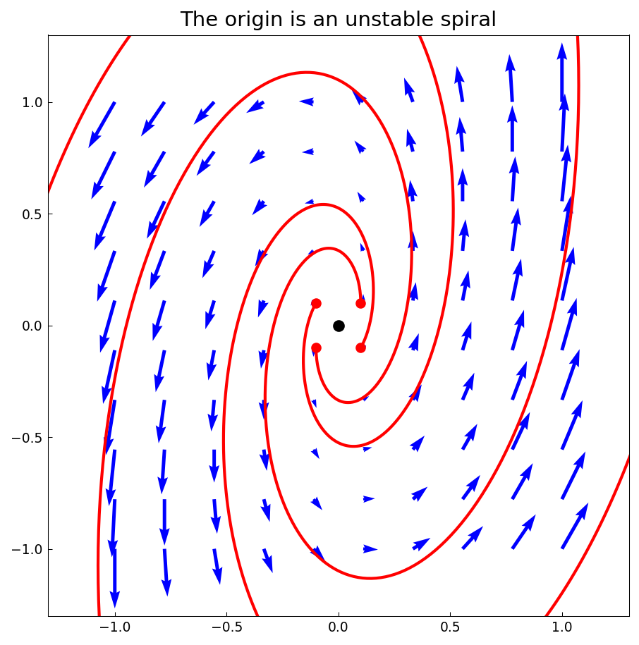

## The origin is a stable spiral

$A = \begin{pmatrix}-0.5 & -2\\ 2 & -0.2\end{pmatrix}$ — complex eigenvalues with negative real part.

```text
eigenvalues of A:
  Column 1
  -0.350000000000000 - 1.994367067517913i
  Column 2
  -0.350000000000000 + 1.994367067517913i
eigenvectors of A:
  Column 1
  -0.707106781186548 + 0.000000000000000i
  0.053033008588991 - 0.705115238808523i
  Column 2
  -0.707106781186548 + 0.000000000000000i
  0.053033008588991 + 0.705115238808523i
```

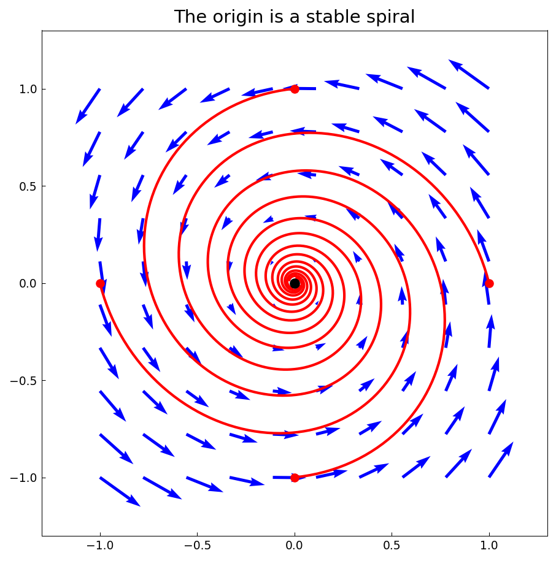

## The origin is a saddle point

$A = \begin{pmatrix}1 & 1\\ 4 & -2\end{pmatrix}$ — eigenvalues of opposite sign; the black lines mark the eigendirections.

```text
eigenvalues of A:
   2   -3
eigenvectors of A:
   0.707106781186547  -0.242535625036333
   0.707106781186547   0.970142500145332
```

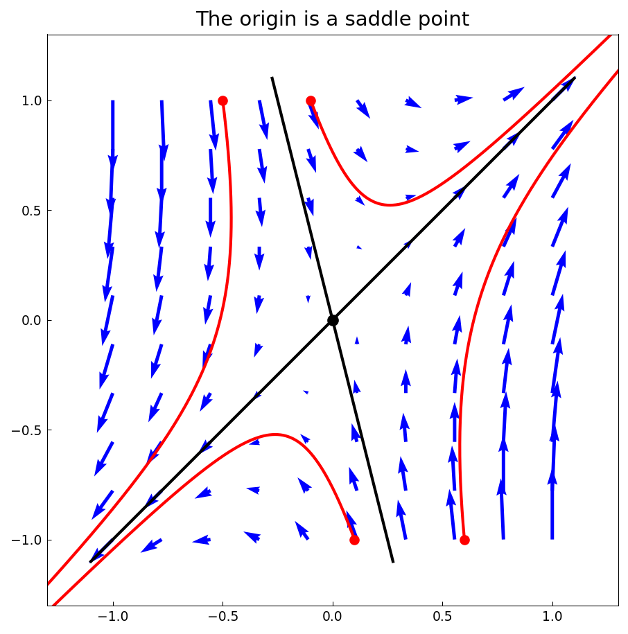

## A line of stable fixed points

$A = \begin{pmatrix}1 & 1\\ -2 & -2\end{pmatrix}$ — a zero eigenvalue: every point of the null line is fixed.

```text
eigenvalues of A:
   0   -1
eigenvectors of A:
   0.707106781186547  -0.447213595499958
  -0.707106781186547   0.894427190999916
```

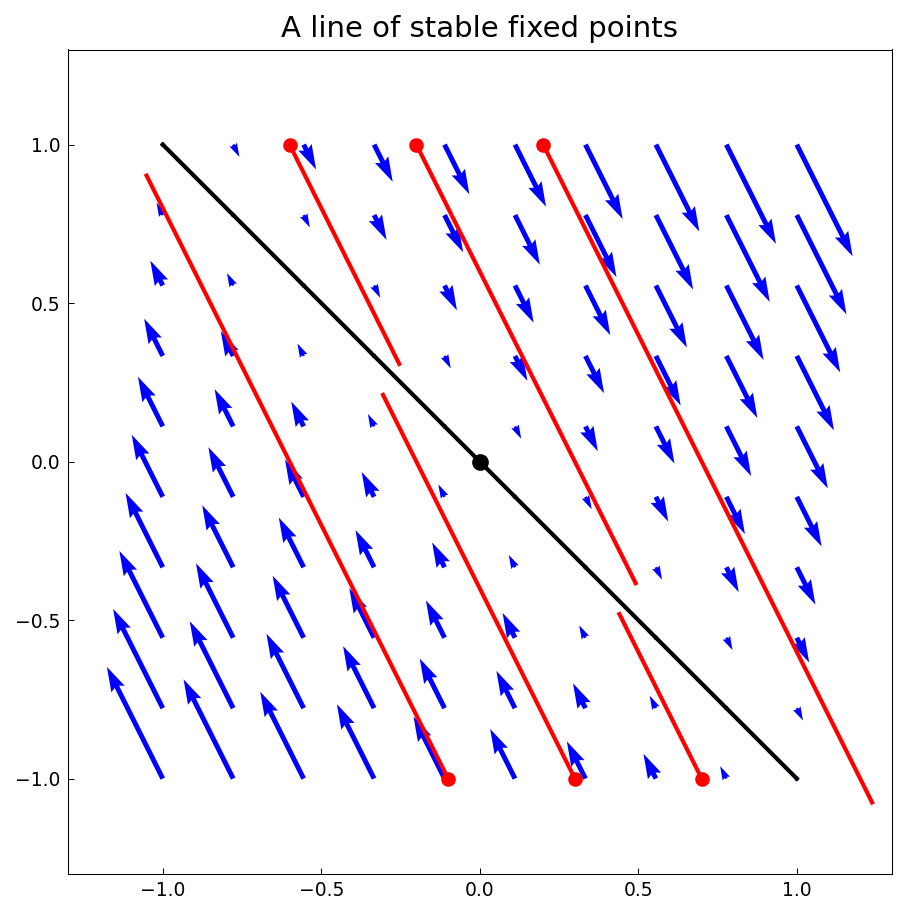

## A line of unstable fixed points

$A = \begin{pmatrix}1 & 2\\ 1 & 2\end{pmatrix}$ — zero and positive eigenvalues.

```text
eigenvalues of A:
   0   3
eigenvectors of A:
  -0.894427190999916  -0.707106781186547
   0.447213595499958  -0.707106781186548
```

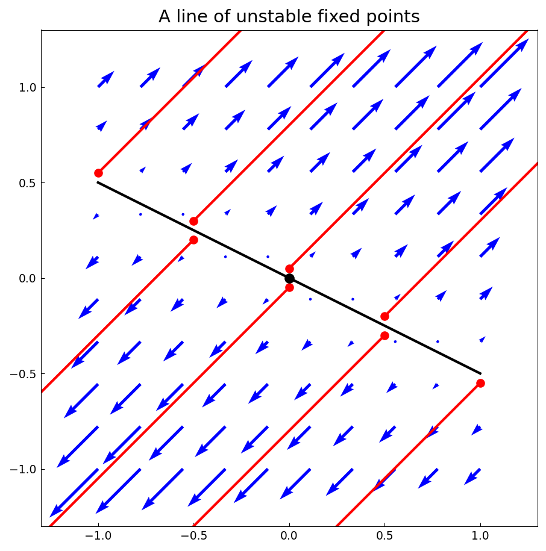

## A stable node with collinear eigendirections

$A = \begin{pmatrix}1 & 4\\ -1 & -3\end{pmatrix}$ — a defective matrix: repeated eigenvalue $-1$, one eigendirection.

```text
eigenvalues of A:
   -1   -1
eigenvectors of A:
   0.894427190999916  -0.894427190999916
  -0.447213595499958   0.447213595499958
```

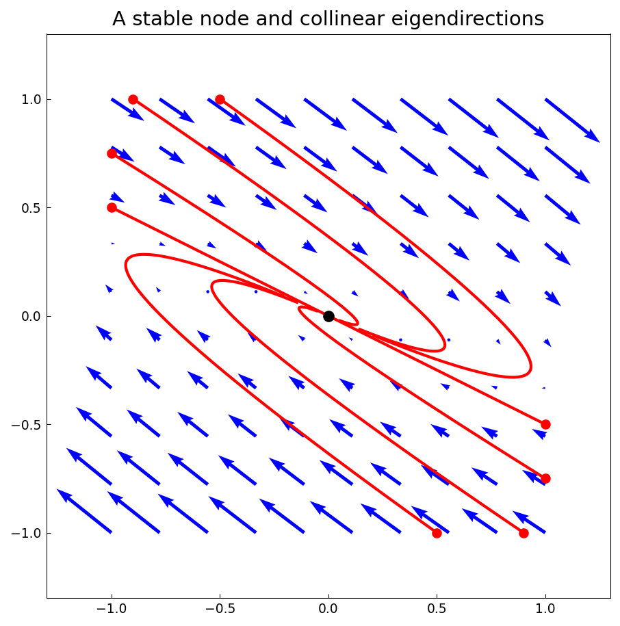

## An unstable node with collinear eigendirections

$A = \begin{pmatrix}-1 & 5/2\\ -5/2 & 4\end{pmatrix}$ — repeated eigenvalue $3/2$. (numpy resolves the defective pair as exactly 1.5, 1.5 where MATLAB prints 1.500000024, 1.499999976 — both are the same defective matrix seen through different eig algorithms.)

```text
eigenvalues of A:
   1.5   1.5
eigenvectors of A:
   0.707106777854547  -0.707106784518549
   0.707106784518548  -0.707106777854546
```

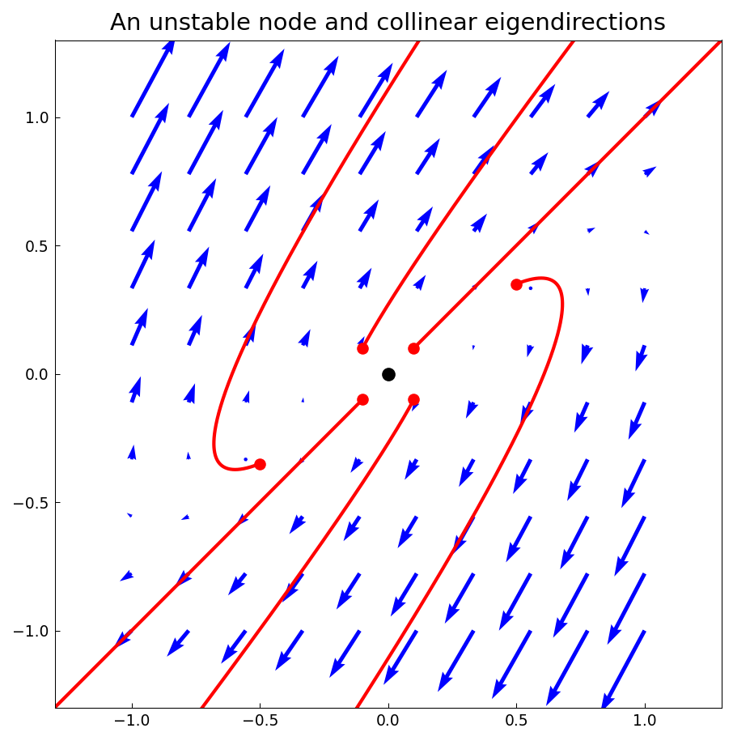

---

*Replica script: [`examples/ode-linear/dynamical_systems_replica.py`](https://github.com/ma-gilles/chebfunjax/blob/main/examples/ode-linear/dynamical_systems_replica.py).
Original example copyright by The University of Oxford and The Chebfun
Developers.*