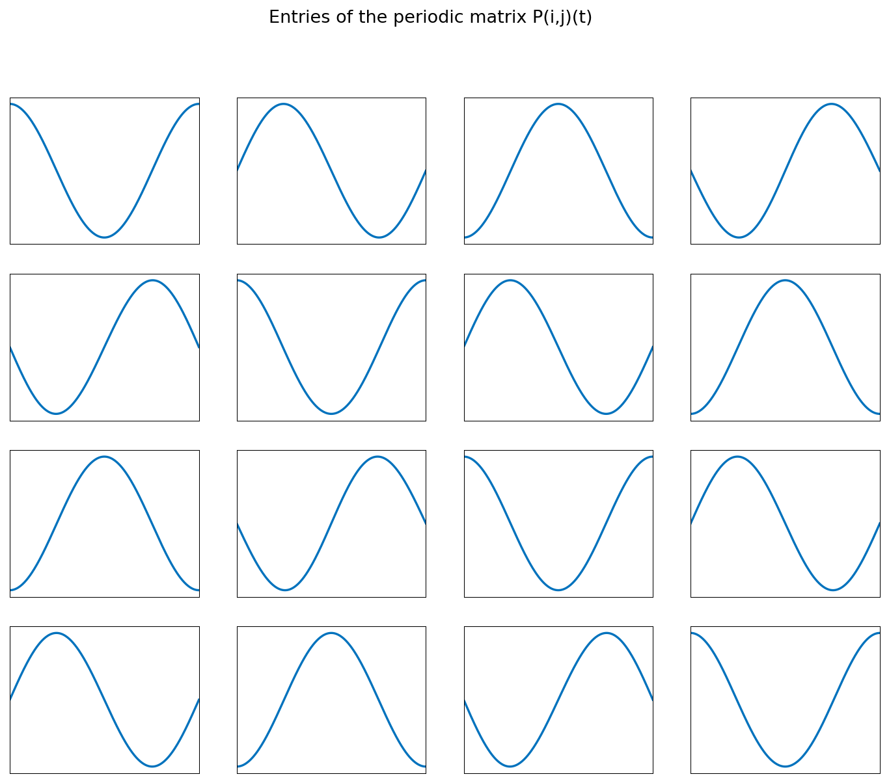

# Floquet theory of periodic ODEs

*Marcus Webb, January 2015*

[Original MATLAB Chebfun example](https://www.chebfun.org/examples/ode-linear/Floquet.html)

(Chebfun example ode-linear/Floquet.m)

Floquet theory describes linear ODEs with periodic coefficients:
every fundamental matrix has the decomposition
$\Phi(t) = P(t)e^{tB}$ with $P$ periodic. The example takes a pair of
coupled Mathieu-type oscillators written as a first-order 4×4 system
on $[0, \pi]$ with $\alpha = 0.15$:

$$ x_1' = x_2, \quad x_2' = y_1 - (2 + \alpha\cos 2t)x_1, \quad
   y_1' = y_2, \quad y_2' = x_1 - (2 + \alpha\cos 2t)y_1. $$

The fundamental matrix is built column by column from four chebop
solves with unit initial data; the monodromy matrix $\Phi(\pi)$ then
gives $B = \log(\Phi(\pi))/\pi$ and the *Floquet exponents* (its
eigenvalues) and *multipliers* ($e^{\lambda\pi}$):

```text
Exponents =
  0.000000000005154 - 0.268354690533427i
  0.000000000005154 + 0.268354690533427i
  -0.037475319732841 + 1.000000000000000i
  0.037475319733873 + 1.000000000000000i
Multipliers =
  0.665180257013861 - 0.746682814661859i
  0.665180257013860 + 0.746682814661859i
  -0.888934086920416 - 0.000000000000001i
  -1.124942799153532 + 0.000000000000002i
```

(Published values agree to ~11 digits; two multipliers on the unit
circle, one inside, one outside — the system has an unstable Floquet
mode.)

The periodic factor $P(t) = \Phi(t)e^{-tB}$, entry by entry —
verified periodic to $|P(0) - P(\pi)| = 8.3\times 10^{-13}$:



---

*Replica script: [`examples/ode-linear/floquet_replica.py`](https://github.com/ma-gilles/chebfunjax/blob/main/examples/ode-linear/floquet_replica.py).
Original example copyright by The University of Oxford and The Chebfun
Developers.*
