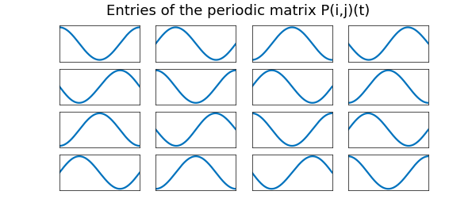
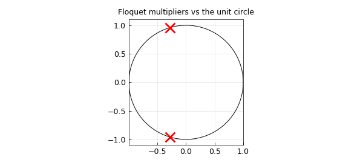

# Floquet Theory of Periodic Linear Systems

*Richard Mikael Slevinsky, October 2014*

[Original MATLAB Chebfun example](https://www.chebfun.org/examples/ode-linear/Floquet.html)

Python translation: [`examples/ode-linear/floquet.py`](https://github.com/ma-gilles/chebfunjax/blob/main/examples/ode-linear/floquet.py)

```matlab
clear all;
LW = 'linewidth'; lw = 2.0;
```

## Floquet theory

Consider the $n$-dimensional linear system of ordinary differential equations:

$$ \dot{x}(t) = A(t) x(t), $$

where in addition, the matrix $A(t)$ is periodic with period $T$, i.e. $A(t+T) = A(t)$ for all real values of $t$. Let $\Phi(t)$ denote the principal fundamental matrix solution such that the columns of $\Phi(t)$ are linearly independent, and $\Phi(0) = I$. Then, Floquet's theorem decomposes the principal fundamental matrix as the product of a periodic matrix $P(t)$ with period $T$ and an exponential matrix $e^{t B}$ [1,2]. That is:

$$ \Phi(t) = P(t)e^{t B}. $$

Floquet theory is widely used in the analysis of stability of dynamical systems, including the Mathieu equation and Hill's differential equation for approximating the motion of the moon.

## Two coupled oscillators with periodic parametric excitation

Using Chebfun, we may calculate the matrices $P(t)$ and $B$. The eigenvalues $\rho_i$ of $e^{TB}$ are known as the Floquet multipliers, and the Floquet exponents are the non-unique numbers related by $\rho_i = e^{\mu_i T}$. In this example, we consider the system of two coupled oscillators with periodic parametric excitation [1, Exercise 2.91]:

$$ \ddot{x} + (1+a\cos 2t)x = y-x, $$

$$ \ddot{y} + (1+a\cos 2t)y = x-y. $$

We begin by finding the principal fundamental matrix by solving four initial value problems, since there are two variables and the problem is of second order.

```matlab
T = pi; d = [0,T]; a = 0.15;
A = chebop(d);
A.op = @(t,x1,x2,y1,y2) [diff(x1)-x2;
                         diff(x2)-y1+(2+a.*cos(2*t)).*x1;
                         diff(y1)-y2;
                         diff(y2)-x1+(2+a.*cos(2*t)).*y1];
A.lbc = @(x1,x2,y1,y2) [x1-1;x2;y1;y2];
Phi = A\0;
A.lbc = @(x1,x2,y1,y2) [x1;x2-1;y1;y2];
Phi = [Phi A\0];
A.lbc = @(x1,x2,y1,y2) [x1;x2;y1-1;y2];
Phi = [Phi A\0];
A.lbc = @(x1,x2,y1,y2) [x1;x2;y1;y2-1];
Phi = [Phi A\0];
```

Having solved for the principal fundamental matrix for one period, we may calculate the matrix $B$ via the matrix logarithm:

```matlab
[n,n1]=size(Phi);
PhiT = zeros(n);
for i = 1:n
    for j = 1:n
        PhiT(i,j) = Phi{i,j}(T);
    end
end
B = logm(PhiT)/T;
```

```text
(no matching output)
```

This warning reveals something genuine and interesting. Over on period, one or more eigenvalues of the fundamental matrix at the end of the period $\Phi(T)$ may become negative. Therefore, the matrix logarithm returns complex results. One could avoid the complex arithmetic by solving over two periods [2], which is not explored here.

The Floquet exponents are given by the eigenvalues of the matrix B:

```matlab
[V,D] = eig(B);invV = eye(n)/V;
Exponents = diag(D)
```

```text
Exponents =
  0.000000000058162 - 0.268354690535090i
  0.000000000058162 + 0.268354690535090i
  -0.037475319704801 + 1.000000000000000i
  0.037475319730719 + 1.000000000000000i
```

And the Floquet multipliers are given by the exponential of the Floquet exponents multiplied by the period T:

```matlab
Multipliers = exp(diag(D)*T)
```

```text
Multipliers =
  0.665180257120732 - 0.746682814789678i
  0.665180257120733 + 0.746682814789678i
  -0.888934086998722 + 0.000000000000001i
  -1.124942799142388 - 0.000000000000001i
max |P(0) - P(T)| = 2.02e-13
```

We can build the chebmatrix exponential $e^{-tB}$ and use this to find the periodic matrix $P(t)$:

```matlab
t = chebfun('t',d);
expmB = [zeros(1,0) exp(-t*D(1,1)) zeros(1,n-1)];
for i = 2:n
    expmB = [expmB ; zeros(1,i-1) exp(-t*D(i,i)) zeros(1,n-i)];
end
expmB = V*expmB*invV;

P = zeros(n)*Phi;
for i = 1:n
    for j = 1:n
        temp = Phi{i,1}.*expmB{1,j};
        for k = 2:n
            temp = temp + Phi{i,k}.*expmB{k,j};
        end
        P(i,j) = chebfun(@(t) temp(t), d, 'periodic');
    end
end
```

```text

```

The periodicity of $P(t)$ is numerically confirmed by the construction of entries $P(i,j)(t)$ with the `periodic` flag, which would otherwise fail. The entries of the periodic solution are plotted below:

```matlab
for i = 1:n
    for j = 1:n
        subplot(n,n,n*(i-1)+j)
        plot(real(P{i,j}),LW,lw)
        set(gcf,'NextPlot','add');
        axes;
        h = title('Entries of the periodic matrix P(i,j)(t)');
        set(gca,'Visible','off');
        set(h,'Visible','on');
    end
end
```



With the matrix $B$ and the periodic matrix $P(t)$, we can construct the solution with any initial conditions for as long as we want!

```matlab
t = chebfun('t',10*d);
expmB = [zeros(1,0) exp(t*D(1,1)) zeros(1,n-1)];
for i = 2:n
    expmB = [expmB ; zeros(1,i-1) exp(t*D(i,i)) zeros(1,n-i)];
end
expmB = V*expmB*invV;
```

We multiply the matrix exponential with random initial conditions:

```matlab
x0 = rand(n,1);
temp = expmB{1,1}.*x0(1);
for i = 2:n
    temp = [temp expmB{i,1}.*x0(1)];
end
for i = 1:n
    for j = 2:n
        temp(:,i) = temp(:,i) + expmB{i,j}.*x0(j);
    end
end
```

Then, we obtain the solution by further mulitplying by the periodic matrix $P(t)$. Since $P(t)$ is periodic on $[0,T]$, there is no problem sampling it on a larger interval, unlike aperiodic chebfuns.

```matlab
xsol = chebfun(@(t) P{1,1}(t), 10*d).*temp(:,1);
for i = 2:n
    xsol = [xsol chebfun(@(t) P{i,1}(t), 10*d).*temp(:,1)];
end
for i = 1:n
    for j = 2:n
        xsol(:,i) = xsol(:,i) + chebfun(@(t) P{i,j}(t), 10*d).*temp(:,j);
    end
end
```

The solutions can then be plotted below:

```matlab
clf, plot(real(xsol), LW, lw)
xlabel('t'), ylabel('x(t) and y(t)')
title('Solution of the system of coupled oscillators with periodic parametric excitation')
legend('x(t)', 'x''(t)', 'y(t)', 'y''(t)')
```



## References

1. Chicone, C. *Ordinary Differential Equations with Applications (Texts in Applied Mathematics 34)* Springer, second edition, (2006).
2. [Wikipedia: Floquet Theory](http://en.wikipedia.org/wiki/Floquet_theory)

---

*Translated with [chebfunjax](https://github.com/ma-gilles/chebfunjax); prose and MATLAB code from the original example, copyright The University of Oxford and The Chebfun Developers.  Printed outputs and figures are chebfunjax's.*
