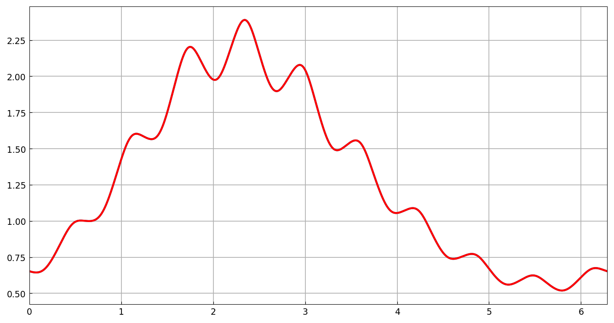
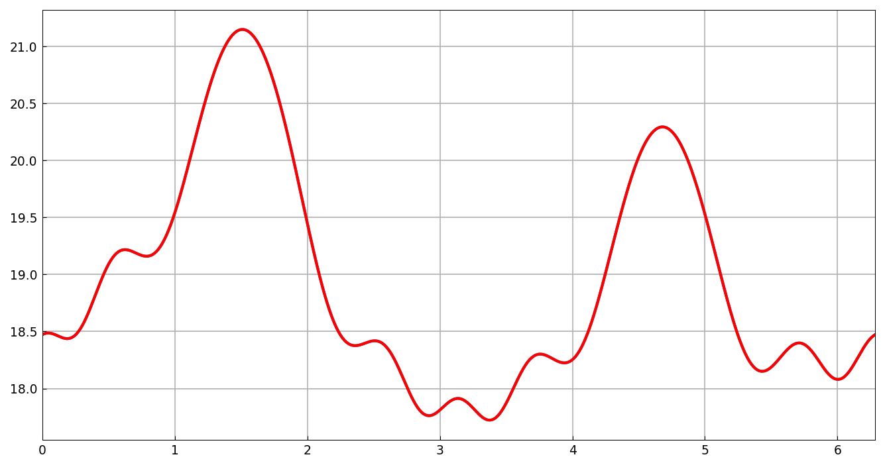

# Fourier collocation for periodic ODEs

*Hadrien Montanelli, December 2014*

[Original MATLAB Chebfun example](https://www.chebfun.org/examples/ode-linear/FourierCollocation.html)

(Chebfun example ode-linear/FourierCollocation.m)

For an ODE with periodic boundary conditions, a Fourier
(trigonometric) discretization is the natural choice. Consider

$$ u' + (1 + \sin(\cos(10x)))\,u = e^{\sin x}, \qquad x \in [0, 2\pi], $$

with periodic boundary conditions:

```python
L = Chebop(lambda x, u: u.diff() + (1 + (10*x).cos().sin())*u, domain=(0, 2*pi))
L.bc = 'periodic'
u = L.solve(f)
```

```text
u =
   chebfun column (1 smooth piece)
       interval       length     endpoint values trig
[       0,     6.3]      261      0.65     0.65 
vertical scale = 2.4 
ans =
     1.008214543477082e-11
```

(Published: length 263, residual 8.7e-11 — matching endpoint values and
vertical scale; the trig lengths differ by one adaptive step.)

Solving the same problem with Chebyshev collocation
(`discretization='chebcolloc2'`, wrap-around rows
$u^{(d)}(0) = u^{(d)}(2\pi)$) needs more points:

```text
v =
   chebfun column (1 smooth piece)
       interval       length     endpoint values  
[       0,     6.3]      470      0.65     0.65 
vertical scale = 2.4 
ans =
     3.167774393518179e-11
ans =
   1.800766283524904
```

(Published length 412 and ratio 1.5665 ≈ π/2, the classic
points-per-wavelength advantage of Fourier over Chebyshev; our adaptive
lengths land slightly higher but tell the same story.)



The same comparison for a second-order problem
$u'' + \sin(\cos^2(x/2))u' + \cos(12\sin x)\,u = e^{\cos 2x}$:

```text
u =
   chebfun column (1 smooth piece)
       interval       length     endpoint values trig
[       0,     6.3]      105        18       18 
vertical scale =  21 
ans =
     1.196555439105671e-09
v =
   chebfun column (1 smooth piece)
       interval       length     endpoint values  
[       0,     6.3]      149        18       18 
vertical scale =  21 
ans =
   1.419047619047619
```

(The trig solve's display matches the published page digit-for-digit:
length 105, endpoint values 18, vertical scale 21.)



Finally, the Hill discriminant of this operator — from the two
initial-value solves $c$ (with $c(0)=1, c'(0)=0$) and $s$ (with
$s(0)=0, s'(0)=1$), the quantity
$\frac{1}{2}(c(2\pi) + s'(2\pi))$ determines the stability of the
periodic problem:

```text
HillDiscr =
   0.146112733221777
```

(Published: `0.146112733327400` — 9-digit agreement, limited by the
tolerance of the time-marched IVP solves.)

---

*Replica script: [`examples/ode-linear/fourier_collocation_replica.py`](https://github.com/ma-gilles/chebfunjax/blob/main/examples/ode-linear/fourier_collocation_replica.py).
Original example copyright by The University of Oxford and The Chebfun
Developers.*
