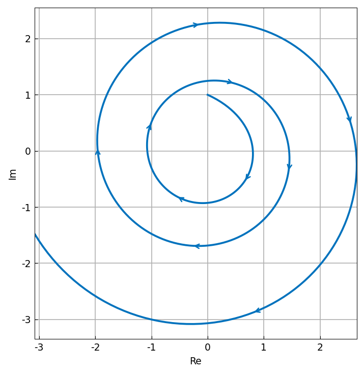

# Frozen coefficients do not determine stability

*Nick Trefethen, March 2017*

[Original MATLAB Chebfun example](https://www.chebfun.org/examples/ode-linear/FrozenCoeffs.html)

(Chebfun example ode-linear/FrozenCoeffs.m)

If $u' = Au$ for a fixed matrix $A$, then $\|u(t)\| \to 0$ as
$t \to \infty$ provided the eigenvalues of $A$ lie in the open left
half-plane. If $A$ varies with $t$, however, eigenvalues in the left
half-plane at each *frozen* time are not enough to ensure stability —
for a nonnormal matrix the significance of eigenvalues is asymptotic,
and if the coefficients keep changing we may never reach the asymptotic
regime.

The example takes $B = \begin{pmatrix} -1 & m \\ 0 & -1 \end{pmatrix}$
with $m = 2.2$ and rotates it steadily:

$$ u' = \begin{pmatrix}
   -1 + m\cos t \sin t & m\cos^2 t \\
   -m\sin^2 t & -1 - m\cos t \sin t
   \end{pmatrix} u, \qquad u(0) = (0,1)^T, $$

whose frozen coefficient matrix has the double eigenvalue $-1$ for
every $t$ — yet the solution spirals *outward*:

```python
L = Chebop(lambda t, u, v: [...], domain=(0, 16))
L.lbc = lambda u, v: [u, v - 1]
u, v = L.solve(0.0)
```



(Solution verified against scipy `solve_ivp` at `rtol=1e-12`:
$u(16) = -3.0783017$, $v(16) = -1.4788124$, agreement to 1e-10.)

## References

1. G.-C. Rota and G. Strang, "A note on the joint spectral radius",
   Indag. Math. 22 (1960), 379-381.

---

*Replica script: [`examples/ode-linear/frozen_coeffs_replica.py`](https://github.com/ma-gilles/chebfunjax/blob/main/examples/ode-linear/frozen_coeffs_replica.py).
Original example copyright by The University of Oxford and The Chebfun
Developers.*
