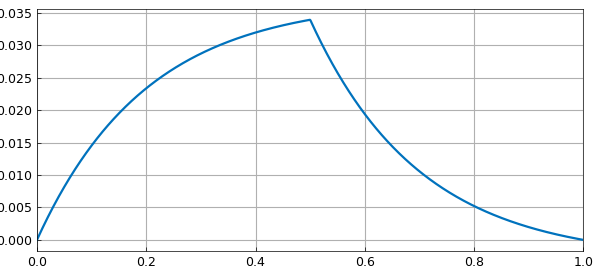
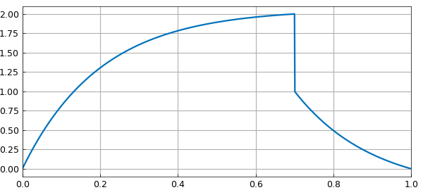
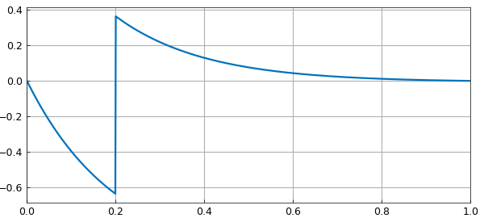
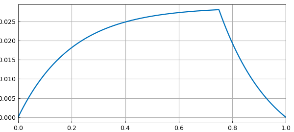
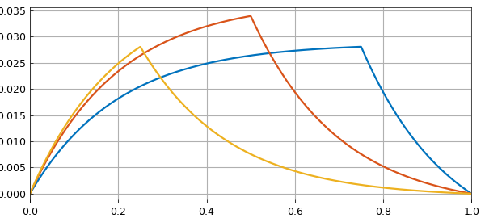
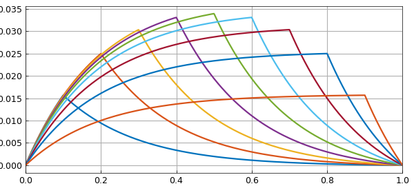

# Jump conditions and Green functions

*Nick Hale and Nick Trefethen, June 2019*

[Original MATLAB Chebfun example](https://www.chebfun.org/examples/ode-linear/JumpGreen.html)

Python translation: [`examples/ode-linear/jump_green.py`](https://github.com/ma-gilles/chebfunjax/blob/main/examples/ode-linear/jump_green.py)

Chebfun allows you to specify jump conditions in ODE BVPs. For example, a 2nd-order ODE would normally take two boundary conditions, like this advection-diffusion equation:

```matlab
eta = 0.2;
L = chebop(@(x,u) eta*diff(u,2) + diff(u), [0 1]);
L.lbc = 0; L.rbc = 0;
```

But suppose we want a continuous solution whose derivative jumps by $-1/\eta$ at $x=1/2$? Mathematically, this is like having one 2nd-order BVP on $[0,1/2]$ coupled to another on $[1/2,1]$, and we will need four boundary conditions in total. The two additional boundary conditions will assert that at $x=1/2$, the derivative jumps by $-1/\eta$ whereas the function value is continuous. Chebfun allows you to specify these conditions like this:

```matlab
L.bc = @(x,u) [jump(u,1/2) ; jump(diff(u),1/2)+eta];
plot(L\0), grid on
```



Incidentally, `jump` is an abbreviation based on a more general Chebfun capability involving evaluations on the left and the right of a point. For example, we could do this:

```matlab
L.bc = @(x,u) [feval(u,.7,'left')-2 ; feval(u,.7,'right')-1];
plot(L\0), grid on
```



Returning to the convenience of `jump`, suppose we want a jump in the function value and continuity of the derivative. We could do this:

```matlab
L.bc = @(x,u) [jump(u,.2)-1; jump(diff(u),.2)];
plot(L\0), grid on
```



Now a Green's function for a linear ODE is a solution to a homogeneous BVP with a derivative jump condition at a point $s$ in the interior. The configuration at the beginning of this example was of exactly this kind. Here is the same calculation but for $s=0.75$.

```matlab
L.bc = @(x,u) [jump(u,0.75) ; jump(diff(u),0.75)+eta];
plot(L\0), grid on
```



Let's superimpose results for $s=0.5$ and $s=0.25$:

```matlab
hold on
for s = .5:-.25:.25
  L.bc = @(x,u) [jump(u,s) ; jump(diff(u),s)+eta];
  plot(L\0)
end
hold off
```



Actually, we can combine Matlab's anonymous functions and Chebfun's ODE capabilities to make a single object that constructs this Green function:

```matlab
green = @(s) chebop(@(x,u) eta*diff(u,2) + diff(u), [0 1], ...
     @(x,u) [u(0); u(1); jump(u,s); jump(diff(u),s)+eta])\0;
```

Here is an illustration for $s = 0.1, 0.2, \dots, 0.9$.

```matlab
for s = .1:.1:.9
  plot(green(s)), hold on
end
grid on, hold off
```



---

*Translated with [chebfunjax](https://github.com/ma-gilles/chebfunjax); prose and MATLAB code from the original example, copyright The University of Oxford and The Chebfun Developers.  Printed outputs and figures are chebfunjax's.*
