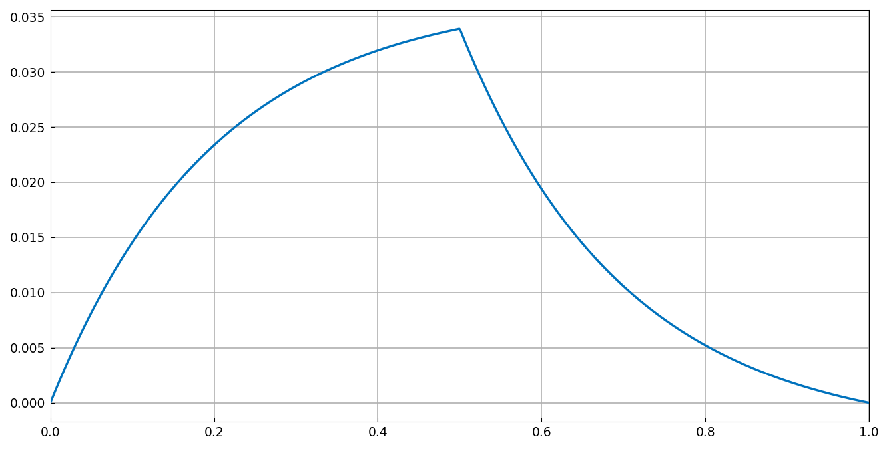
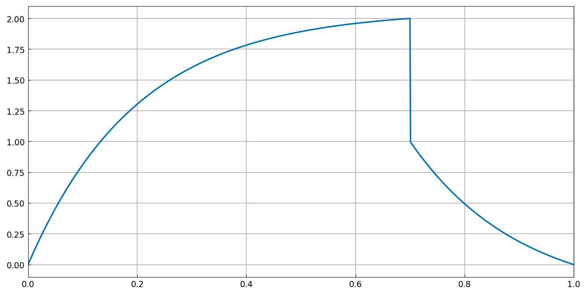
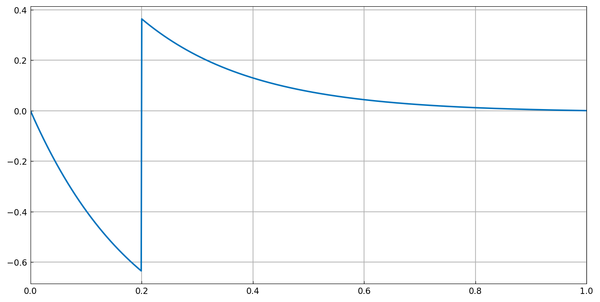
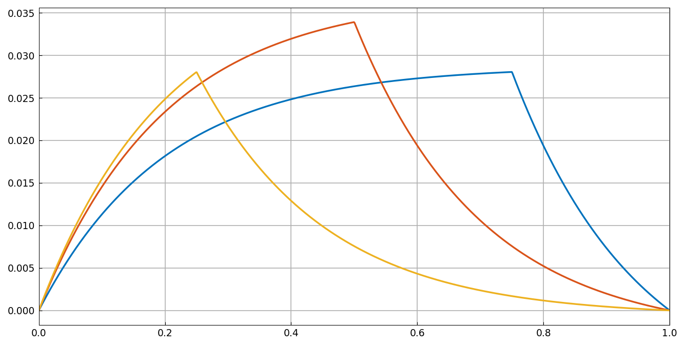
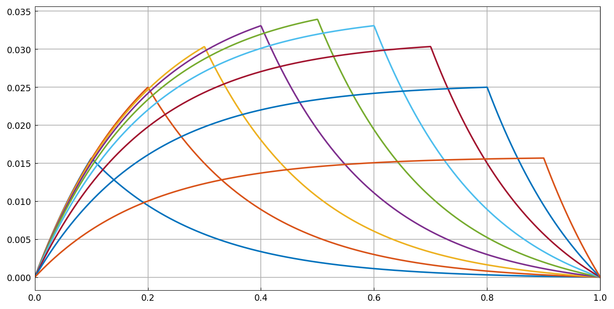

# Green's functions and jump conditions

*Nick Trefethen, May 2015*

[Original MATLAB Chebfun example](https://www.chebfun.org/examples/ode-linear/JumpGreen.html)

(Chebfun example ode-linear/JumpGreen.m)

Interior conditions on an ODE solution — jumps in the function or its
derivative at a point $s$ — are imposed through the general `.bc`
field with the `jump` function. For the advection-diffusion operator
$L u = \eta u'' + u'$ on $[0,1]$ with $\eta = 0.2$ and homogeneous
Dirichlet conditions, a derivative jump of $-\eta$ at $s = 1/2$
produces the *Green's function* $g(x; 1/2)$:

```python
L.bc = lambda x, u: [jump(u, 0.5), jump(u.diff(), 0.5) + eta]
```



One-sided *values* can be prescribed instead — here
$u(0.7^-) = 2$, $u(0.7^+) = 1$:

```python
L.bc = lambda x, u: [u(0.7, 'left') - 2, u(0.7, 'right') - 1]
```



or a unit jump in the function value with a continuous derivative at
$x = 0.2$:



Sweeping the source location gives the family of Green's functions —
first $s = 0.75, 0.5, 0.25$:



and the full fan $s = 0.1, \dots, 0.9$, each solve producing the kink
exactly at its source point:



---

*Replica script: [`examples/ode-linear/jump_green_replica.py`](https://github.com/ma-gilles/chebfunjax/blob/main/examples/ode-linear/jump_green_replica.py).
Original example copyright by The University of Oxford and The Chebfun
Developers.*
