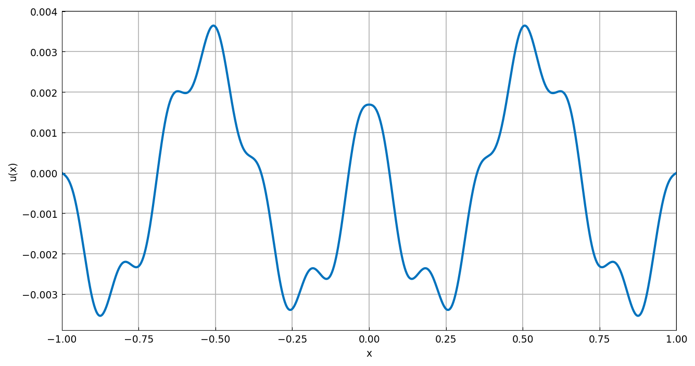
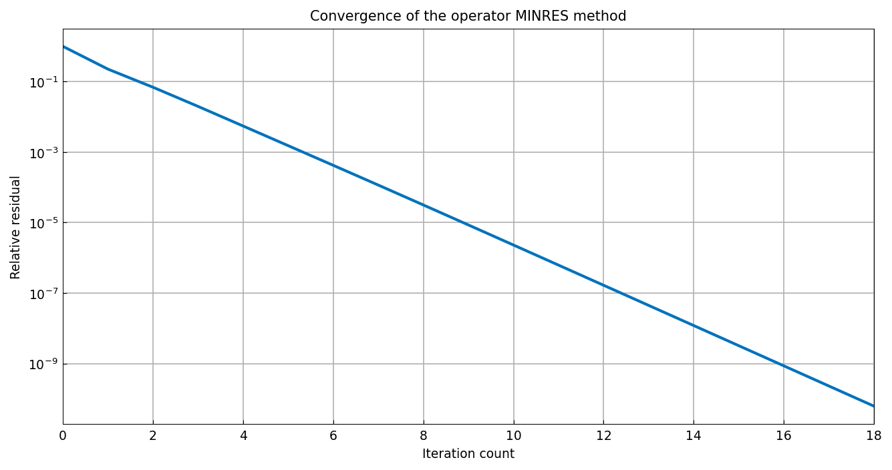
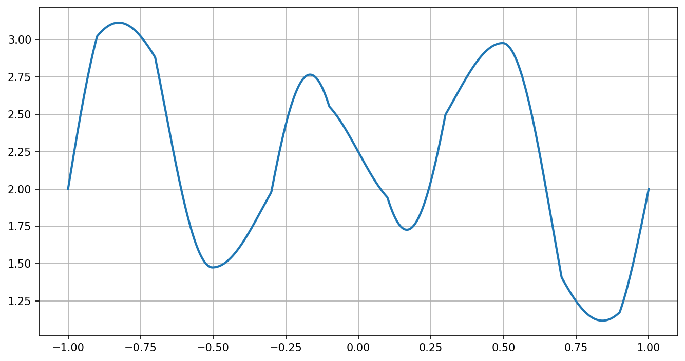

# Krylov subspace methods for ODEs

*Alex Townsend and Marc Aurele Gilles, November 2016*

[Original MATLAB Chebfun example](https://www.chebfun.org/examples/ode-linear/Krylov.html)

(Chebfun example ode-linear/Krylov.m)

Krylov subspace methods — CG, MINRES, GMRES — can be applied not just
to matrices but directly to differential operators, using the
indefinite-integral preconditioner $R_1 = \mathrm{cumsum}$ with adjoint
$R_2(u) = \mathrm{sum}(u) - \mathrm{cumsum}(u)$ (Gilles & Townsend).

**Matrix warm-up.** CG on the standard tridiagonal discretization of
$-u''$ agrees with a direct solve:

```text
error =
     2.854238962252348e-14
```

**Why not CG on the collocation matrix?** The Chebyshev collocation
matrix of a self-adjoint operator is far from symmetric:

```text
ans =
     2.090942398256434e+07
```

**Operator CG.** For the variable-coefficient problem
$-( (2+\cos 70\pi x)u')' + (1+x^{12})u = 1/(1+x^2)$ with $u(-1)=3$,
$u(1)=-5$, both collocation backslash and the operator-CG iteration
solve it (timings machine-dependent; MATLAB reports 59 s / 3.9 s):

```text
Elapsed time is 525.358639 seconds.
Elapsed time is 496.461999 seconds.
```

On the Poisson model problem `pcg` reaches machine precision against
backslash:

```text
error =
     4.129865598435375e-14
```

**Indefinite operators.** $-u'' - 100u$ has eigenvalues on both sides
of zero — digit-for-digit the published values:

```text
ans =
  -77.793390
  -60.521582
  -38.314972
  -11.173560
   20.902654
   57.913670
```

so CG is not applicable, but MINRES is:

```text
error =
     2.796283724092571e-13
```



**GMRES** works too:

```text
error =
     4.135628665582831e-14
```

**A rough manufactured solution.** With coefficient
$2+\cos(21\pi x)$ and exact solution $\sin(40\pi x)$, MINRES converges
geometrically:

```text
error =
     4.832413570246968e-11
```



**A stiff problem with a tight tolerance.**
$-10^{-5}u'' + u = 1$ at `tol=1e-13`:

```text
u_minres =
   chebfun column (1 smooth piece)
       interval       length     endpoint values  
[      -1,       1]      137   9.4e-16 -3.2e-11 
vertical scale =   1 
error =
     6.609e-12
```

(Published: length 139, endpoint values `7.1e-16 -4.1e-12` — the same
boundary-layer resolution to one adaptive step.)

**Piecewise-smooth coefficients.** With
$a = 2 + \mathrm{sign}(\cos 5\pi x)$ and $c = -|x|$:

```text
relative_residual =
     1.817677780432234e-13
```

(Published: `4.095871962535807e-12`.)



## References

1. M. A. Gilles and A. Townsend, "Continuous analogues of Krylov
   subspace methods for differential operators", SIAM J. Numer. Anal.
   57 (2019), 899-924.

---

*Replica script: [`examples/ode-linear/krylov_replica.py`](https://github.com/ma-gilles/chebfunjax/blob/main/examples/ode-linear/krylov_replica.py).
Original example copyright by The University of Oxford and The Chebfun
Developers.*
