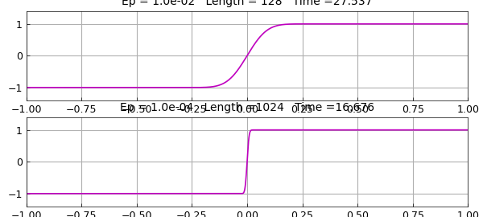
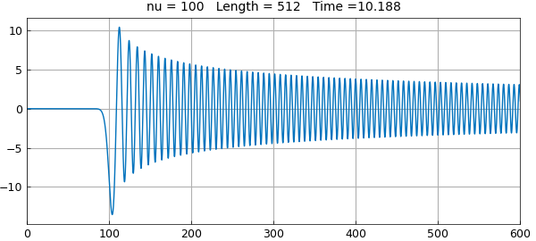
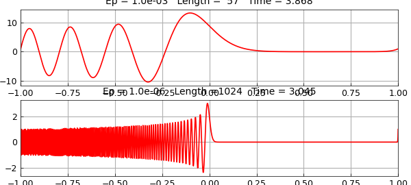
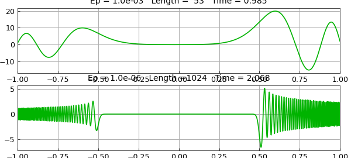
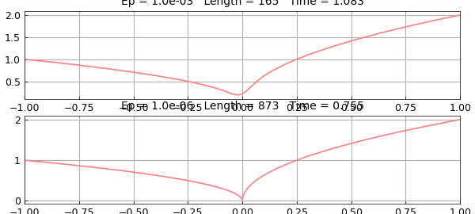
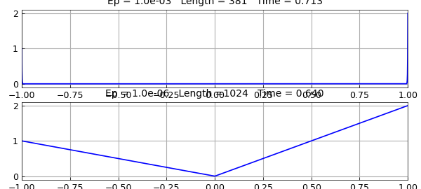

# Lee and Greengard ODE examples

*Nick Trefethen, June 2012*

[Original MATLAB Chebfun example](https://www.chebfun.org/examples/ode-linear/LeeGreengardODEs.html)

Python translation: [`examples/ode-linear/lee_greengard.py`](https://github.com/ma-gilles/chebfunjax/blob/main/examples/ode-linear/lee_greengard.py)

In 1997 Lee and Greengard published a paper called "A fast adaptive numerical method for stiff two-point boundary value problems" [1]. The algorithm described there, being adaptive, can handle far stiffer problems than Chebfun. Nevertheless Chebfun does pretty well with Lee and Greengard's interesting collection of examples. These problems are linear.

The following discussion is based on Chebfun's classical spectral discretizations (rectangular collocation). It would be interesting to revisit the same examples with the alternative ultraspherical discretizations introduced with Version 5 to see whether certain values of $\varepsilon$ can be reduced further.

For more Chebfun examples in this vein see Chapter 20 of [3].

## Example 1. Viscous shock

The first example is $$ \varepsilon u''(x) + 2 x u'(x) = 0, \quad u(-1) = -1, ~ u(1) = 1. $$ The following anonymous function produces a Chebfun solution as a function of $\varepsilon$:

```matlab
uep = @(ep) chebop(@(x,u) ep*diff(u,2) + 2*x*diff(u),[-1,1],-1,1)\0;
```

Here we plot the solution for $\varepsilon = 0.01, 0.0001$. It works fine, but Lee and Greengard can go down to $10^{-14}$.

```matlab
for k = 1:2
    ep = 10^(-2*k);
    subplot(2,1,k)
    tic, u = uep(ep); t = toc;
    plot(u,'m'), ylim(1.4*[-1 1]); grid on
    title(sprintf('Ep = %5.1e   Length =%4d   Time =%6.3f',ep,length(u),t))
end
```



## Example 2. Bessel equation

The second example is $$ u''(x) + x^{-1} u'(x) + {x^2-\nu^2\over x^2} u(x) = 0, \quad u(0) = 0, ~ u(600) = 1 $$ with $\nu = 100$. We follow the same pattern as before (multiplying the equation through by $x^2$):

```matlab
unu = @(nu) chebop(@(x,u) x^2*diff(u,2)+x*diff(u)+(x^2-nu^2)*u,[0,600],0,1)\0;
```

The solution for $\nu = 100$ looks just as in Lee and Greengard:

```matlab
nu = 100;
tic, u = unu(nu); t = toc;
clf, plot(u), grid on
title(sprintf('nu = %3d   Length =%4d   Time =%6.3f',nu,length(u),t))
```



## Example 3. Turning point

This example is an Airy equation, $$ \varepsilon u''(x) - x u(x) = 0, \quad u(-1) = 1, ~ u(1) = 1. $$ We proceed as usual:

```matlab
uep = @(ep) chebop(@(x,u) ep*diff(u,2)-x*u,[-1,1],1,1)\0;
clf
for k = 1:2
    ep = 10^(-3*k);
    subplot(2,1,k)
    tic, u = uep(ep); t = toc;
    plot(u,'r'), grid on
    title(sprintf('Ep = %5.1e   Length =%4d   Time =%6.3f',ep,length(u),t))
end
```



## Example 4. Potential barrier

The fourth example is $$ \varepsilon u''(x) + (x^2-0.25)u(x) = 0, \quad u(-1) = 1, ~ u(1) = 2. $$ Here we go:

```matlab
uep = @(ep) chebop(@(x,u) ep*diff(u,2)+(x^2-0.25)*u,[-1,1],1,2)\0;
for k = 1:2
    ep = 10^(-3*k);
    subplot(2,1,k)
    tic, u = uep(ep); t = toc;
    plot(u,'color',[0 .7 0]), grid on
    title(sprintf('Ep = %5.1e   Length =%4d   Time =%6.3f',ep,length(u),t))
end
```



## Example 5. Cusp

This time we have $$ \varepsilon u''(x) + x u'(x) - 0.5u(x) = 0, \quad u(-1) = 1, ~ u(1) = 2. $$ With a global discretization and standard defaults, Chebfun can go down to $10^{-5}$ or so. With a breakpoint introduced at $x=0$ by specifying the domain `[-1, 0, 1]`, we get a little further, though not as far as Lee and Greengard:

```matlab
uep = @(ep) chebop(@(x,u) ep*diff(u,2)+x*diff(u)-0.5*u,[-1 0 1],1,2)\0;
for k = 1:2
    ep = 10^(-3*k);
    subplot(2,1,k)
    tic, u = uep(ep); t = toc;
    plot(u,'color',[1 .5 .5]), grid on
    title(sprintf('Ep = %5.1e   Length =%4d   Time =%6.3f',ep,length(u),t))
end
```



## Example 6. Exponential ill-conditioning

Finally we consider $$ \varepsilon u''(x) - x u'(x) + u(x) = 0, \quad u(-1) = 1, ~ u(1) = 2. $$ The pictures look fine down to Lee and Greengard's value of $\varepsilon = 1/70$:

```matlab
uep = @(ep) chebop(@(x,u) ep*diff(u,2)-x*diff(u)+u,[-1 0 1],1,2)\0;
for k = 1:2
    ep = (1/35)/k;
    subplot(2,1,k)
    tic, u = uep(ep); t = toc;
    plot(u,'color',[0 .8 .8]), grid on
    title(sprintf('Ep = %5.1e   Length =%4d   Time =%6.3f',ep,length(u),t))
end
```



However, this problem is highly ill-conditioned and I have not investigated how accurate the solution really is. See [2].

## References

1. J.-Y. Lee and L. Greengard, "A fast adaptive numerical method for stiff two-point boundary value problems", *SIAM Journal on Scientific Computing*, 18 (1997), 403-429.
2. L. N. Trefethen, Eight perspectives on the exponentially ill-conditioned equation $\varepsilon y'' - xy' + y = 0$, *SIAM Review*, 62 (2020), 439--462.
3. L. N. Trefethen, A. Birkisson, and T. A. Driscoll, *Exploring ODEs*, SIAM, 2018; freely available at `people.maths.ox.ac.uk/trefethen/ExplODE/`.

---

*Translated with [chebfunjax](https://github.com/ma-gilles/chebfunjax); prose and MATLAB code from the original example, copyright The University of Oxford and The Chebfun Developers.  Printed outputs and figures are chebfunjax's.*
