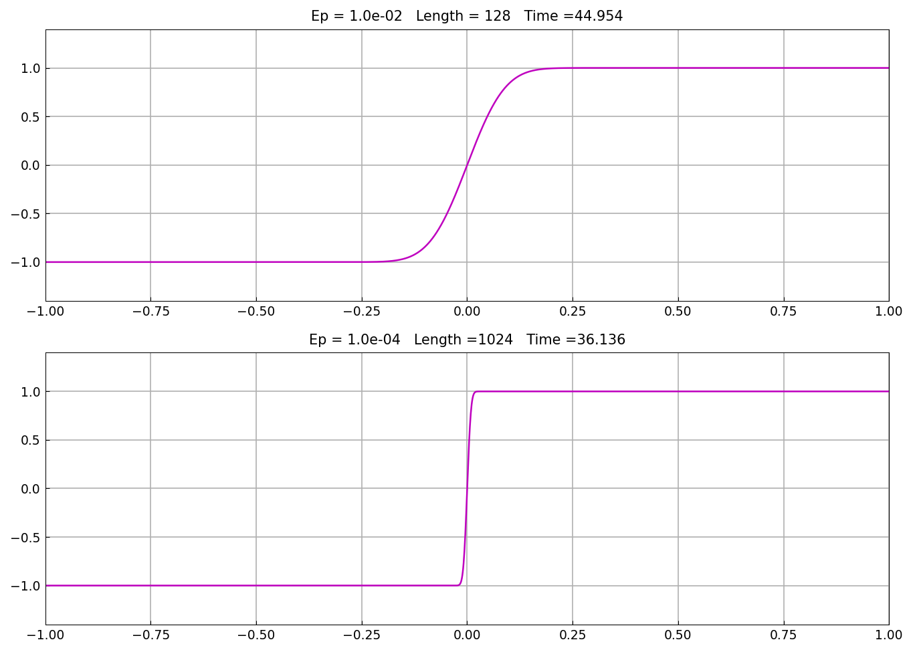
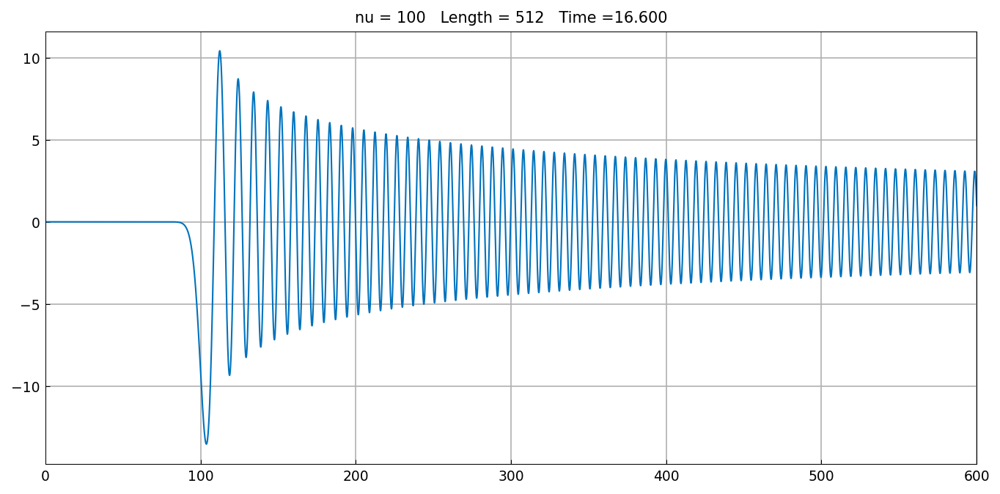
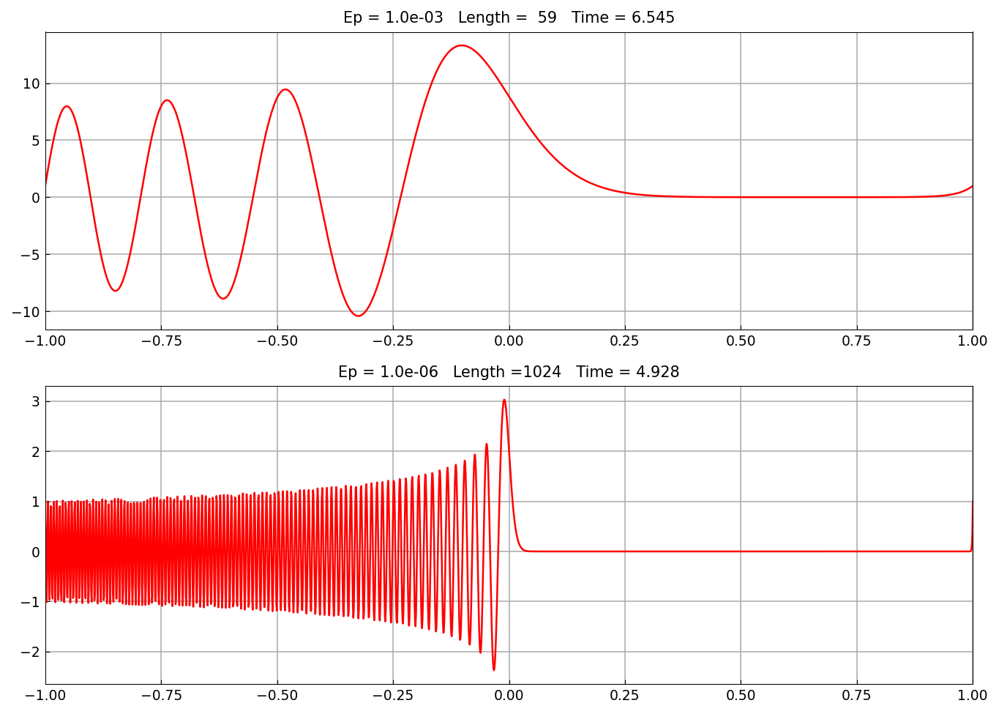
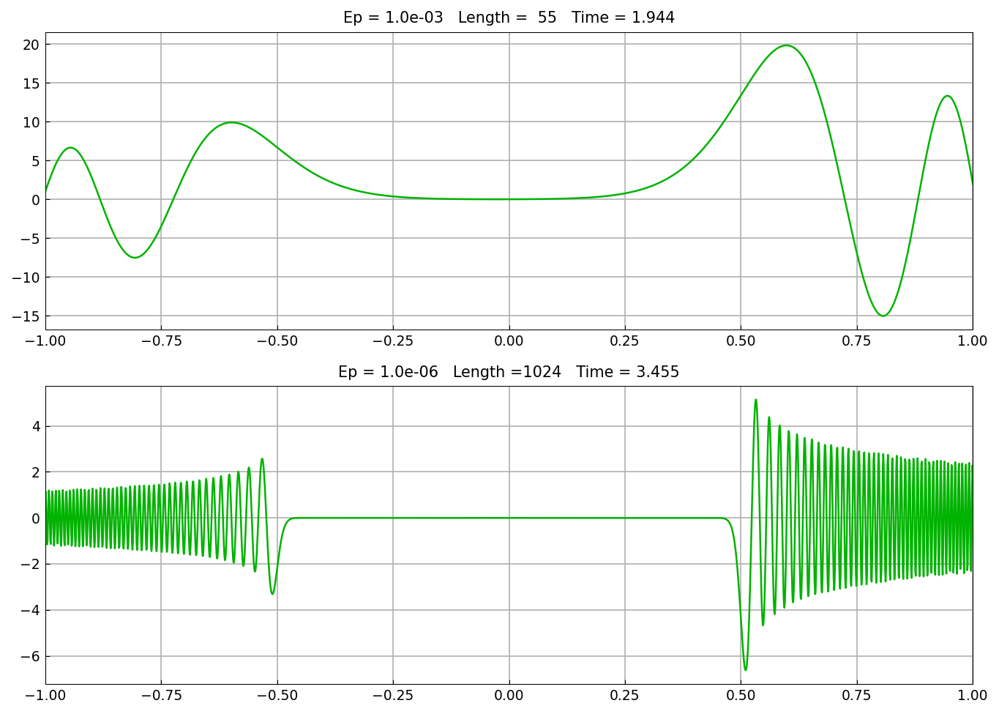
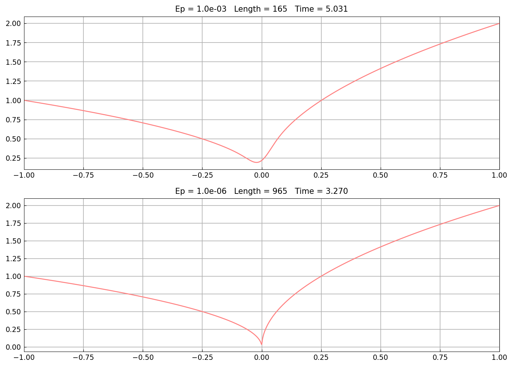
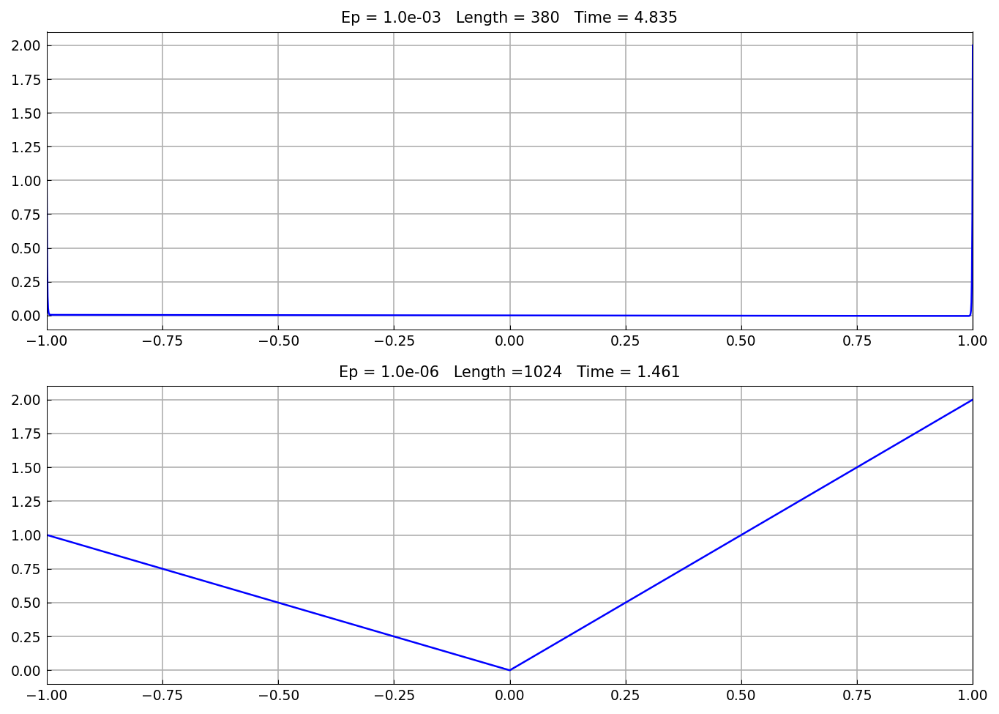

# Lee & Greengard ODE test problems

*Nick Trefethen, December 2016*

[Original MATLAB Chebfun example](https://www.chebfun.org/examples/ode-linear/LeeGreengardODEs.html)

(Chebfun example ode-linear/LeeGreengardODEs.m)

Lee and Greengard's 1997 paper presented six challenging linear BVPs
that have become standard stress tests for spectral ODE solvers. Each
is solved here for two values of the small parameter; the figure titles
carry the adaptive lengths and solve times (MATLAB's published lengths
differ in detail; the hardest $\epsilon = 10^{-6}$ cases saturate
chebfunjax's default 1024-point-per-piece cap while still resolving the
plotted structure).

**1. Viscous shock**: $\epsilon u'' + 2xu' = 0$, $u(\pm 1) = \pm 1$ —
an interior layer of width $O(\sqrt\epsilon)$ at $x = 0$:

**2. Bessel's equation** with $\nu = 100$ on $[0, 600]$:
$x^2u'' + xu' + (x^2 - \nu^2)u = 0$ — exponentially small until the
turning point at $x = \nu$, then oscillatory:

**3. Turning point**: $\epsilon u'' - xu = 0$ (the Airy equation
rescaled) — oscillation for $x < 0$, decay for $x > 0$:

**4. Two turning points**: $\epsilon u'' + (x^2 - 0.25)u = 0$ —
oscillation confined to $|x| > 1/2$:

**5. Interior boundary layers**: $\epsilon u'' + xu' - 0.5u = 0$ on a
domain with a breakpoint at the interior turning point:

**6. Cusp**: $\epsilon u'' - xu' + u = 0$ — a corner-like solution at
$x = 0$:

## References

1. J.-Y. Lee and L. Greengard, "A fast adaptive numerical method for
   stiff two-point boundary value problems", SIAM J. Sci. Comput. 18
   (1997), 403-429.

---

*Replica script: [`examples/ode-linear/lee_greengard_replica.py`](https://github.com/ma-gilles/chebfunjax/blob/main/examples/ode-linear/lee_greengard_replica.py).
Original example copyright by The University of Oxford and The Chebfun
Developers.*
