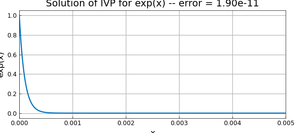

# Linear exp initial-value problem

*Tom Maerz, October 2010*

[Original MATLAB Chebfun example](https://www.chebfun.org/examples/ode-linear/LinExpIVP.html)

Python translation: [`examples/ode-linear/lin_exp_ivp.py`](https://github.com/ma-gilles/chebfunjax/blob/main/examples/ode-linear/lin_exp_ivp.py)

This is an elementary example to illustrate how one might use Chebfun to solve a very simple ODE initial-value problem. We take the scalar test problem

$$ u' - \lambda u = 0 ,~~~ u(0) = 1,~ \lambda = -10000 $$

on the interval $[0,.005]$. The solution is $\exp(\lambda x)$.

```matlab
d = [0,.005];                       % domain
x = chebfun('x',d);                 % x variable
L = chebop(d);                      % operator
lambda = -10000;                    % specifying parameter lambda
L.op = @(u) diff(u,1) - lambda*u;   % linear operator defining the ODE
L.lbc = @(u) u-1;                   % imposing Dirichlet boundary condition
u = L\0;                            % solve the problem
plot(u,'linewidth',1.6)             % plot the solution
err = norm(u-exp(lambda*x),inf);    % measure the error
FS = 'fontsize';
xlabel('x',FS,12)
ylabel('exp(x)',FS,12)
title(sprintf('Solution of IVP for exp(x) -- error = %7.2e',err),FS,14)
```



---

*Translated with [chebfunjax](https://github.com/ma-gilles/chebfunjax); prose and MATLAB code from the original example, copyright The University of Oxford and The Chebfun Developers.  Printed outputs and figures are chebfunjax's.*
