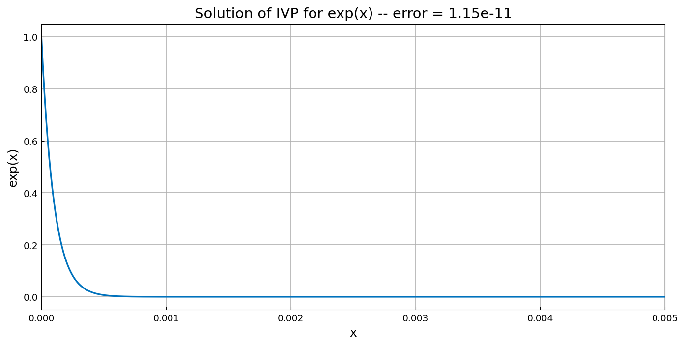

# A linear exponential initial-value problem

*Nick Trefethen and Tom Maerz, September 2010*

[Original MATLAB Chebfun example](https://www.chebfun.org/examples/ode-linear/LinExpIVP.html)

(Chebfun example ode-linear/LinExpIVP.m)

We take the world's simplest ODE initial-value problem,

$$ u' = \lambda u, \qquad u(0) = 1, $$

with $\lambda = -10000$, on the interval $[0, 0.005]$. The solution is
$e^{\lambda x}$, decaying from 1 to $e^{-50} \approx 1.9\times
10^{-22}$:

```python
L = Chebop(lambda x, u: u.diff(1) + 10000*u, domain=(0, 0.005))
L.lbc = lambda u: u - 1
u = L.solve(0.0)
```

```text
error = 1.15e-11
```

(The published figure bakes its error into the title at a comparable
1e-11 level.)



---

*Replica script: [`examples/ode-linear/lin_exp_ivp_replica.py`](https://github.com/ma-gilles/chebfunjax/blob/main/examples/ode-linear/lin_exp_ivp_replica.py).
Original example copyright by The University of Oxford and The Chebfun
Developers.*
