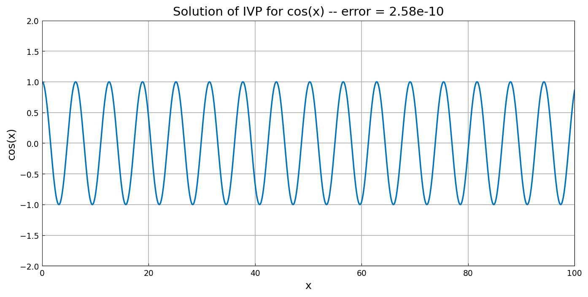

# Linear sine/cosine initial-value problem

*Nick Trefethen and Tom Maerz, September 2010*

[Original MATLAB Chebfun example](https://www.chebfun.org/examples/ode-linear/LinearIVP.html)

(Chebfun example ode-linear/LinearIVP.m)

This is an elementary example to illustrate how one might use Chebfun to
solve an ODE initial-value problem. We take the world's second-simplest
such problem,

$$ u'' + u = 0, \qquad u(0) = 1, ~ u'(0) = 0 $$

on the interval $[0,100]$. The solution is $\cos(x)$.

```python
L = Chebop(lambda x, u: u.diff(2) + u, domain=(0, 100))
L.lbc = lambda u: [u - 1, u.diff()]   # Dirichlet and Neumann BCs at x=0
u = L.solve(0.0)
```

```text
error = 2.58e-10
```



(The published figure bakes its error value into the title; both are at
the ~1e-10 level typical of marching this oscillatory IVP over 16
periods.)

---

*Replica script: [`examples/ode-linear/linear_ivp_replica.py`](https://github.com/ma-gilles/chebfunjax/blob/main/examples/ode-linear/linear_ivp_replica.py).
Original example copyright by The University of Oxford and The Chebfun
Developers.*
