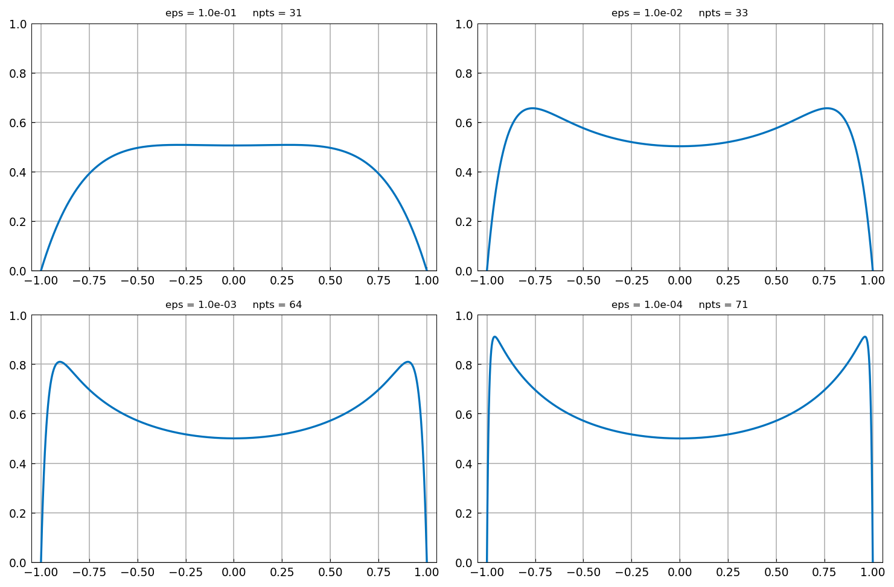
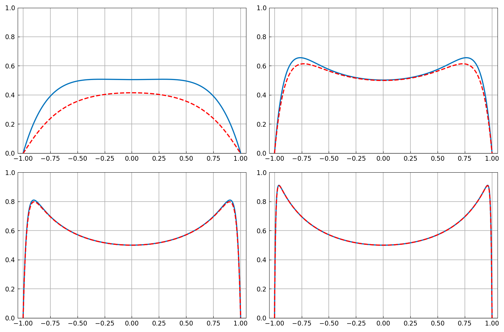
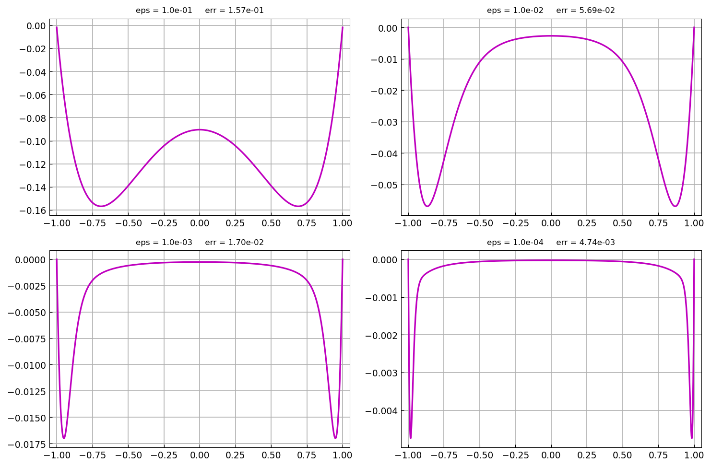

# Boundary layers and matched asymptotics

*Nick Trefethen, November 2010*

[Original MATLAB Chebfun example](https://www.chebfun.org/examples/ode-linear/MatchedAsymp.html)

(Chebfun example ode-linear/MatchedAsymp.m)

A classic problem of singular perturbation theory is the
boundary-value problem

$$ -\epsilon u'' + (2 - x^2) u = 1, \qquad u(-1) = u(1) = 0, $$

for small $\epsilon > 0$. Here are the solutions for
$\epsilon = 10^{-1}, \dots, 10^{-4}$:

```text
Elapsed time is 48.519965 seconds.
```

(Published: 3.3 s on 2010-era MATLAB; the timing is machine- and
path-dependent.)



Matched asymptotics predicts the interior solution $1/(2-x^2)$
corrected by boundary layers of width $O(\sqrt{\epsilon})$:

$$ u \approx \frac{1}{2-x^2} - e^{(x-1)/\sqrt{\epsilon}}
   - e^{(-x-1)/\sqrt{\epsilon}}. $$

Overlaying the model (dashed) on the computed solutions:



The model error shrinks like $O(\sqrt{\epsilon})$ as
$\epsilon \to 0$:



---

*Replica script: [`examples/ode-linear/matched_asymp_replica.py`](https://github.com/ma-gilles/chebfunjax/blob/main/examples/ode-linear/matched_asymp_replica.py).
Original example copyright by The University of Oxford and The Chebfun
Developers.*
