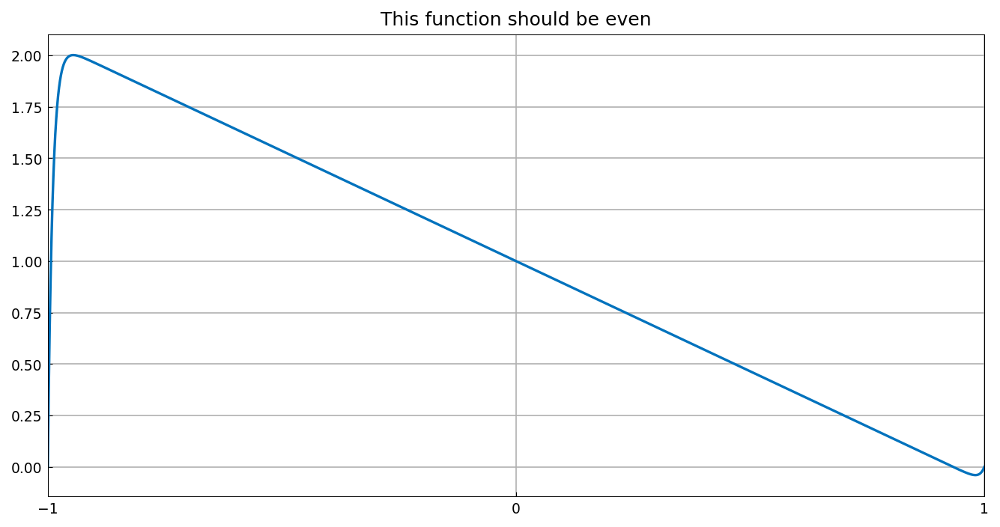
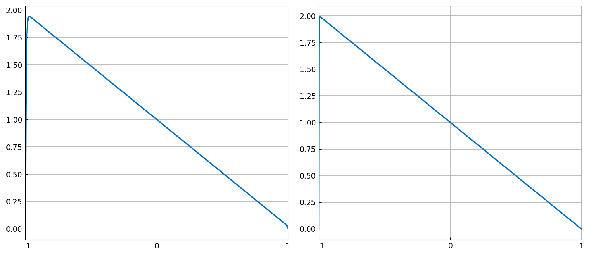
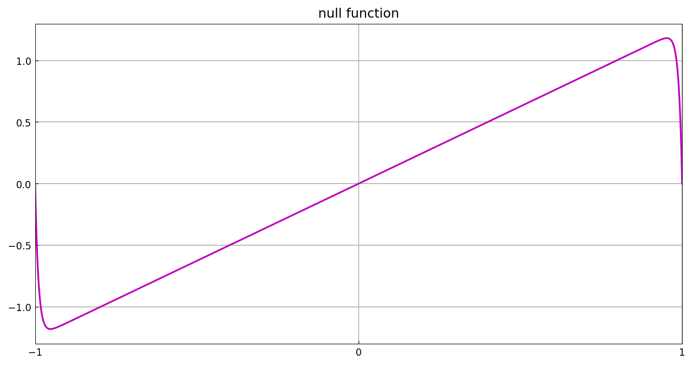
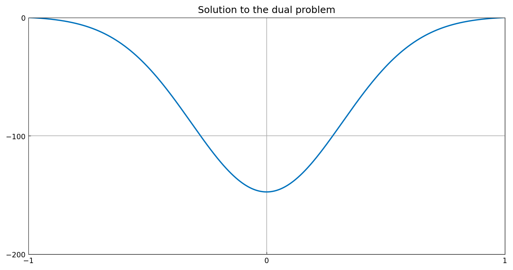
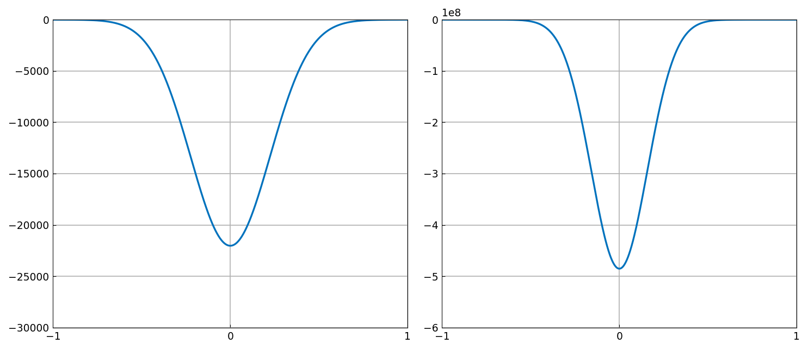

# Near-nonuniqueness in linear BVPs

*Nick Trefethen, December 2016*

[Original MATLAB Chebfun example](https://www.chebfun.org/examples/ode-linear/NearNonuniqueness.html)

(Chebfun example ode-linear/NearNonuniqueness.m)

Consider the linear boundary-value problem

$$ 0.01 u'' - xu' + u = 1, \qquad u(-1) = u(1) = 0. $$

The equation and boundary conditions are symmetric about $x = 0$, so the
solution should be even. But the computed solution is far from even:



Yet the residual is tiny:

```text
residual_norm =
     2.755279041622051e-09
```

(Published: `1.968740850551058e-10` — both are "small residual, dubious
solution", which is the point of the example.)

Shrinking $\epsilon$ makes things stranger still ($\epsilon = 0.005$
and $0.001$):



The explanation is *near-nonuniqueness*: the operator has an eigenvalue
exponentially close to zero, so an odd null-function component can be
added to the solution almost for free. The eigenvalues are close to
integers:

```text
ans =
   -4.000000007930783
   -2.999999997914577
   -1.999999999902494
   -1.000000000014337
   -0.000000000000704
    1.000000000000779
```

(Published values agree to ~1e-8 — the deviations from exact integers
are themselves noise of the degeneracy.)

Here is the null function belonging to the near-zero eigenvalue — a
boundary-layer-flanked odd function:



WKB analysis explains the layers via the indicial roots:

```text
ans =
  -98.989794855663561
   -1.010205144336438
ans =
   98.989794855663561
    1.010205144336438
```

(Digit-for-digit with the published page.)

For the *dual* problem $0.1u'' + xu' + u = 1$ the same mechanism
produces exponentially **large** solutions instead:





with the corresponding indicial roots:

```text
ans =
   98.989794855663561
    1.010205144336438
ans =
  -98.989794855663561
   -1.010205144336438
```

---

*Replica script: [`examples/ode-linear/near_nonuniqueness_replica.py`](https://github.com/ma-gilles/chebfunjax/blob/main/examples/ode-linear/near_nonuniqueness_replica.py).
Original example copyright by The University of Oxford and The Chebfun
Developers.*
