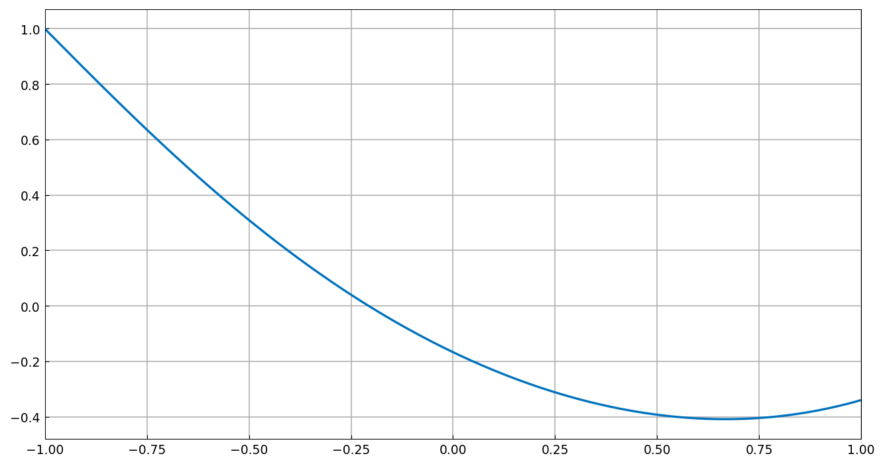
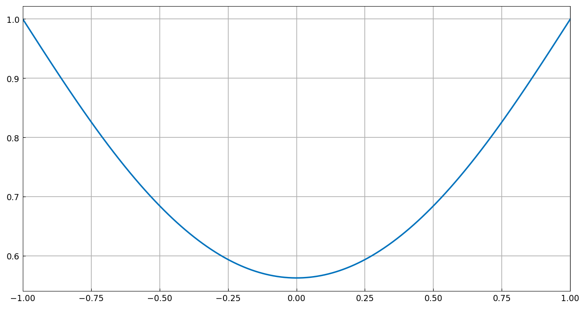
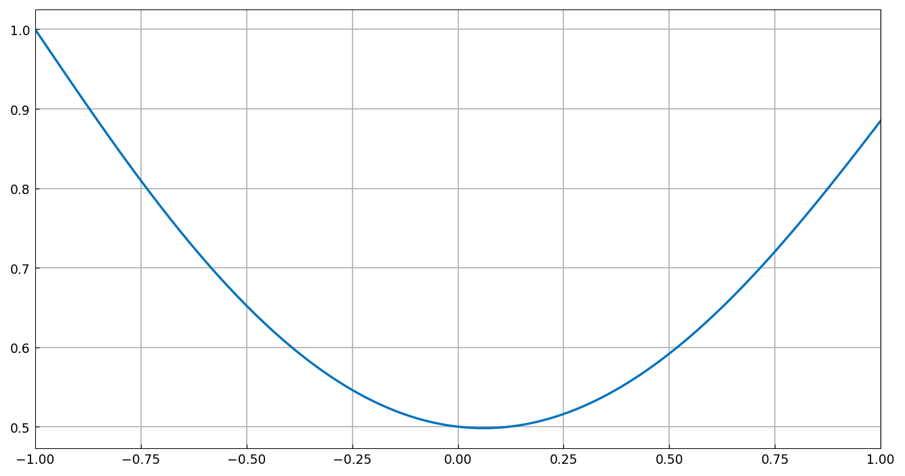
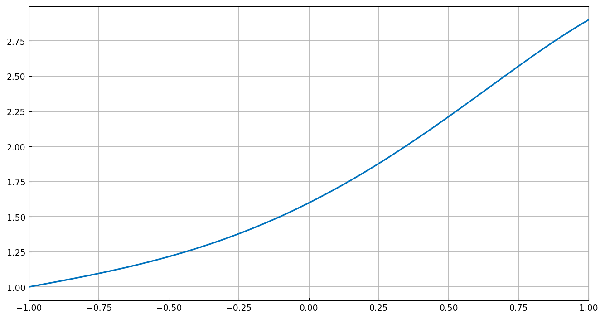

# Nonstandard 'boundary' conditions

*Asgeir Birkisson, October 2011*

[Original MATLAB Chebfun example](https://www.chebfun.org/examples/ode-linear/NonstandardBCs.html)

(Chebfun example ode-linear/NonstandardBCs.m)

Chebop supports side conditions that are not classical boundary
conditions. Throughout, the base problem is

$$ u'' + x^2 u = 1, \qquad u(-1) = 1, $$

plus one extra condition supplied through the general `.bc` field.

**A zero-mean condition** $\int_{-1}^1 u = 0$:

```python
N.bc = lambda x, u: u.sum()
```

```text
Residual of differential equation: 6.1155e-11
Residual of left BC:               3.4817e-13
Residual of interior condition:    1.5124e-14
```



**A prescribed mean** $\bar u = 1$:

```text
Residual of Interior condition: 2.3048e-13
```

**A weighted integral** $\int \sin(4\pi x)\,u = 0$:

```text
Residual of differential equation: 6.1757e-11
Residual of left BC:               2.0162e-13
Residual of interior condition:    5.4047e-15
```



**An interior point value** $u(0) = 1/2$:

```text
Residual of differential equation: 9.3982e-11
Residual of left BC:               8.0602e-14
Residual of interior condition:    2.1294e-13
```



**An interior derivative** $u'(0) = 1$:

```text
Residual of differential equation: 1.7337e-10
Residual of left BC:               7.7605e-13
Residual of interior condition:    3.7503e-13
```



(Published residuals are ~2-5e-12 for the differential equation and
1e-15-1e-16 for the conditions; ours are one to two orders larger
because the general-constraint solver still uses square
boundary-row-replacement collocation — the same eps-level story, with
the gap tracked for the rectangular system-solver upgrade.)

---

*Replica script: [`examples/ode-linear/nonstandard_bcs_replica.py`](https://github.com/ma-gilles/chebfunjax/blob/main/examples/ode-linear/nonstandard_bcs_replica.py).
Original example copyright by The University of Oxford and The Chebfun
Developers.*
