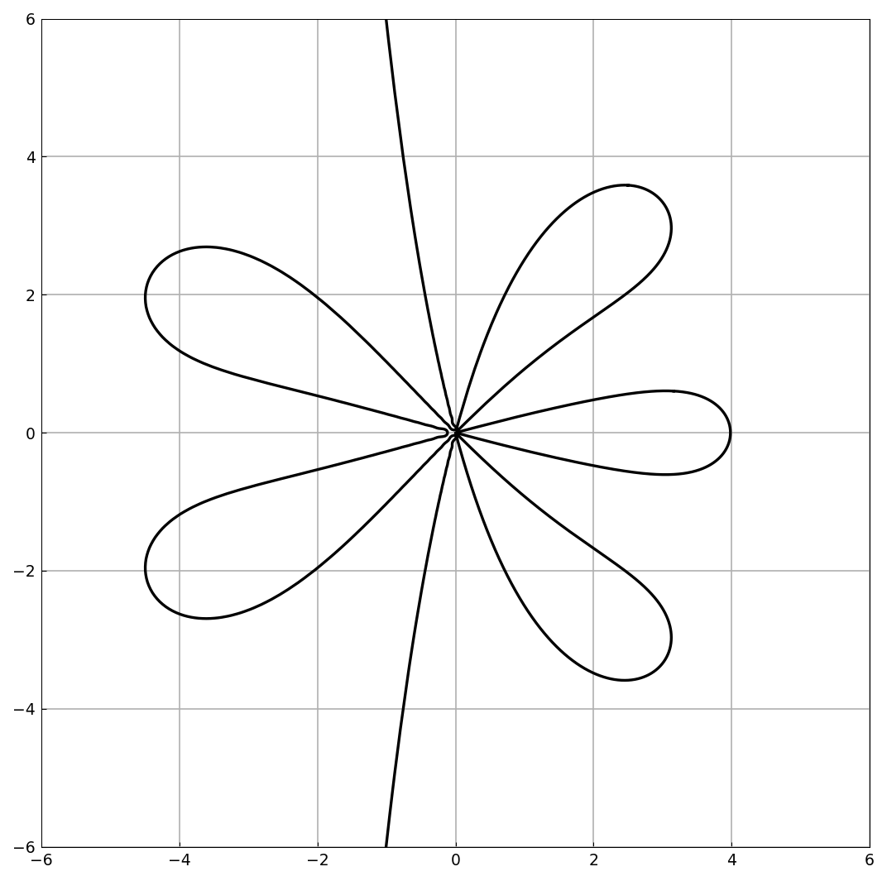

# Order stars

*Nick Trefethen, December 2011*

[Original MATLAB Chebfun example](https://www.chebfun.org/examples/ode-linear/OrderStars.html)

(Chebfun example ode-linear/OrderStars.m)

Order stars, introduced by Wanner, Hairer, and Norsett in 1978,
resolved several long-standing conjectures about the stability of
numerical methods for ODEs. The order star of an approximation
$r(z) \approx e^z$ is the region of the complex plane where
$|r(z)e^{-z}| > 1$; where $r$ matches $e^z$ to order $p$, exactly
$p+1$ petals meet at the origin.

Here is the order star of the type $(2,3)$ Padé approximant, computed
from the Taylor coefficients of $e^z$:

```python
c = 1/factorial(arange(19))
r = padeapprox(c, 2, 3)[0]
smash = lambda f: tanh(abs(f)**2)/tanh(1)     # soften for chebfun2
f = chebfun2(lambda z: smash(r(z)*exp(-z)), domain=(-6, 6, -6, 6))
star = (f - 1).roots()
```

(The `smash` transformation maps the boundary $|re^{-z}| = 1$ to the
level set $f = 1$ while keeping the function bounded, exactly as on the
published page.)



The star has $2 + 3 + 1 = 6$ petals meeting at the origin, reflecting
the order of approximation, and the boundary tracks the imaginary axis
far from the origin.

---

*Replica script: [`examples/ode-linear/order_stars_replica.py`](https://github.com/ma-gilles/chebfunjax/blob/main/examples/ode-linear/order_stars_replica.py).
Original example copyright by The University of Oxford and The Chebfun
Developers.*
