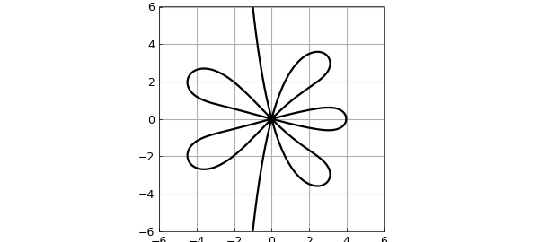

# Order Stars

*Nick Trefethen, July 2014*

[Original MATLAB Chebfun example](https://www.chebfun.org/examples/ode-linear/OrderStars.html)

Python translation: [`examples/ode-linear/order_stars.py`](https://github.com/ma-gilles/chebfunjax/blob/main/examples/ode-linear/order_stars.py)

Order stars are a beautiful idea of complex analysis that resolved several open conjectures when they were introduced in 1978 by Wanner, Hairer, and Norsett [1,2,3]. Chebfun is not really a very good tool for illustrating them, since there are poles involved that must be smashed away, but let us give it a go.

Let $R(z)$ be a function of the complex variable $z$. The *order star* of $R$ is the region bounded by the curve(s) in the plane satisfying the condition

$$ | e^{-z} R(z)| = 1 . $$

For example, here is a function handle for the type $(2,3)$ Pade approximant of $e^z$:

```matlab
c = 1./factorial(0:18);
r = padeapprox(c,2,3);
```

We can use this mollifying function to turn poles into constants while preserving the absolute value $f=1$:

```matlab
smash = @(f) tanh(abs(f).^2)/tanh(1);
```

Now we can plot the order star like this:

```matlab
d = 6*[-1 1 -1 1];
f = chebfun2(@(z) smash(r(z).*exp(-z)),d);
star = roots(f-1);
plot(star,'k','linewidth',1.6)
axis(d), axis square
```



Such figures reveal important properties of the function $R$. For example, the meeting of 12 sectors at the origin reflects the 6th-order agreement of the Pade approximant with $e^z$,

$$ e^z - R(z) = O(z^6). $$

## References

1. E. Hairer and G. Wanner, *Solving Ordinary Differential Equations II*, 2nd revised ed., Springer, 1996.
2. A. Iserles and S. P. Norsett, *Order Stars*, Chapman and Hall, 1991.
3. G. Wanner, E. Hairer, and S. P. Norsett, Order stars and stability theorems, *BIT*, 18 (1978), 475-489.

---

*Translated with [chebfunjax](https://github.com/ma-gilles/chebfunjax); prose and MATLAB code from the original example, copyright The University of Oxford and The Chebfun Developers.  Printed outputs and figures are chebfunjax's.*
