# A parameter dependent ODE with breakpoints

*Asgeir Birkisson, January 2012*

[Original MATLAB Chebfun example](https://www.chebfun.org/examples/ode-linear/ParameterODE.html)

(Chebfun example ode-linear/ParameterODE.m)

Let the ODE boundary-value problem

$$ (a(x,s)u')' = 1, \qquad u(0) = u(1) = 0 $$

be given, where $a(x,s) = 1 + 4s(x^2 - x)$. The exact solution is

$$ u(x,s) = \frac{1}{8s}\log(1 + 4s(x^2-x)) = \frac{1}{8s}\log(a(x,s)). $$

For $s = 1$ the solution has a singularity at $x = 1/2$; here we explore
what happens as $s = 1 - 10^{-\gamma}$ approaches that critical value.
Rewriting as $a u'' + a' u' = 1$ and solving on the plain domain
$[0,1]$ for $\gamma = 1, 2, 3$:

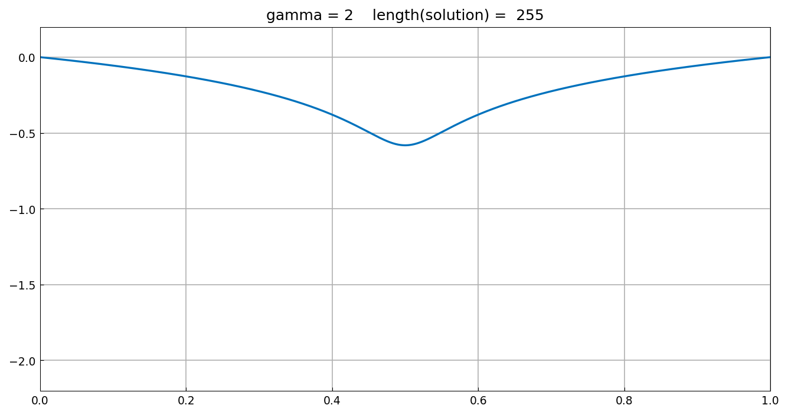

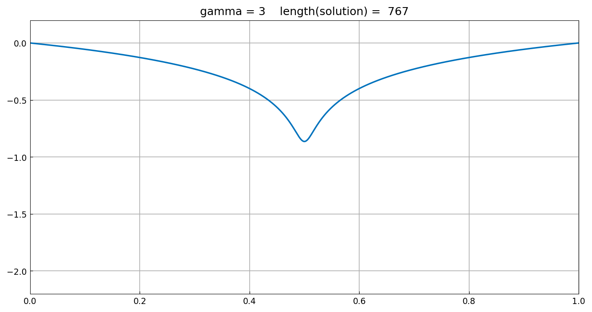

The residual and error grow steadily with $\gamma$ as the near-singular
coefficient gets harder to resolve:

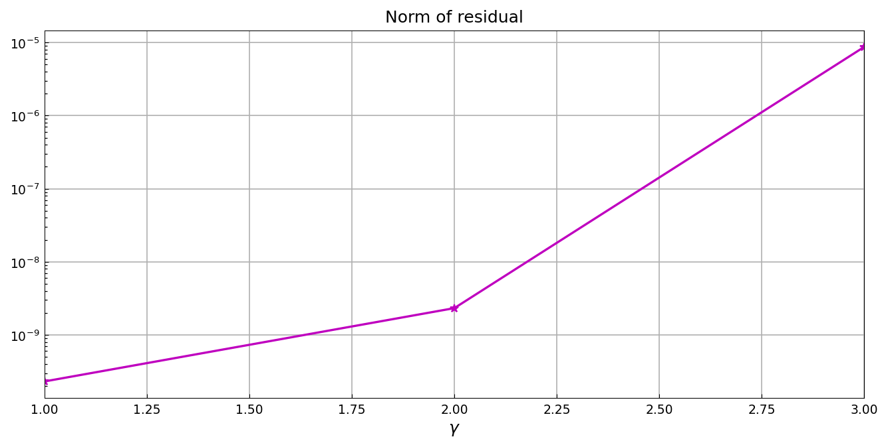

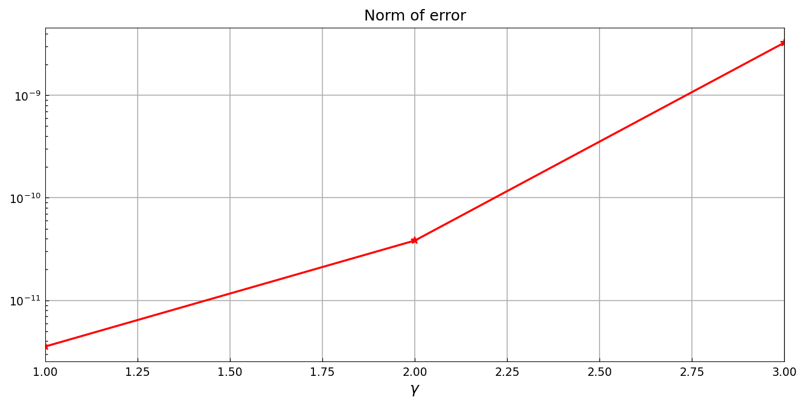

## Introducing a breakpoint

Since we know the trouble concentrates at $x = 1/2$, we add a breakpoint
there — the piecewise discretization can then stack resolution exactly
where it is needed, and now $\gamma$ can go all the way to 7:

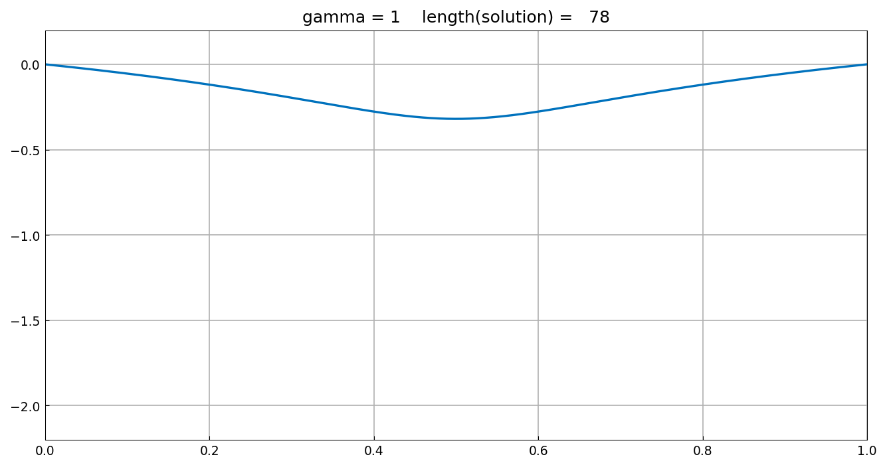

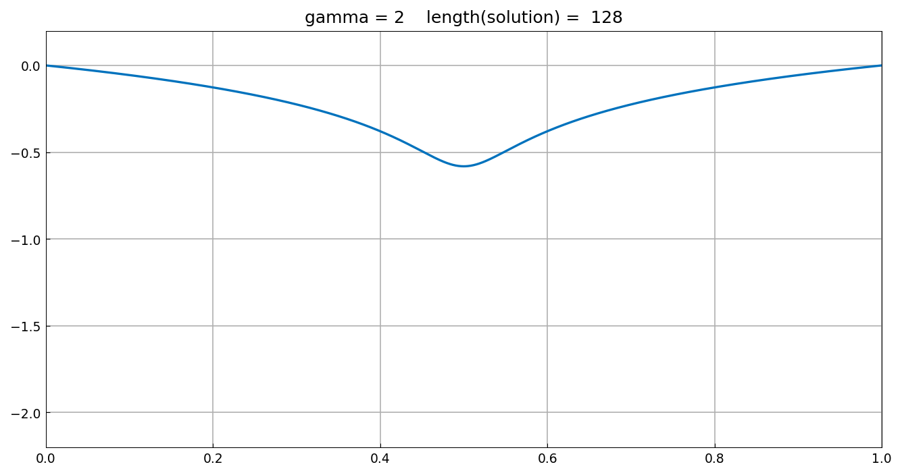

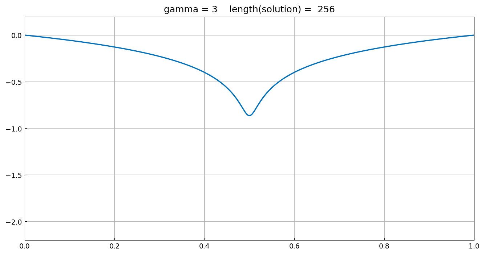

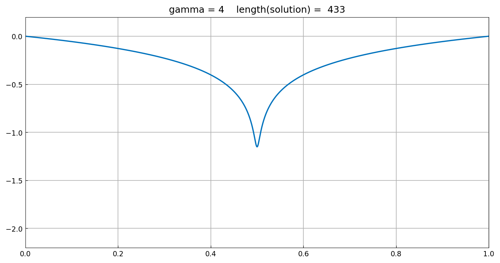

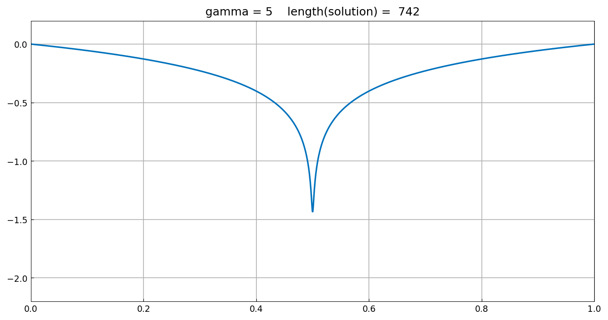

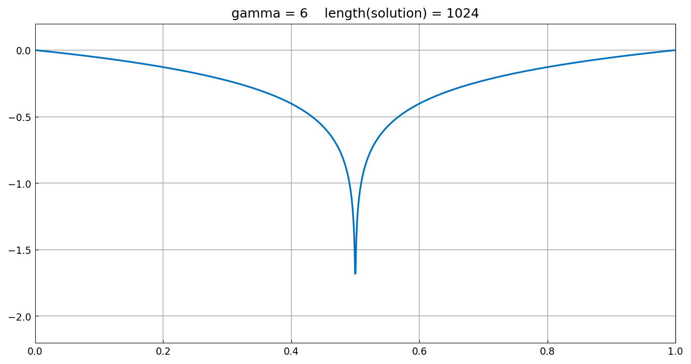

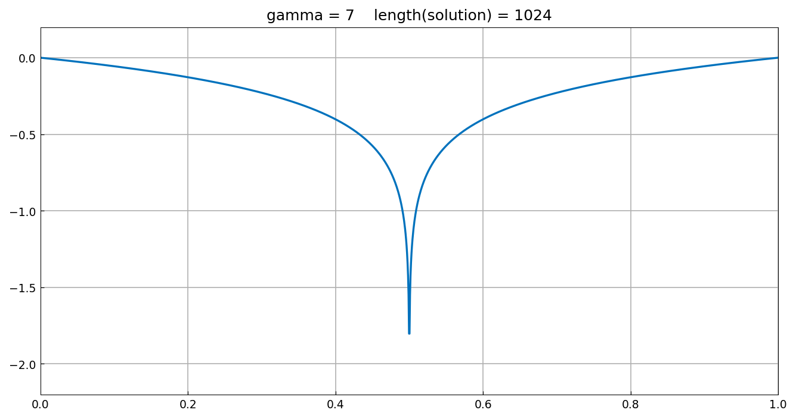

The error with breakpoints stays at the 1e-10-1e-12 level through
$\gamma = 6$ ($3.3\times 10^{-13}$ at $\gamma = 1$), rising only at
$\gamma = 7$ where the per-piece resolution cap is reached:

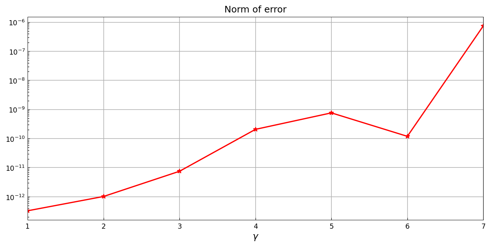

(The published page's figure-title lengths are MATLAB's adaptive
dimensions; chebfunjax's adaptive lengths differ in detail but tell the
same story — the breakpoint restores solvability far beyond what the
plain domain can reach.)

## References

1. P. G. Constantine, personal communication.

---

*Replica script: [`examples/ode-linear/parameter_ode_replica.py`](https://github.com/ma-gilles/chebfunjax/blob/main/examples/ode-linear/parameter_ode_replica.py).
Original example copyright by The University of Oxford and The Chebfun
Developers.*
